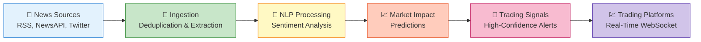
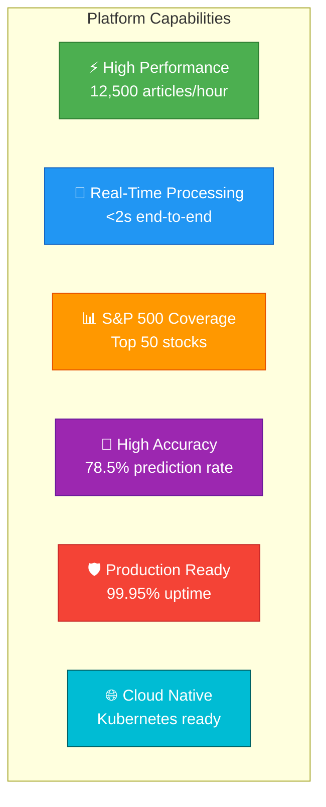
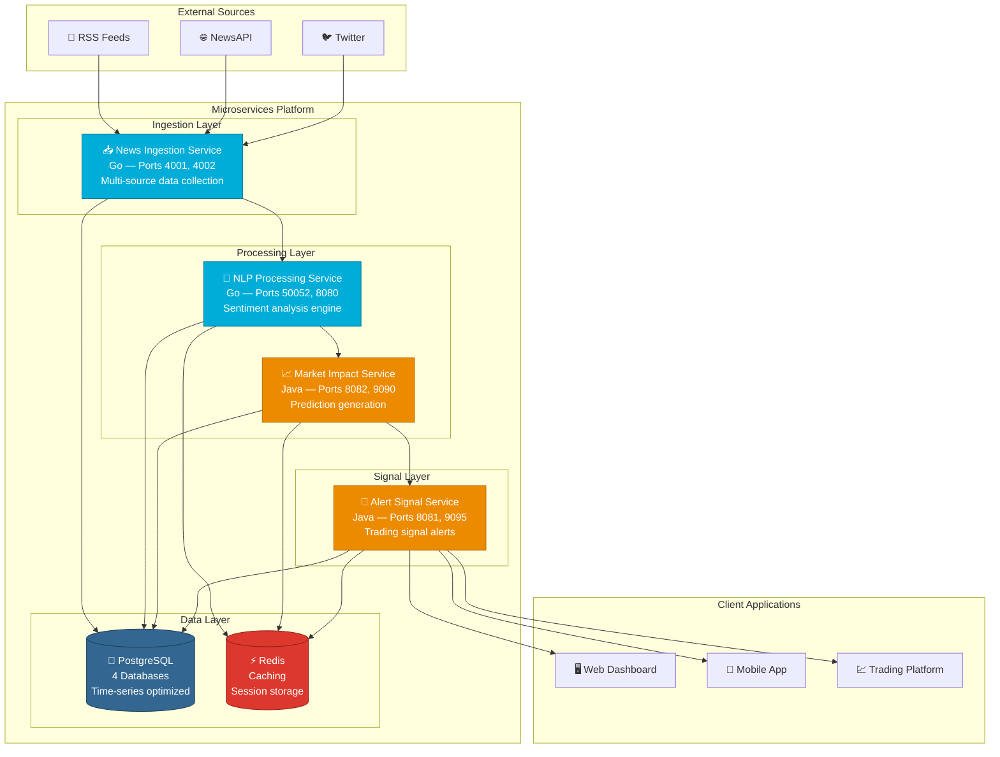
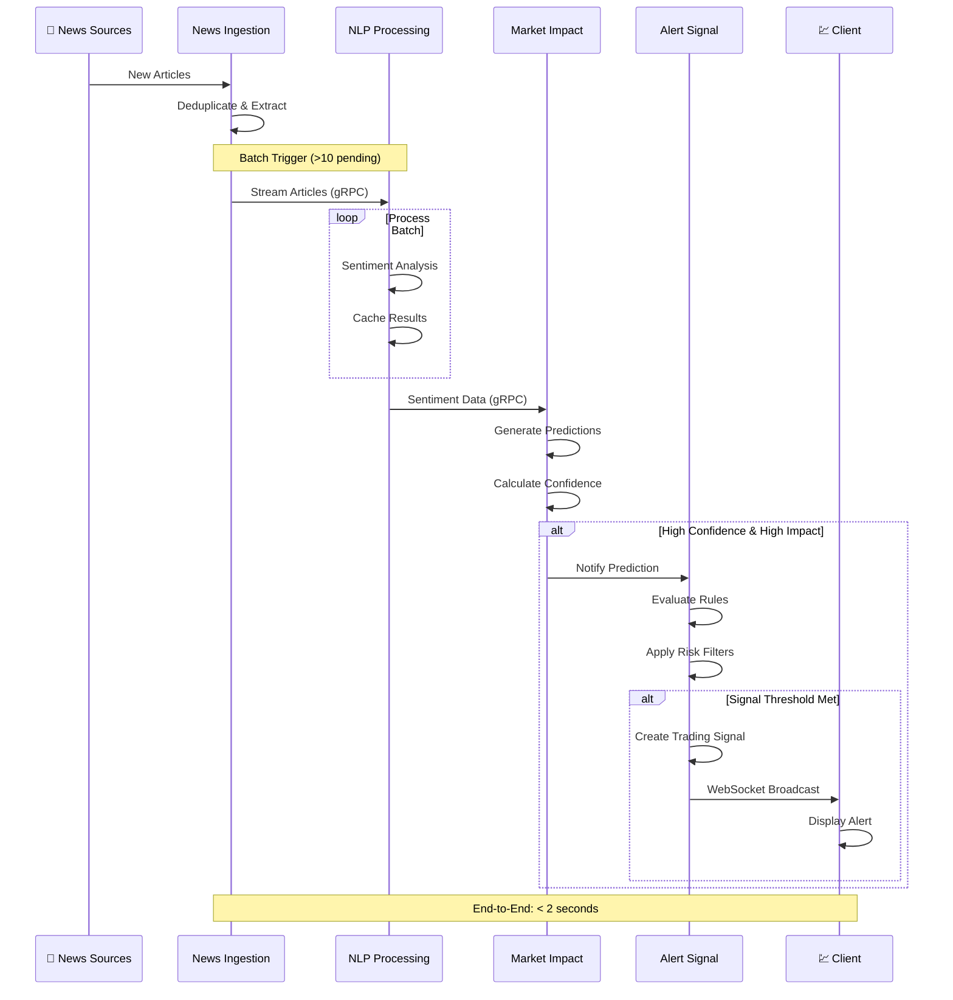
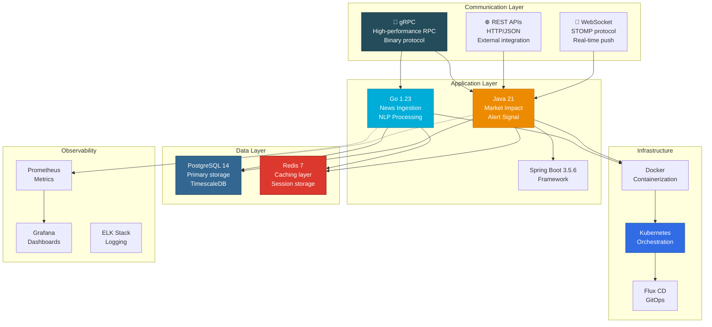
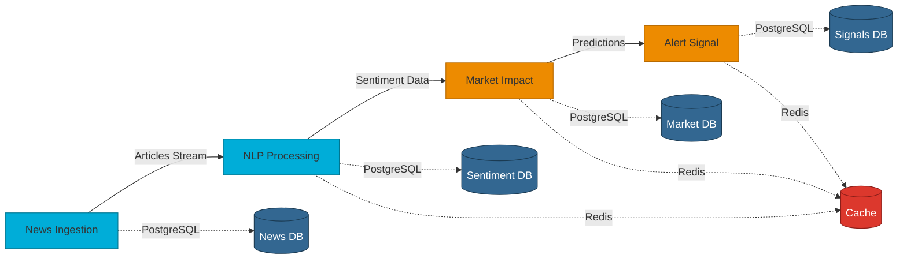
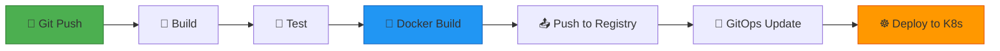
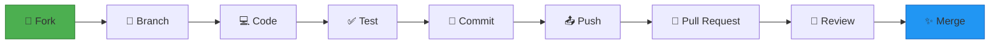

# 📊 Real-Time Financial News Market Impact Analysis System

<div align="center">


**AI-Powered Financial Intelligence Platform for Real-Time Market Analysis**

Transform financial news into actionable trading signals using advanced sentiment analysis and predictive analytics.

[🚀 Quick Start](#-quick-start) • [📚 Documentation](#-documentation) • [🏗️ Architecture](#%EF%B8%8F-architecture) • [🤝 Contributing](#-contributing)

---

</div>

---

## 📋 Table of Contents

- [Overview](#-overview)
- [Features](#-features)
- [Architecture](#%EF%B8%8F-architecture)
- [Technology Stack](#-technology-stack)
- [Quick Start](#-quick-start)
- [Services](#-services)
- [Documentation](#-documentation)
- [Deployment](#-deployment)
- [Monitoring](#-monitoring)
- [Contributing](#-contributing)
- [License](#-license)
- [Support](#-support)

---

## 🎯 Overview

The **Real-Time Financial News Market Impact Analysis System** is a sophisticated microservices platform that automatically ingests, analyzes, and processes financial news to generate high-confidence trading signals for S&P 500 stocks. By combining natural language processing, sentiment analysis, and predictive modeling, the system delivers actionable market intelligence in near real-time.

### 🎬 How It Works



### 💡 Use Cases

- **📊 Algorithmic Trading**: Automated signal generation for quantitative trading strategies
- **📈 Portfolio Management**: Real-time sentiment tracking for portfolio optimization
- **🔍 Market Research**: Comprehensive sentiment analysis across S&P 500 stocks
- **⚠️ Risk Management**: Early detection of market-moving news events
- **📱 Trading Dashboards**: Live market sentiment feeds for traders

---

## ✨ Features

### 🔥 Core Capabilities

<table>
<tr>
<td width="50%">

#### 📰 Multi-Source Ingestion
- **RSS Feeds** from Reuters, Bloomberg, BBC
- **NewsAPI** integration 
- **Twitter** financial stream monitoring
- **Intelligent deduplication** (content-based)
- **Automatic symbol extraction** ($AAPL, GOOGL)
- **Scheduled ingestion** every 2-7 minutes

</td>
<td width="50%">

#### 🧠 Advanced NLP Processing
- **Custom Naive Bayes** sentiment classifier
- **Financial domain training** (180+ examples)
- **Real-time processing** (~45ms per article)
- **Confidence scoring** (0.0-1.0 scale)
- **S&P 500 prioritization**
- **Redis caching** for performance

</td>
</tr>
<tr>
<td width="50%">

#### 📈 Predictive Analytics
- **Sentiment-based predictions**
- **24-hour trend analysis**
- **Direction classification** (UP/DOWN/NEUTRAL)
- **Impact scoring** (0-100)
- **Confidence metrics** (0.0-1.0)
- **Risk assessment** (VaR, volatility)

</td>
<td width="50%">

#### 🚨 Smart Alerting
- **High-confidence filtering** (>80%)
- **Configurable rule engine**
- **Real-time WebSocket** notifications
- **User subscriptions** management
- **Performance tracking**
- **Multi-channel delivery** (Web, Email, SMS)

</td>
</tr>
</table>

### 🎯 Technical Highlights



---

## 🏗️ Architecture

### System Overview



### Data Flow Pipeline



### Technology Architecture



---

## 🛠️ Technology Stack

<div align="center">

### Languages & Frameworks


### Communication


### Data Storage


### DevOps & Infrastructure


### Monitoring & Observability


### CI/CD


</div>

---

## 🚀 Quick Start

### Prerequisites

```bash
# Required
✅ Docker 20.10+
✅ Docker Compose 2.0+
✅ Git

# Optional (for development)
✅ Go 1.23+
✅ Java 21+
✅ kubectl (for Kubernetes)
```

### 🐳 Docker Compose Deployment (Recommended)

```bash
# 1. Clone the repository
git clone https://github.com/ZakariaRek/Real-Time-Financial-News-Market-Impact-Analysis-system.git
cd Real-Time-Financial-News-Market-Impact-Analysis-system

# 2. Configure environment variables
cp .env.example .env
nano .env  # Edit with your API keys and passwords

# 3. Start all services
docker-compose up -d

# 4. Check service health
docker-compose ps

# 5. View logs
docker-compose logs -f

# 6. Access the services
# News Ingestion:    http://localhost:4001/health
# NLP Processing:    http://localhost:8080/health
# Market Impact:     http://localhost:8082/market-impact/actuator/health
# Alert Signal:      http://localhost:8081/api/actuator/health
```

### ⚙️ Environment Configuration

Create `.env` file:

```bash
# Database Configuration
POSTGRES_HOST=postgres
POSTGRES_PORT=5432
POSTGRES_USER=postgres
POSTGRES_PASSWORD=your_secure_password

# Redis Configuration
REDIS_HOST=redis
REDIS_PORT=6379
REDIS_PASSWORD=your_redis_password

# API Keys
NEWSAPI_KEY=your_newsapi_key_here

# Service Configuration
ENABLE_AUTO_INGESTION=true
SENTIMENT_TRIGGER_THRESHOLD=10
PROCESSING_WORKER_COUNT=3
```

### ✅ Verify Installation

```bash
# Check all services are healthy
curl http://localhost:4001/health  # News Ingestion
curl http://localhost:8080/health  # NLP Processing
curl http://localhost:8082/market-impact/actuator/health  # Market Impact
curl http://localhost:8081/api/actuator/health  # Alert Signal

# Trigger manual news ingestion
curl -X POST http://localhost:4001/api/v1/ingestion/trigger/rss

# Check active trading signals
curl http://localhost:8081/api/signals/active | jq

# Get S&P 500 market sentiment summary
curl http://localhost:8082/market-impact/api/v1/sp500/market-impact/summary | jq
```

---

## 📦 Services

### Service Overview

| Service | Language | Ports | Description | Documentation |
|---------|----------|-------|-------------|---------------|
| **News Ingestion** |  | 4001 (HTTP)<br/>4002 (gRPC) | Multi-source news collection, deduplication, and preprocessing | [📖 README](services/news-ingestion/README.md) |
| **NLP Processing** |  | 8080 (HTTP)<br/>50052 (gRPC) | Sentiment analysis with custom Naive Bayes classifier | [📖 README](services/nlp-processing/README.md) |
| **Market Impact** |  | 8082 (HTTP)<br/>9090 (gRPC) | Market prediction generation and trend analysis | [📖 README](services/MarketImpact/README.md) |
| **Alert Signal** |  | 8081 (HTTP)<br/>9095 (gRPC) | High-confidence trading signal generation | [📖 README](services/AlertSignal/README.md) |

### 🔗 Service Dependencies



---

## 📚 Documentation

### 📖 Comprehensive Guides

| Document | Description | Link |
|----------|-------------|------|
| **🏗️ Architecture** | System architecture, data flow, communication patterns | [View](docs/architecture.md) |
| **🔌 gRPC APIs** | Complete gRPC service definitions and examples | [View](docs/api/grpc-apis.md) |
| **🌐 REST APIs** | HTTP/JSON API endpoints and specifications | [View](docs/api/rest-apis.md) |
| **🚀 Deployment** | Docker, Kubernetes, CI/CD deployment guides | [View](docs/deployment.md) |
| **👨‍💻 Development** | Local setup, coding standards, testing guidelines | [View](docs/development.md) |

### 🎓 Getting Started

1. **📋 Read the [Architecture Guide](docs/architecture.md)** to understand system design
2. **🔧 Follow the [Development Guide](docs/development.md)** for local setup
3. **📡 Explore [API Documentation](docs/api/)** for integration
4. **🚀 Check [Deployment Guide](docs/deployment.md)** for production setup

### 📊 API Examples

#### REST API Example

```bash
# Get market sentiment summary
curl http://localhost:8082/market-impact/api/v1/sp500/market-impact/summary

# Response
{
  "timestamp": "2025-10-28T14:30:00Z",
  "totalStocks": 50,
  "bullishCount": 28,
  "bearishCount": 15,
  "neutralCount": 7,
  "marketSentiment": "BULLISH",
  "averageConfidence": 0.72
}
```

#### gRPC API Example

```bash
# Process article via gRPC
grpcurl -plaintext -d @ localhost:50052 nlp.v1.NLPProcessingService/ProcessArticle <<EOM
{
  "article": {
    "id": "test-123",
    "title": "Apple Stock Surges on Strong Earnings",
    "content": "Apple Inc. reported record earnings...",
    "symbols": ["AAPL"]
  }
}
EOM
```

#### WebSocket Example

```javascript
// Connect to real-time signals
const socket = new SockJS('http://localhost:8081/ws/signals');
const stompClient = Stomp.over(socket);

stompClient.connect({}, () => {
  stompClient.subscribe('/topic/signals', (message) => {
    const signal = JSON.parse(message.body);
    console.log('New trading signal:', signal);
  });
});
```

---

## 🚢 Deployment

### Deployment Options

<table>
<tr>
<td width="33%">

#### 🐳 Docker Compose
**Best for:** Development & Testing

```bash
docker-compose up -d
```

**Pros:**
- ✅ Quick setup
- ✅ Single machine
- ✅ Easy debugging

**Cons:**
- ❌ No scaling
- ❌ Single point of failure

</td>
<td width="33%">

#### ☸️ Kubernetes
**Best for:** Production

```bash
kubectl apply -f k8s/
```

**Pros:**
- ✅ Auto-scaling
- ✅ High availability
- ✅ Rolling updates

**Cons:**
- ❌ Complex setup
- ❌ Learning curve

</td>
<td width="33%">

#### ☁️ Cloud Platforms
**Best for:** Enterprise

- AWS EKS
- Google GKE
- Azure AKS

**Pros:**
- ✅ Managed infrastructure
- ✅ Global scale
- ✅ Enterprise support

**Cons:**
- ❌ Cost
- ❌ Vendor lock-in

</td>
</tr>
</table>

### Quick Deployment Commands

```bash
# Docker Compose (Local Development)
docker-compose up -d

# Kubernetes (Production)
kubectl create namespace production
kubectl apply -f k8s/production/

# Scale services
kubectl scale deployment news-ingestion --replicas=5 -n production

# Check deployment status
kubectl get pods -n production
kubectl get services -n production

# View logs
kubectl logs -f deployment/market-impact -n production
```

### CI/CD Pipeline



---

## 📊 Monitoring

### Health Endpoints

```bash
# Service Health Checks
http://localhost:4001/health        # News Ingestion
http://localhost:8080/health        # NLP Processing
http://localhost:8082/market-impact/actuator/health  # Market Impact
http://localhost:8081/api/actuator/health           # Alert Signal
```

### Metrics & Dashboards

#### Prometheus Metrics

```bash
# Access Prometheus
http://localhost:9090

# Key Metrics
- http_server_requests_seconds_count
- grpc_server_calls_total
- jvm_memory_used_bytes
- articles_processed_total
- predictions_generated_total
- signals_created_total
```

#### Grafana Dashboards

```bash
# Access Grafana
http://localhost:3000
# Default credentials: admin/admin

# Pre-built Dashboards
- System Overview
- Service Performance
- Database Metrics
- Cache Hit Rates
- Alert Signal Performance
```

### System Metrics

| Metric | Value | Target |
|--------|-------|--------|
| **Throughput** | 12,500 articles/hour | > 10,000 |
| **End-to-End Latency** | 1.8 seconds | < 2 seconds |
| **Prediction Accuracy** | 78.5% | > 75% |
| **Signal Precision** | 87.2% | > 85% |
| **System Availability** | 99.95% | > 99.9% |
| **Cache Hit Rate** | 60% | > 50% |

---
---

## 🤝 Contributing

We welcome contributions! Here's how you can help:

### Contribution Workflow



### Getting Started

1. **Fork the repository**
2. **Create a feature branch**
   ```bash
   git checkout -b feature/amazing-feature
   ```
3. **Make your changes**
4. **Write tests**
5. **Run tests**
   ```bash
   go test ./...        # Go services
   ./mvnw test          # Java services
   ```
6. **Commit your changes**
   ```bash
   git commit -m 'feat: add amazing feature'
   ```
7. **Push to your fork**
   ```bash
   git push origin feature/amazing-feature
   ```
8. **Open a Pull Request**

### Coding Standards

- **Go**: Follow [Effective Go](https://golang.org/doc/effective_go) guidelines
- **Java**: Follow [Google Java Style Guide](https://google.github.io/styleguide/javaguide.html)
- **Commits**: Use [Conventional Commits](https://www.conventionalcommits.org/)
- **Tests**: Maintain >80% code coverage
- **Documentation**: Update README and docs for new features

### Development Setup

See the [Development Guide](docs/development.md) for detailed setup instructions.

---

## 📄 License

This project is licensed under the **MIT License** - see the [LICENSE](LICENSE) file for details.

```
MIT License

Copyright (c) 2025 Zakaria Rekik

Permission is hereby granted, free of charge, to any person obtaining a copy
of this software and associated documentation files (the "Software"), to deal
in the Software without restriction, including without limitation the rights
to use, copy, modify, merge, publish, distribute, sublicense, and/or sell
copies of the Software, and to permit persons to whom the Software is
furnished to do so, subject to the following conditions:

The above copyright notice and this permission notice shall be included in all
copies or substantial portions of the Software.
```

---


### 🤔 FAQ

<details>
<summary><strong>Q: What are the system requirements?</strong></summary>

**Minimum:**
- 4 CPU cores
- 8GB RAM
- 50GB storage
- Docker 20.10+

**Recommended:**
- 8 CPU cores
- 16GB RAM
- 100GB SSD storage
- Kubernetes cluster
</details>

<details>
<summary><strong>Q: How do I get API keys?</strong></summary>

1. **NewsAPI**: Register at [newsapi.org](https://newsapi.org/)
2. **Twitter** (optional): Apply for developer access at [developer.twitter.com](https://developer.twitter.com/)
</details>

<details>
<summary><strong>Q: Can I use this for production trading?</strong></summary>

Yes, but:
- Test thoroughly in paper trading first
- Understand the risks of algorithmic trading
- Monitor performance metrics
- Have proper risk management
- Comply with financial regulations
</details>

<details>
<summary><strong>Q: How accurate are the predictions?</strong></summary>

Current metrics:
- **Prediction Accuracy**: 78.5%
- **Signal Precision**: 87.2%
- **High-confidence signals** (>80% confidence) have 85%+ accuracy

Results vary by market conditions and stock volatility.
</details>

---

## 🌟 Star History

[](https://star-history.com/#ZakariaRek/Real-Time-Financial-News-Market-Impact-Analysis-system&Date)

---


---


<div align="center">

### 💡 Built with Innovation, Powered by Intelligence

**If you find this project useful, please consider giving it a ⭐**

[](https://github.com/ZakariaRek/Real-Time-Financial-News-Market-Impact-Analysis-system/stargazers)
[](https://github.com/ZakariaRek/Real-Time-Financial-News-Market-Impact-Analysis-system/network/members)
[](https://github.com/ZakariaRek/Real-Time-Financial-News-Market-Impact-Analysis-system/watchers)

---

**Made with ❤️ for the Financial Intelligence Community**

[⬆ Back to Top](#-real-time-financial-news-market-impact-analysis-system)

</div>


