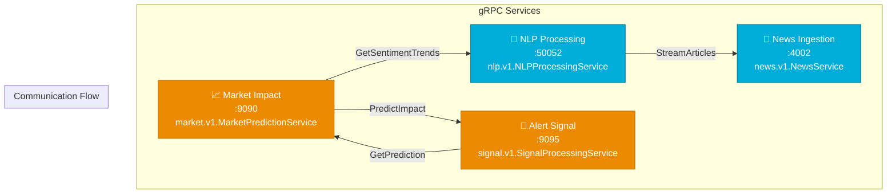
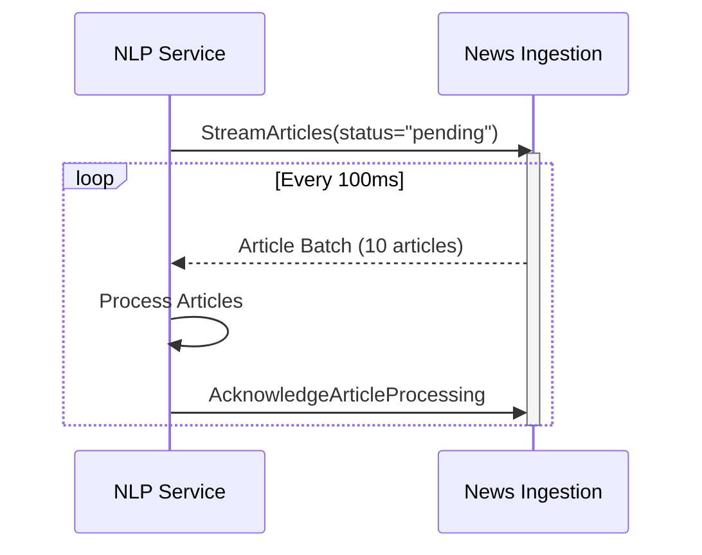
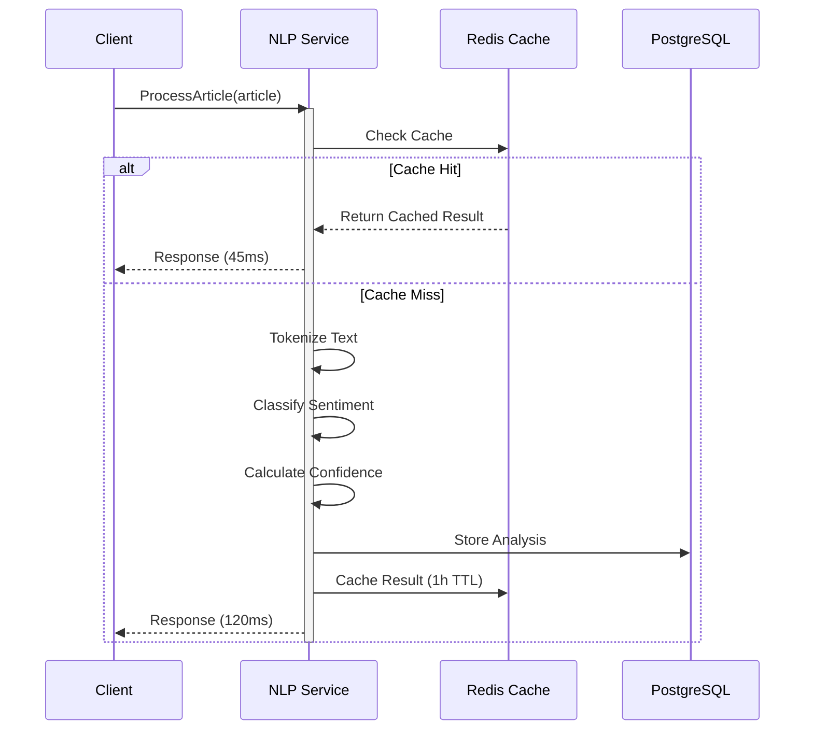
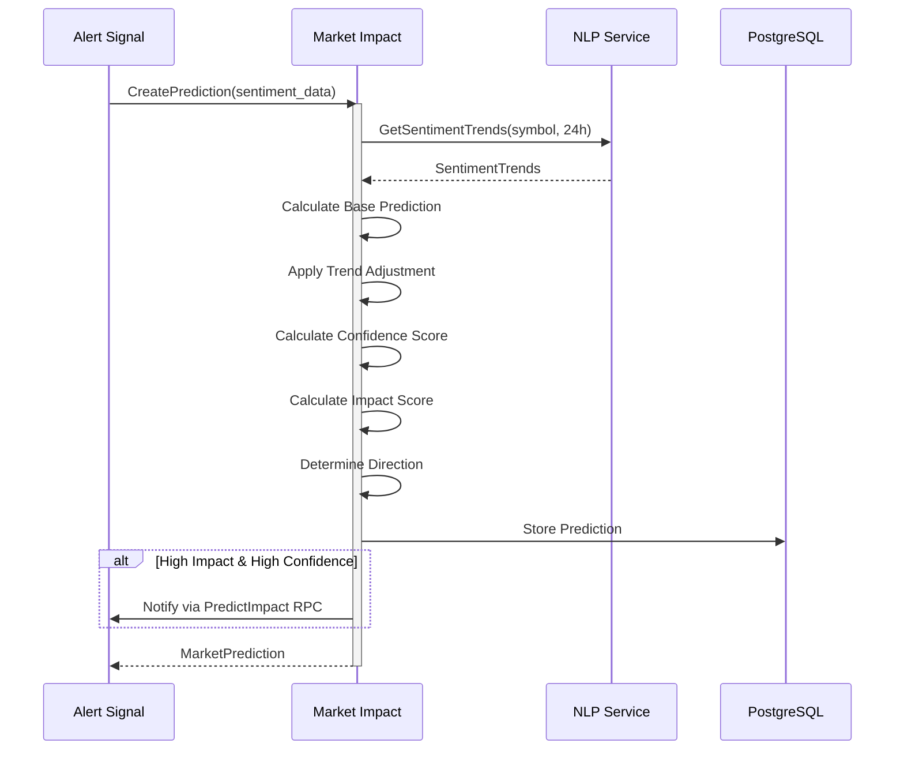
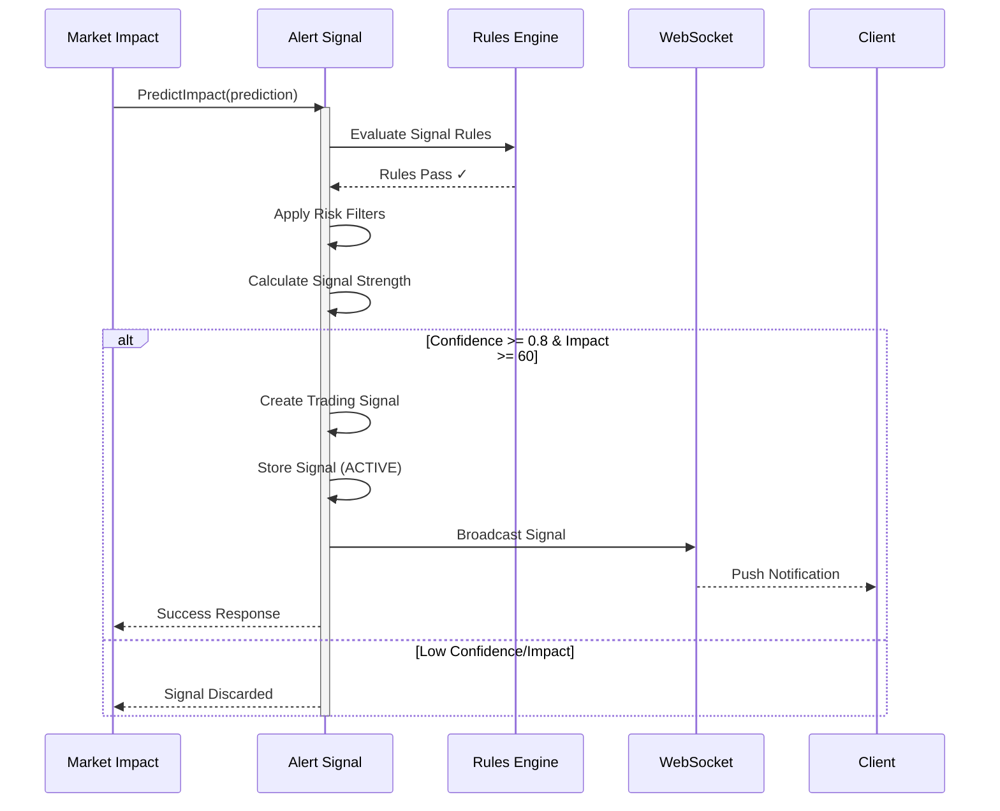
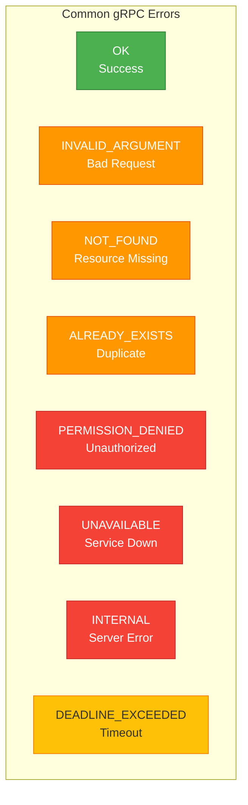
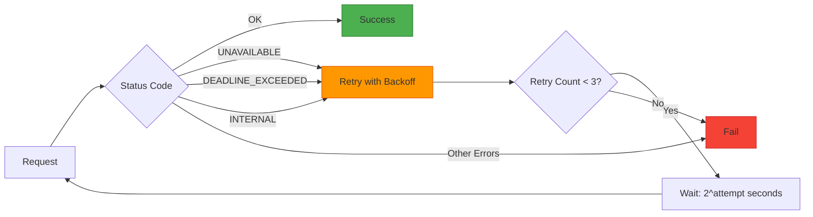

# 🔌 gRPC APIs Documentation

<div align="center">


**High-Performance Inter-Service Communication**

[Services](#-services) • [Message Types](#-message-types) • [Examples](#-examples) • [Testing](#-testing)

</div>

---

## 📋 Table of Contents

- [Overview](#-overview)
- [Service Endpoints](#-service-endpoints)
- [News Ingestion Service](#-news-ingestion-service)
- [NLP Processing Service](#-nlp-processing-service)
- [Market Impact Service](#-market-impact-service)
- [Alert Signal Service](#-alert-signal-service)
- [Common Message Types](#-common-message-types)
- [Error Handling](#-error-handling)
- [Testing with grpcurl](#-testing-with-grpcurl)

---

## 🎯 Overview

The system uses **gRPC** (Google Remote Procedure Call) for high-performance, low-latency communication between microservices. gRPC uses Protocol Buffers (protobuf) for efficient binary serialization.

### Why gRPC?

✅ **Performance**: 7-10x faster than REST
✅ **Type Safety**: Strong typing with protobuf
✅ **Streaming**: Bidirectional streaming support
✅ **Code Generation**: Automatic client/server code
✅ **Language Agnostic**: Works across Go and Java

---

## 🌐 Service Endpoints



| Service | Host | Port | Package |
|---------|------|------|---------|
| **News Ingestion** | localhost | 4002 | `news.v1` |
| **NLP Processing** | localhost | 50052 | `nlp.v1` |
| **Market Impact** | localhost | 9090 | `market.v1` |
| **Alert Signal** | localhost | 9095 | `signal.v1` |

---

## 📰 News Ingestion Service

### Service Definition

```protobuf
service NewsService {
  // Article CRUD operations
  rpc CreateArticle(CreateArticleRequest) returns (CreateArticleResponse);
  rpc GetArticle(GetArticleRequest) returns (GetArticleResponse);
  rpc ListArticles(ListArticlesRequest) returns (ListArticlesResponse);
  
  // Streaming operations
  rpc StreamArticles(StreamArticlesRequest) returns (stream StreamArticlesResponse);
  rpc StreamArticlesByDateRange(StreamArticlesByDateRangeRequest) 
      returns (stream StreamArticlesByDateRangeResponse);
  
  // Processing acknowledgment
  rpc AcknowledgeArticleProcessing(AcknowledgeArticleProcessingRequest) 
      returns (AcknowledgeArticleProcessingResponse);
      
  // Health check
  rpc HealthCheck(HealthCheckRequest) returns (HealthCheckResponse);
}
```

### Message Flow



### Key RPCs

#### 1. StreamArticles (Server Streaming)

**Request:**
```protobuf
message StreamArticlesRequest {
  string status = 1;           // "pending", "processing", "completed"
  int32 batch_size = 2;        // Articles per batch (default: 10)
  repeated string symbols = 3;  // Filter by symbols
}
```

**Response Stream:**
```protobuf
message StreamArticlesResponse {
  repeated Article articles = 1;
  int32 total_count = 2;
  string next_cursor = 3;
}

message Article {
  string id = 1;               // UUID
  string title = 2;
  string content = 3;
  string url = 4;
  repeated string symbols = 5;  // ["AAPL", "GOOGL"]
  string published_at = 6;      // ISO 8601
  uint32 source_id = 7;
  string processing_status = 8;
}
```

**Example (grpcurl):**
```bash
grpcurl -plaintext -d @ localhost:4002 news.v1.NewsService/StreamArticles <<EOM
{
  "status": "pending",
  "batch_size": 10,
  "symbols": ["AAPL", "TSLA", "GOOGL"]
}
EOM
```

#### 2. AcknowledgeArticleProcessing

**Request:**
```protobuf
message AcknowledgeArticleProcessingRequest {
  repeated string article_ids = 1;  // Processed article IDs
  string new_status = 2;            // "processing" or "completed"
  string processor_id = 3;          // Service identifier
}
```

**Response:**
```protobuf
message AcknowledgeArticleProcessingResponse {
  bool success = 1;
  int32 updated_count = 2;
  string message = 3;
}
```

---

## 🧠 NLP Processing Service

### Service Definition

```protobuf
service NLPProcessingService {
  // Single article processing
  rpc ProcessArticle(ProcessArticleRequest) returns (ProcessArticleResponse);
  
  // Batch processing
  rpc ProcessBatch(BatchProcessRequest) returns (BatchProcessResponse);
  
  // Sentiment queries
  rpc GetSentimentTrends(SentimentTrendsRequest) returns (SentimentTrendsResponse);
  rpc GetAnalysisResult(GetAnalysisRequest) returns (GetAnalysisResponse);
  
  // Health check
  rpc HealthCheck(Empty) returns (HealthCheckResponse);
}
```

### Processing Flow



### Key RPCs

#### 1. ProcessArticle

**Request:**
```protobuf
message ProcessArticleRequest {
  Article article = 1;
  ProcessingOptions options = 2;
}

message ProcessingOptions {
  bool enable_sentiment = 1;      // Default: true
  double confidence_threshold = 2; // Default: 0.3
  string model_version = 3;        // Default: "naive-bayes-1.0"
}
```

**Response:**
```protobuf
message ProcessArticleResponse {
  AnalysisResult result = 1;
  bool success = 2;
  string message = 3;
}

message AnalysisResult {
  string article_id = 1;
  SentimentAnalysis sentiment = 2;
  int64 processing_time_ms = 3;
  string status = 4;           // "completed", "failed", "low_confidence"
  string created_at = 5;
}

message SentimentAnalysis {
  string article_id = 1;
  double compound_score = 2;    // -1.0 to +1.0
  double confidence = 3;         // 0.0 to 1.0
  string primary_symbol = 4;
  string model_version = 5;
  string analysis_timestamp = 6;
}
```

**Example Response:**
```json
{
  "result": {
    "article_id": "550e8400-e29b-41d4-a716-446655440000",
    "sentiment": {
      "article_id": "550e8400-e29b-41d4-a716-446655440000",
      "compound_score": 0.85,
      "confidence": 0.92,
      "primary_symbol": "AAPL",
      "model_version": "naive-bayes-financial-1.0",
      "analysis_timestamp": "2025-10-28T14:30:15Z"
    },
    "processing_time_ms": 45,
    "status": "completed",
    "created_at": "2025-10-28T14:30:15Z"
  },
  "success": true,
  "message": "Article processed successfully"
}
```

#### 2. GetSentimentTrends

**Request:**
```protobuf
message SentimentTrendsRequest {
  string symbol = 1;           // Required: "AAPL"
  string start_time = 2;       // ISO 8601
  string end_time = 3;         // ISO 8601
  string interval = 4;         // "hour", "day", "week"
  int32 limit = 5;             // Max results (default: 100)
}
```

**Response:**
```protobuf
message SentimentTrendsResponse {
  repeated SentimentTrend trends = 1;
  int32 total_count = 2;
}

message SentimentTrend {
  string timestamp = 1;        // ISO 8601
  string symbol = 2;
  double avg_sentiment = 3;    // Average compound score
  int32 article_count = 4;
  double volatility = 5;       // Standard deviation
}
```

**Example:**
```bash
grpcurl -plaintext -d @ localhost:50052 nlp.v1.NLPProcessingService/GetSentimentTrends <<EOM
{
  "symbol": "AAPL",
  "start_time": "2025-10-27T00:00:00Z",
  "end_time": "2025-10-28T23:59:59Z",
  "interval": "hour",
  "limit": 48
}
EOM
```

---

## 📈 Market Impact Service

### Service Definition

```protobuf
service MarketPredictionService {
  // Prediction operations
  rpc CreatePrediction(CreateMarketPredictionRequest) returns (MarketPrediction);
  rpc GetPrediction(GetMarketPredictionRequest) returns (GetMarketPredictionResponse);
  rpc GetLatestPrediction(GetLatestPredictionRequest) returns (GetLatestPredictionResponse);
  
  // Query operations
  rpc GetPredictionsBySymbol(GetPredictionsBySymbolRequest) 
      returns (GetPredictionsBySymbolResponse);
  rpc GetRecentPredictions(GetRecentPredictionsRequest) 
      returns (GetRecentPredictionsResponse);
  rpc GetHighConfidencePredictions(GetHighConfidencePredictionsRequest)
      returns (GetHighConfidencePredictionsResponse);
      
  // Health check
  rpc HealthCheck(Empty) returns (HealthCheckResponse);
}
```

### Prediction Flow



### Key RPCs

#### 1. CreatePrediction

**Request:**
```protobuf
message CreateMarketPredictionRequest {
  string article_id = 1;       // Optional
  string symbol = 2;           // Required
  double sentiment_score = 3;  // From NLP service
  double confidence = 4;       // From NLP service
}
```

**Response:**
```protobuf
message MarketPrediction {
  string id = 1;                     // UUID
  string article_id = 2;
  string symbol = 3;
  double predicted_change_percent = 4; // e.g., 2.45 for +2.45%
  string direction = 5;               // "UP", "DOWN", "NEUTRAL"
  double confidence = 6;              // 0.0 to 1.0
  double impact_score = 7;            // 0 to 100
  string model_type = 8;              // "SENTIMENT_BASED_v1.0"
  string prediction_timestamp = 9;
}
```

**Example Response:**
```json
{
  "id": "660e8400-e29b-41d4-a716-446655440001",
  "article_id": "550e8400-e29b-41d4-a716-446655440000",
  "symbol": "AAPL",
  "predicted_change_percent": 2.45,
  "direction": "UP",
  "confidence": 0.85,
  "impact_score": 72.5,
  "model_type": "SENTIMENT_BASED_v1.0",
  "prediction_timestamp": "2025-10-28T14:30:00Z"
}
```

#### 2. GetLatestPrediction

**Request:**
```protobuf
message GetLatestPredictionRequest {
  string symbol = 1;  // Required
}
```

**Response:**
```protobuf
message GetLatestPredictionResponse {
  MarketPrediction prediction = 1;
  bool found = 2;
}
```

---

## 🚨 Alert Signal Service

### Service Definition

```protobuf
service SignalProcessingService {
  // Signal processing (called by Market Impact)
  rpc PredictImpact(PredictImpactRequest) returns (PredictImpactResponse);
  
  // Signal queries
  rpc GetSignal(GetSignalRequest) returns (GetSignalResponse);
  rpc GetActiveSignals(GetActiveSignalsRequest) returns (GetActiveSignalsResponse);
  
  // Health check
  rpc HealthCheck(Empty) returns (HealthCheckResponse);
}

service TradingSignalGrpcService {
  // CRUD operations
  rpc CreateSignal(CreateSignalRequest) returns (CreateSignalResponse);
  rpc GetSignal(GetSignalRequest) returns (GetSignalResponse);
  rpc UpdateSignalStatus(UpdateSignalStatusRequest) returns (UpdateSignalStatusResponse);
  rpc GetActiveSignals(Empty) returns (GetActiveSignalsResponse);
}
```

### Signal Processing Flow



### Key RPCs

#### 1. PredictImpact (Called by Market Impact)

**Request:**
```protobuf
message PredictImpactRequest {
  string prediction_id = 1;  // From Market Impact
  string symbol = 2;
  double confidence = 3;
  double impact_score = 4;
  string direction = 5;      // "UP", "DOWN"
  double predicted_change = 6;
}
```

**Response:**
```protobuf
message PredictImpactResponse {
  bool success = 1;
  string signal_id = 2;       // Created signal ID (if applicable)
  string message = 3;
  double confidence = 4;
  double strength = 5;        // Signal strength (0-1)
}
```

**Example:**
```bash
grpcurl -plaintext -d @ localhost:9095 signal.v1.SignalProcessingService/PredictImpact <<EOM
{
  "prediction_id": "660e8400-e29b-41d4-a716-446655440001",
  "symbol": "AAPL",
  "confidence": 0.92,
  "impact_score": 75.5,
  "direction": "UP",
  "predicted_change": 2.45
}
EOM
```

#### 2. GetActiveSignals

**Request:**
```protobuf
message GetActiveSignalsRequest {
  repeated string symbols = 1;  // Optional filter
  double min_confidence = 2;     // Optional filter (default: 0.8)
}
```

**Response:**
```protobuf
message GetActiveSignalsResponse {
  repeated TradingSignal signals = 1;
  int32 total_count = 2;
}

message TradingSignal {
  string id = 1;
  string prediction_id = 2;
  string symbol = 3;
  string signal_type = 4;      // "PREDICTION_BASED"
  string direction = 5;         // "UP", "DOWN", "HOLD"
  double strength = 6;          // 0.0 to 1.0
  double confidence = 7;
  string status = 8;            // "ACTIVE", "INACTIVE", "EXECUTED"
  string generated_at = 9;
  double actual_return_percent = 10; // After execution
}
```

---

## 📦 Common Message Types

### Shared Types Across Services

```protobuf
// Empty message for RPCs with no parameters
message Empty {}

// Standard health check response
message HealthCheckResponse {
  string status = 1;           // "healthy", "unhealthy"
  string service = 2;          // Service name
  string timestamp = 3;
  map<string, string> details = 4;
}

// Error message
message Error {
  string code = 1;             // "NOT_FOUND", "INVALID_ARGUMENT"
  string message = 2;
  map<string, string> details = 3;
}

// Pagination
message PageRequest {
  int32 page = 1;              // Page number (1-based)
  int32 page_size = 2;         // Items per page
  string sort_by = 3;          // Field to sort by
  string sort_order = 4;       // "asc" or "desc"
}

message PageResponse {
  int32 page = 1;
  int32 page_size = 2;
  int32 total_items = 3;
  int32 total_pages = 4;
  bool has_next = 5;
  bool has_previous = 6;
}
```

---

## ⚠️ Error Handling

### gRPC Status Codes



### Error Response Format

All services return errors in a consistent format:

```protobuf
// Error in response metadata
rpc_status: {
  code: 3           // NOT_FOUND
  message: "Article with ID xyz not found"
  details: [
    {
      type: "BadRequest"
      field: "article_id"
      description: "Invalid UUID format"
    }
  ]
}
```

### Retry Strategy



**Recommended Configuration:**

```yaml
grpc:
  max_retry_attempts: 3
  initial_backoff: 1s
  max_backoff: 30s
  timeout: 30s
  keep_alive_time: 30s
```

---

## 🧪 Testing with grpcurl

### Installation

```bash
# Go install
go install github.com/fullstorydev/grpcurl/cmd/grpcurl@latest

# macOS
brew install grpcurl

# Linux
apt-get install grpcurl
```

### Basic Commands

#### 1. List Services

```bash
# List all services
grpcurl -plaintext localhost:4002 list

# List service methods
grpcurl -plaintext localhost:4002 list news.v1.NewsService
```

#### 2. Describe Service

```bash
# Describe service
grpcurl -plaintext localhost:4002 describe news.v1.NewsService

# Describe specific method
grpcurl -plaintext localhost:4002 describe news.v1.NewsService.StreamArticles
```

#### 3. Health Check (All Services)

```bash
# News Ingestion
grpcurl -plaintext localhost:4002 news.v1.NewsService/HealthCheck

# NLP Processing
grpcurl -plaintext localhost:50052 nlp.v1.NLPProcessingService/HealthCheck

# Market Impact
grpcurl -plaintext localhost:9090 market.v1.MarketPredictionService/HealthCheck

# Alert Signal
grpcurl -plaintext localhost:9095 signal.v1.SignalProcessingService/HealthCheck
```

#### 4. Stream Articles (NLP Processing)

```bash
grpcurl -plaintext -d @ localhost:4002 news.v1.NewsService/StreamArticles <<EOM
{
  "status": "pending",
  "batch_size": 5,
  "symbols": ["AAPL", "GOOGL"]
}
EOM
```

#### 5. Process Article (NLP)

```bash
grpcurl -plaintext -d @ localhost:50052 nlp.v1.NLPProcessingService/ProcessArticle <<EOM
{
  "article": {
    "id": "test-123",
    "title": "Apple Stock Surges on Strong Earnings",
    "content": "Apple Inc. reported record quarterly earnings today...",
    "symbols": ["AAPL"],
    "published_at": "2025-10-28T10:00:00Z",
    "source_id": 1
  },
  "options": {
    "enable_sentiment": true,
    "confidence_threshold": 0.3
  }
}
EOM
```

#### 6. Get Sentiment Trends (NLP)

```bash
grpcurl -plaintext -d @ localhost:50052 nlp.v1.NLPProcessingService/GetSentimentTrends <<EOM
{
  "symbol": "AAPL",
  "start_time": "2025-10-27T00:00:00Z",
  "end_time": "2025-10-28T23:59:59Z",
  "interval": "hour"
}
EOM
```

#### 7. Create Prediction (Market Impact)

```bash
grpcurl -plaintext -d @ localhost:9090 market.v1.MarketPredictionService/CreatePrediction <<EOM
{
  "symbol": "TSLA",
  "sentiment_score": 0.85,
  "confidence": 0.92
}
EOM
```

#### 8. Trigger Alert Signal

```bash
grpcurl -plaintext -d @ localhost:9095 signal.v1.SignalProcessingService/PredictImpact <<EOM
{
  "prediction_id": "test-pred-123",
  "symbol": "AAPL",
  "confidence": 0.92,
  "impact_score": 75.0,
  "direction": "UP",
  "predicted_change": 2.45
}
EOM
```

---

## 🔍 Advanced Testing

### Using grpcui (Interactive GUI)

```bash
# Install
go install github.com/fullstorydev/grpcui/cmd/grpcui@latest

# Launch interactive UI
grpcui -plaintext localhost:4002
```

Opens a browser interface for easy testing!

### Load Testing with ghz

```bash
# Install
go install github.com/bojand/ghz/cmd/ghz@latest

# Load test NLP Processing
ghz --insecure \
  --proto proto/nlp_processing.proto \
  --call nlp.v1.NLPProcessingService/ProcessArticle \
  -d @ \
  -n 1000 \
  -c 10 \
  localhost:50052 <<EOM
{
  "article": {
    "id": "load-test-{{.RequestNumber}}",
    "title": "Test Article",
    "content": "Testing load...",
    "symbols": ["AAPL"]
  }
}
EOM
```

---

## 📊 Performance Benchmarks

| Service | RPC | Latency (p50) | Latency (p99) | Throughput |
|---------|-----|---------------|---------------|------------|
| **News Ingestion** | StreamArticles | 50ms | 150ms | 200 articles/s |
| **NLP Processing** | ProcessArticle | 45ms | 120ms | 1,300 articles/min |
| **Market Impact** | CreatePrediction | 100ms | 250ms | 200 predictions/min |
| **Alert Signal** | PredictImpact | 50ms | 100ms | 100 signals/min |

---

## 🔐 Security Best Practices

### TLS Configuration (Production)

```yaml
grpc:
  tls:
    enabled: true
    cert_file: /path/to/server.crt
    key_file: /path/to/server.key
    ca_file: /path/to/ca.crt
    client_auth: require
```

### Authentication

```protobuf
// Add authentication metadata
metadata: {
  "authorization": "Bearer <token>"
  "x-api-key": "<api-key>"
}
```

---

<div align="center">

**High-Performance gRPC Communication for Financial Intelligence**


[Back to Top](#-grpc-apis-documentation)

</div>  