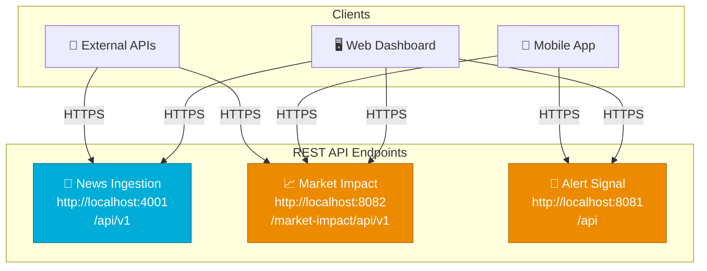
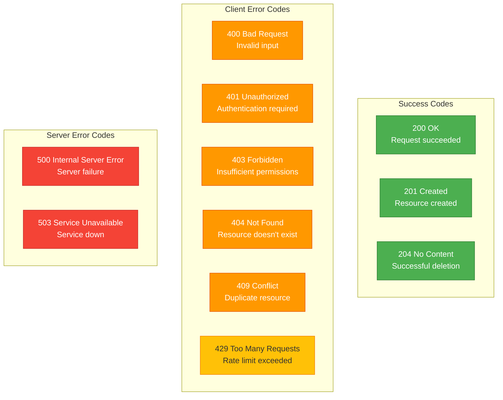

# 🌐 REST APIs Documentation

<div align="center">


**HTTP/JSON APIs for External Integration**

[Overview](#-overview) • [Endpoints](#-endpoints) • [Examples](#-examples) • [Authentication](#-authentication)

</div>

---

## 📋 Table of Contents

- [Overview](#-overview)
- [Base URLs](#-base-urls)
- [Authentication](#-authentication)
- [News Ingestion API](#-news-ingestion-api)
- [Market Impact API](#-market-impact-api)
- [Alert Signal API](#-alert-signal-api)
- [Common Responses](#-common-responses)
- [Error Handling](#-error-handling)
- [Rate Limiting](#-rate-limiting)
- [Examples](#-examples)

---

## 🎯 Overview

The system exposes RESTful HTTP APIs for external clients, dashboards, and third-party integrations. All APIs use JSON for request/response payloads and follow REST conventions.

### API Design Principles

✅ **RESTful**: Standard HTTP methods (GET, POST, PUT, DELETE)
✅ **JSON Format**: All requests and responses in JSON
✅ **Stateless**: No server-side session management
✅ **Versioned**: URLs include version (e.g., `/api/v1/`)
✅ **Paginated**: Large result sets support pagination
✅ **CORS Enabled**: Cross-origin requests supported

---

## 🌐 Base URLs



| Service | Base URL | Port |
|---------|----------|------|
| **News Ingestion** | `http://localhost:4001/api/v1` | 4001 |
| **Market Impact** | `http://localhost:8082/market-impact/api/v1` | 8082 |
| **Alert Signal** | `http://localhost:8081/api` | 8081 |

---

## 🔐 Authentication

### API Key Authentication (Optional)

For production deployments, APIs can be secured with API keys:

```http
GET /api/v1/articles
Authorization: Bearer <your-api-key>
X-API-Key: <your-api-key>
```

### Development Mode

No authentication required for local development.

---

## 📰 News Ingestion API

Base URL: `http://localhost:4001/api/v1`

### Article Endpoints

#### 1. Create Article

```http
POST /articles
Content-Type: application/json
```

**Request Body:**
```json
{
  "source_id": 1,
  "title": "Apple Reports Record Quarterly Earnings",
  "content": "Apple Inc. (AAPL) announced record-breaking earnings...",
  "url": "https://example.com/article/12345",
  "symbols": ["AAPL", "SPY"],
  "published_at": "2025-10-28T10:00:00Z"
}
```

**Response (201 Created):**
```json
{
  "success": true,
  "data": {
    "id": "550e8400-e29b-41d4-a716-446655440000",
    "source_id": 1,
    "title": "Apple Reports Record Quarterly Earnings",
    "content": "Apple Inc. (AAPL) announced...",
    "url": "https://example.com/article/12345",
    "symbols": ["AAPL", "SPY"],
    "published_at": "2025-10-28T10:00:00Z",
    "processing_status": "pending",
    "relevance_score": 0.95,
    "content_hash": "a3f5b2c1...",
    "created_at": "2025-10-28T10:01:00Z",
    "updated_at": "2025-10-28T10:01:00Z"
  },
  "message": "Article created successfully"
}
```

#### 2. Get Article by ID

```http
GET /articles/{id}
```

**Response (200 OK):**
```json
{
  "success": true,
  "data": {
    "id": "550e8400-e29b-41d4-a716-446655440000",
    "title": "Apple Reports Record Quarterly Earnings",
    "symbols": ["AAPL"],
    "processing_status": "completed",
    "relevance_score": 0.95
  }
}
```

#### 3. List Articles

```http
GET /articles?limit=50&status=pending&symbols=AAPL,GOOGL
```

**Query Parameters:**
| Parameter | Type | Default | Description |
|-----------|------|---------|-------------|
| `limit` | integer | 50 | Max results per page |
| `offset` | integer | 0 | Pagination offset |
| `status` | string | - | Filter by status (pending/processing/completed) |
| `symbols` | string | - | Comma-separated symbols |
| `from_date` | string | - | ISO 8601 datetime |
| `to_date` | string | - | ISO 8601 datetime |

**Response (200 OK):**
```json
{
  "success": true,
  "data": [
    {
      "id": "uuid-1",
      "title": "Article 1",
      "symbols": ["AAPL"],
      "published_at": "2025-10-28T10:00:00Z"
    },
    {
      "id": "uuid-2",
      "title": "Article 2",
      "symbols": ["GOOGL"],
      "published_at": "2025-10-28T11:00:00Z"
    }
  ],
  "pagination": {
    "limit": 50,
    "offset": 0,
    "total": 125,
    "has_more": true
  }
}
```

#### 4. Update Article Status

```http
PUT /articles/{id}/status
Content-Type: application/json
```

**Request Body:**
```json
{
  "status": "completed"
}
```

**Response (200 OK):**
```json
{
  "success": true,
  "data": {
    "id": "550e8400-e29b-41d4-a716-446655440000",
    "processing_status": "completed",
    "updated_at": "2025-10-28T10:05:00Z"
  }
}
```

### Source Endpoints

#### 1. List Sources

```http
GET /sources?active=true
```

**Response (200 OK):**
```json
{
  "success": true,
  "data": [
    {
      "id": 1,
      "name": "Reuters Business",
      "source_type": "RSS",
      "base_url": "https://reuters.com/feed",
      "rate_limit_per_minute": 60,
      "status": "active",
      "success_rate": 0.98,
      "created_at": "2025-01-01T00:00:00Z"
    }
  ]
}
```

#### 2. Create Source

```http
POST /sources
Content-Type: application/json
```

**Request Body:**
```json
{
  "name": "Bloomberg Markets",
  "source_type": "RSS",
  "base_url": "https://bloomberg.com/feed",
  "rate_limit_per_minute": 100
}
```

### Ingestion Triggers

#### 1. Trigger Manual Ingestion

```http
POST /ingestion/trigger
Content-Type: application/json
```

**Request Body:**
```json
{
  "source_type": "rss"
}
```

**Response (200 OK):**
```json
{
  "success": true,
  "message": "Ingestion triggered successfully",
  "data": {
    "job_id": "job-123",
    "source_type": "rss",
    "started_at": "2025-10-28T10:00:00Z"
  }
}
```

#### 2. Trigger RSS Ingestion

```http
POST /ingestion/trigger/rss
```

#### 3. Trigger NewsAPI Ingestion

```http
POST /ingestion/trigger/newsapi
```

#### 4. Get Ingestion Status

```http
GET /ingestion/status
```

**Response:**
```json
{
  "success": true,
  "data": {
    "last_rss_run": "2025-10-28T09:58:00Z",
    "last_newsapi_run": "2025-10-28T09:52:00Z",
    "pending_articles": 45,
    "processing_articles": 12,
    "completed_articles": 1234,
    "next_scheduled_run": "2025-10-28T10:00:00Z"
  }
}
```

### Health & Metrics

#### 1. Health Check

```http
GET /health
```

**Response (200 OK):**
```json
{
  "status": "healthy",
  "service": "news-ingestion",
  "version": "1.0.0",
  "database": "connected",
  "servers": {
    "http": "running",
    "grpc": "running"
  }
}
```

#### 2. Metrics

```http
GET /metrics
```

**Response:**
```json
{
  "articles_ingested": 1250,
  "articles_processed": 1180,
  "errors": 5,
  "last_ingestion": "2025-10-28T10:00:00Z",
  "uptime": "48h15m30s"
}
```

---

## 📈 Market Impact API

Base URL: `http://localhost:8082/market-impact/api/v1`

### Prediction Endpoints

#### 1. Generate Prediction

```http
POST /market-impact/predict
Content-Type: application/json
```

**Request Body:**
```json
{
  "articleId": "550e8400-e29b-41d4-a716-446655440000",
  "symbol": "AAPL"
}
```

**Response (200 OK):**
```json
{
  "id": "660e8400-e29b-41d4-a716-446655440001",
  "articleId": "550e8400-e29b-41d4-a716-446655440000",
  "symbol": "AAPL",
  "predictedChangePercent": 2.45,
  "direction": "UP",
  "confidence": 0.85,
  "impactScore": 72.5,
  "modelType": "SENTIMENT_BASED_v1.0",
  "predictionTimestamp": "2025-10-28T14:30:00Z"
}
```

#### 2. Generate Prediction from Trends

```http
POST /market-impact/predict/trends
Content-Type: application/json
```

**Request Body:**
```json
{
  "symbol": "TSLA",
  "hoursBack": 24
}
```

#### 3. Test Prediction

```http
POST /market-impact/predict/test?symbol=AAPL
```

**Response:**
```json
{
  "id": "test-prediction-123",
  "symbol": "AAPL",
  "predictedChangePercent": 1.85,
  "direction": "UP",
  "confidence": 0.75,
  "impactScore": 65.0,
  "modelType": "SENTIMENT_BASED_v1.0"
}
```

#### 4. High Confidence Test

```http
POST /market-impact/predict/test-high?symbol=AAPL&confidence=0.92&impactScore=80
```

Creates a high-confidence prediction that triggers Alert Signal.

### S&P 500 Market Impact

#### 1. Get All S&P 500 Market Impact

```http
GET /sp500/market-impact
```

**Response (200 OK):**
```json
[
  {
    "symbol": "AAPL",
    "predictedChangePercent": 2.45,
    "direction": "UP",
    "confidence": 0.85,
    "impactScore": 72.5,
    "modelType": "SENTIMENT_BASED_v1.0",
    "timestamp": "2025-10-28T14:30:00Z"
  },
  {
    "symbol": "MSFT",
    "predictedChangePercent": 1.82,
    "direction": "UP",
    "confidence": 0.78,
    "impactScore": 68.3,
    "modelType": "SENTIMENT_BASED_v1.0",
    "timestamp": "2025-10-28T14:30:00Z"
  }
]
```

#### 2. Get Top Movers

```http
GET /sp500/market-impact/top-movers?limit=20
```

**Response:**
```json
[
  {
    "symbol": "NVDA",
    "impactScore": 92.5,
    "predictedChangePercent": 5.2,
    "direction": "UP",
    "confidence": 0.95
  },
  {
    "symbol": "TSLA",
    "impactScore": 88.3,
    "predictedChangePercent": -3.8,
    "direction": "DOWN",
    "confidence": 0.91
  }
]
```

#### 3. Get Market Sentiment Summary

```http
GET /sp500/market-impact/summary
```

**Response (200 OK):**
```json
{
  "timestamp": "2025-10-28T14:30:00Z",
  "totalStocks": 50,
  "bullishCount": 28,
  "bearishCount": 15,
  "neutralCount": 7,
  "bullishPercentage": 56.0,
  "bearishPercentage": 30.0,
  "averageImpactScore": 45.2,
  "averageConfidence": 0.72,
  "marketSentiment": "BULLISH"
}
```

#### 4. Real-time Stream (SSE)

```http
GET /sp500/market-impact/stream
Accept: text/event-stream
```

**Server-Sent Events Stream:**
```
event: prediction-update
data: {"symbol":"AAPL","impactScore":75.5,"direction":"UP"}

event: prediction-update
data: {"symbol":"GOOGL","impactScore":68.2,"direction":"UP"}

event: market-summary
data: {"bullishPercentage":58.0,"marketSentiment":"BULLISH"}
```

**JavaScript Example:**
```javascript
const eventSource = new EventSource('http://localhost:8082/market-impact/api/v1/sp500/market-impact/stream');

eventSource.addEventListener('prediction-update', (event) => {
  const prediction = JSON.parse(event.data);
  console.log('New prediction:', prediction);
});

eventSource.addEventListener('market-summary', (event) => {
  const summary = JSON.parse(event.data);
  console.log('Market summary:', summary);
});
```

### Market Prediction CRUD

#### 1. Get Prediction by ID

```http
GET /market-predictions/{id}
```

#### 2. Get Predictions by Symbol

```http
GET /market-predictions/symbol/{symbol}
```

#### 3. Get Recent Predictions

```http
GET /market-predictions/recent?hours=24
```

#### 4. Get High Confidence Predictions

```http
GET /market-predictions/high-confidence?minConfidence=0.8
```

**Response:**
```json
{
  "success": true,
  "data": [
    {
      "id": "pred-1",
      "symbol": "AAPL",
      "confidence": 0.92,
      "impactScore": 85.5,
      "direction": "UP"
    },
    {
      "id": "pred-2",
      "symbol": "NVDA",
      "confidence": 0.88,
      "impactScore": 92.3,
      "direction": "UP"
    }
  ],
  "count": 2
}
```

#### 5. Get Latest Prediction for Symbol

```http
GET /market-predictions/symbol/{symbol}/latest
```

---

## 🚨 Alert Signal API

Base URL: `http://localhost:8081/api`

### Signal Endpoints

#### 1. Get Active Signals

```http
GET /signals/active
```

**Response (200 OK):**
```json
{
  "success": true,
  "message": "Operation completed successfully",
  "data": [
    {
      "id": "123e4567-e89b-12d3-a456-426614174000",
      "predictionId": "987e6543-e21b-12d3-a456-426614174000",
      "symbol": "AAPL",
      "signalType": "PREDICTION_BASED",
      "direction": "UP",
      "strength": 0.85,
      "confidence": 0.92,
      "status": "ACTIVE",
      "generatedAt": "2025-10-28T14:30:00Z"
    }
  ],
  "timestamp": "2025-10-28T14:35:00Z"
}
```

#### 2. Get Signals by Symbol

```http
GET /signals/symbol/{symbol}?status=ACTIVE
```

**Query Parameters:**
- `status`: ACTIVE, INACTIVE, EXECUTED, EXPIRED

**Response:**
```json
{
  "success": true,
  "data": [
    {
      "id": "signal-1",
      "symbol": "AAPL",
      "direction": "UP",
      "strength": 0.85,
      "confidence": 0.92,
      "status": "ACTIVE"
    }
  ]
}
```

#### 3. Get Signal by ID

```http
GET /signals/{id}
```

#### 4. Get High-Confidence Signals

```http
GET /signals/high-confidence?minConfidence=0.8
```

#### 5. Get Signal Performance

```http
GET /signals/performance/signal/{signalId}
```

**Response:**
```json
{
  "success": true,
  "data": [
    {
      "id": "perf-123",
      "signalId": "signal-456",
      "performanceDate": "2025-10-28",
      "return1d": 2.35,
      "return1w": 5.67,
      "maxDrawdown": -1.23,
      "accuracy": 0.89
    }
  ]
}
```

### User Subscription Endpoints

#### 1. Create Subscription

```http
POST /user-subscriptions
Content-Type: application/json
```

**Request Body:**
```json
{
  "userId": "user123",
  "subscriptionName": "My Trading Alerts",
  "symbols": ["AAPL", "TSLA", "MSFT"],
  "signalTypes": ["PREDICTION_BASED"],
  "minConfidence": 0.85,
  "deliveryMethods": ["WEBSOCKET", "EMAIL"],
  "isActive": true
}
```

**Response (201 Created):**
```json
{
  "success": true,
  "data": {
    "id": "sub-123",
    "userId": "user123",
    "subscriptionName": "My Trading Alerts",
    "symbols": ["AAPL", "TSLA", "MSFT"],
    "minConfidence": 0.85,
    "isActive": true,
    "createdAt": "2025-10-28T14:00:00Z"
  }
}
```

#### 2. Get User Subscriptions

```http
GET /user-subscriptions/user/{userId}
```

#### 3. Get Active Subscriptions by Symbol

```http
GET /user-subscriptions/symbol/{symbol}
```

### Signal Rules Endpoints

#### 1. Create Rule

```http
POST /signal-rules
Content-Type: application/json
```

**Request Body:**
```json
{
  "ruleName": "High Impact Apple Signals",
  "ruleType": "CONFIDENCE_THRESHOLD",
  "conditions": "{\"minConfidence\":0.8,\"minImpactScore\":50.0,\"requiredDirection\":\"UP\"}",
  "symbols": ["AAPL"],
  "successRate": 0.75,
  "isActive": true
}
```

#### 2. Get Active Rules

```http
GET /signal-rules/active
```

#### 3. Get Rules by Symbol

```http
GET /signal-rules/active/symbol/{symbol}
```

### WebSocket Connection

#### Connect to WebSocket

```http
WS ws://localhost:8081/ws/signals
```

**JavaScript Example:**
```javascript
import SockJS from 'sockjs-client';
import { Stomp } from '@stomp/stompjs';

const socket = new SockJS('http://localhost:8081/ws/signals');
const stompClient = Stomp.over(socket);

stompClient.connect({}, (frame) => {
  console.log('Connected: ' + frame);
  
  // Subscribe to all signals
  stompClient.subscribe('/topic/signals', (message) => {
    const signal = JSON.parse(message.body);
    console.log('New signal:', signal);
  });
  
  // Subscribe to specific symbol
  stompClient.subscribe('/topic/signals/AAPL', (message) => {
    const signal = JSON.parse(message.body);
    console.log('AAPL signal:', signal);
  });
});
```

---

## 📦 Common Responses

### Success Response Format

All successful responses follow this structure:

```json
{
  "success": true,
  "message": "Operation completed successfully",
  "data": { /* response data */ },
  "timestamp": "2025-10-28T14:30:00Z"
}
```

### Pagination Response

```json
{
  "success": true,
  "data": [ /* items */ ],
  "pagination": {
    "limit": 50,
    "offset": 0,
    "total": 1250,
    "has_more": true,
    "next_offset": 50
  }
}
```

---

## ⚠️ Error Handling

### Error Response Format

```json
{
  "success": false,
  "error": {
    "code": "NOT_FOUND",
    "message": "Article with ID xyz not found",
    "details": {
      "resource": "article",
      "id": "xyz"
    }
  },
  "timestamp": "2025-10-28T14:30:00Z"
}
```

### HTTP Status Codes



### Common Error Codes

| Code | HTTP Status | Description |
|------|-------------|-------------|
| `INVALID_INPUT` | 400 | Invalid request body or parameters |
| `UNAUTHORIZED` | 401 | Missing or invalid authentication |
| `FORBIDDEN` | 403 | Insufficient permissions |
| `NOT_FOUND` | 404 | Resource not found |
| `DUPLICATE` | 409 | Resource already exists |
| `RATE_LIMIT_EXCEEDED` | 429 | Too many requests |
| `INTERNAL_ERROR` | 500 | Server error |
| `SERVICE_UNAVAILABLE` | 503 | Service temporarily down |

---

## 🚦 Rate Limiting

### Default Limits

| Service | Endpoint | Limit | Window |
|---------|----------|-------|--------|
| **News Ingestion** | All | 1000 req | 1 minute |
| **Market Impact** | Predictions | 100 req | 1 minute |
| **Market Impact** | SSE Stream | 10 connections | Per IP |
| **Alert Signal** | All | 500 req | 1 minute |

### Rate Limit Headers

```http
X-RateLimit-Limit: 1000
X-RateLimit-Remaining: 945
X-RateLimit-Reset: 1730125200
```

### Rate Limit Exceeded Response

```json
{
  "success": false,
  "error": {
    "code": "RATE_LIMIT_EXCEEDED",
    "message": "Rate limit exceeded. Please retry after 60 seconds.",
    "details": {
      "limit": 1000,
      "window": "1 minute",
      "retry_after": 60
    }
  }
}
```

---

## 💡 Examples

### cURL Examples

#### Create Article
```bash
curl -X POST http://localhost:4001/api/v1/articles \
  -H "Content-Type: application/json" \
  -d '{
    "source_id": 1,
    "title": "Tesla Stock Rises on Delivery Numbers",
    "content": "Tesla delivered more vehicles than expected...",
    "url": "https://example.com/article",
    "symbols": ["TSLA"],
    "published_at": "2025-10-28T10:00:00Z"
  }'
```

#### Get Market Summary
```bash
curl http://localhost:8082/market-impact/api/v1/sp500/market-impact/summary | jq
```

#### Get Active Signals
```bash
curl http://localhost:8081/api/signals/active | jq
```

#### Stream Market Impact (SSE)
```bash
curl -N http://localhost:8082/market-impact/api/v1/sp500/market-impact/stream
```

### Python Examples

```python
import requests

# Create prediction
url = "http://localhost:8082/market-impact/api/v1/market-impact/predict"
payload = {"symbol": "AAPL"}
response = requests.post(url, json=payload)
prediction = response.json()

print(f"Prediction: {prediction['direction']}")
print(f"Confidence: {prediction['confidence']}")
print(f"Impact Score: {prediction['impactScore']}")
```

### JavaScript/TypeScript Examples

```typescript
// Fetch active signals
async function getActiveSignals() {
  const response = await fetch('http://localhost:8081/api/signals/active');
  const data = await response.json();
  
  if (data.success) {
    console.log('Active signals:', data.data);
  }
}

// Stream market impact updates
const eventSource = new EventSource(
  'http://localhost:8082/market-impact/api/v1/sp500/market-impact/stream'
);

eventSource.addEventListener('prediction-update', (event) => {
  const prediction = JSON.parse(event.data);
  console.log('New prediction:', prediction);
});
```

---

## 📊 API Performance

| Endpoint | Avg Response Time | p99 Latency |
|----------|-------------------|-------------|
| `GET /articles` | 50ms | 150ms |
| `POST /articles` | 120ms | 300ms |
| `GET /sp500/market-impact` | 80ms | 200ms |
| `POST /market-impact/predict` | 250ms | 600ms |
| `GET /signals/active` | 45ms | 120ms |
| `SSE /market-impact/stream` | Real-time | - |

---

<div align="center">

**RESTful APIs for Financial Intelligence Platform**


[Back to Top](#-rest-apis-documentation)

</div>