# 🏗️ System Architecture Documentation

**Real-Time Financial News Market Impact Analysis System**

[Overview](#-overview) • [Services](#-services) • [Data Flow](#-data-flow) • [Infrastructure](#-infrastructure)

---

## 📋 Table of Contents

- [System Overview](#-system-overview)
- [Architecture Principles](#-architecture-principles)
- [Service Architecture](#-service-architecture)
- [Data Flow](#-data-flow)
- [Communication Patterns](#-communication-patterns)
- [Data Storage](#-data-storage)
- [Infrastructure](#-infrastructure)
- [Security](#-security)
- [Scalability](#-scalability)

---

## 🎯 System Overview

The Real-Time Financial News Market Impact Analysis System is a distributed microservices architecture designed to ingest, process, and analyze financial news in real-time, generating actionable trading signals for S&P 500 stocks.

### Key Components

| Service | Technology | Port | Purpose |
|---------|-----------|------|---------|
| **News Ingestion** |  | 4001/4002 | News collection & preprocessing |
| **NLP Processing** |  | 50052/8080 | Sentiment analysis |
| **Market Impact** |  | 8082/9090 | Market prediction |
| **Alert Signal** |  | 8081/9095 | Trading signals |

---

## 🏛️ Architecture Principles

### Design Philosophy

1. **Microservices Architecture**
    - Loosely coupled, independently deployable services
    - Single responsibility principle
    - Technology diversity

2. **Event-Driven Processing**
    - Asynchronous communication via gRPC streams
    - Real-time data propagation
    - Reactive system design

3. **Data-Centric Design**
    - Centralized data stores per service
    - Event sourcing for audit trails
    - Time-series optimization

4. **Cloud-Native**
    - Container-first deployment (Docker)
    - Kubernetes-ready
    - GitOps deployment model

---

## 🔧 Service Architecture

### High-Level System Architecture

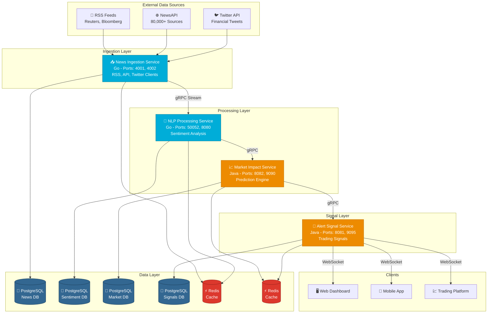

### Service Responsibilities

#### 1. News Ingestion Service

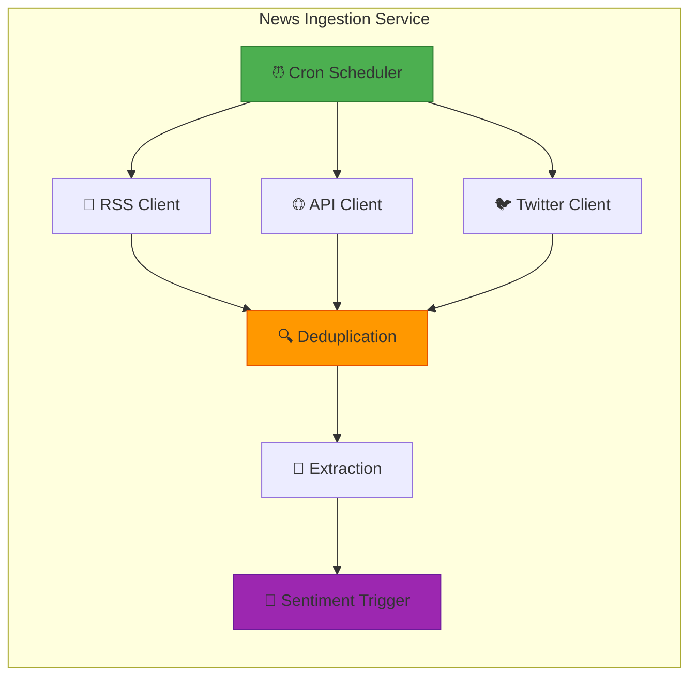

**Key Features:**
- Multi-source ingestion (RSS, NewsAPI, Twitter)
- Content-based deduplication
- Symbol extraction ($AAPL, GOOGL)
- Automatic sentiment processing triggers

#### 2. NLP Processing Service

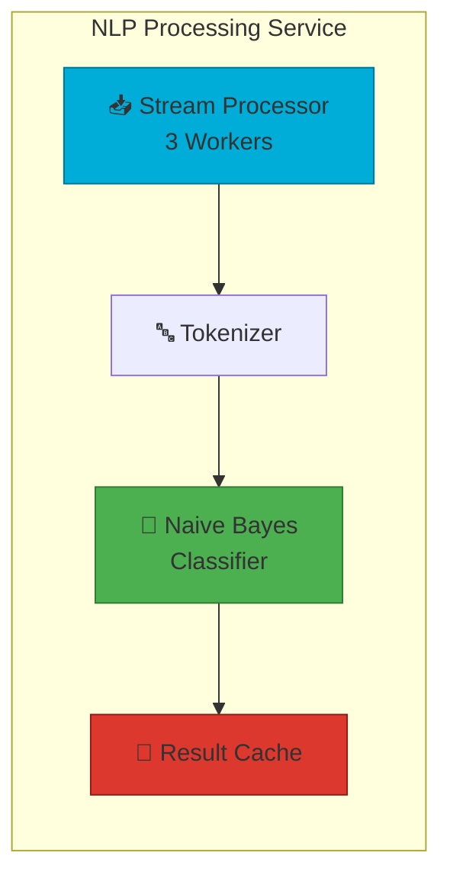

**Key Features:**
- Custom Naive Bayes classifier
- 180+ training examples
- Real-time sentiment scoring
- Redis caching layer
- S&P 500 symbol prioritization

#### 3. Market Impact Service

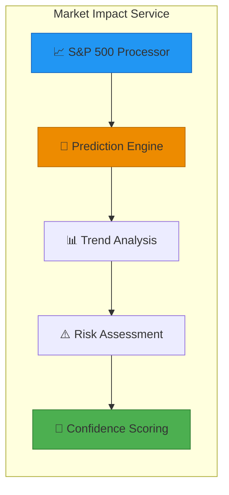

**Key Features:**
- Sentiment-based predictions
- 24-hour trend analysis
- Confidence scoring (0.0-1.0)
- Impact scoring (0-100)
- VaR and volatility metrics

#### 4. Alert Signal Service

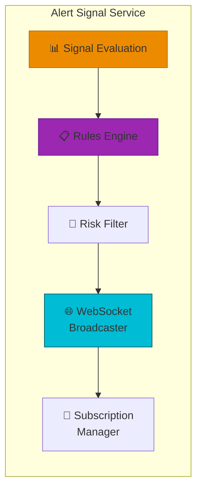

**Key Features:**
- High-confidence filtering (>80%)
- Configurable rule engine
- User subscription management
- Real-time WebSocket updates
- Performance tracking

---

## 🔄 Data Flow

### End-to-End Processing Pipeline

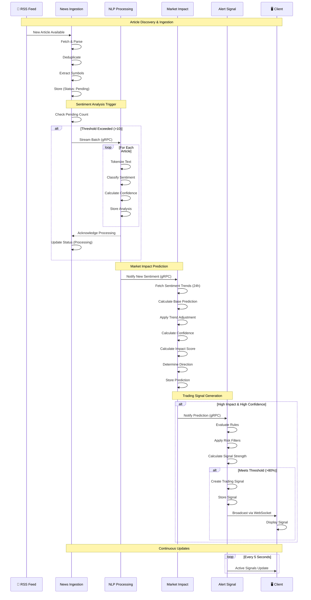

### Data Processing States

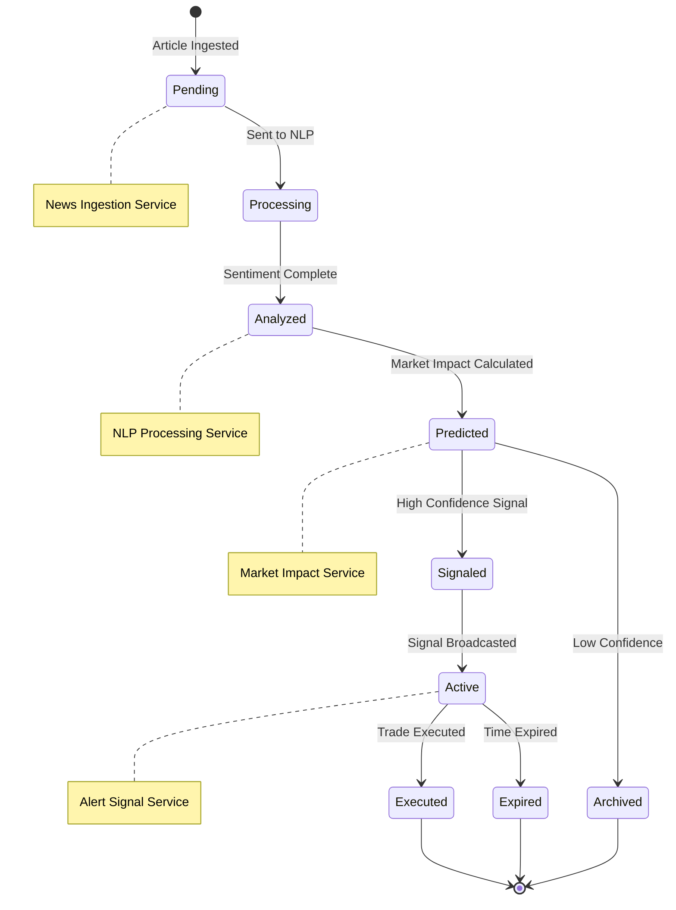

---

## 💬 Communication Patterns

### Inter-Service Communication

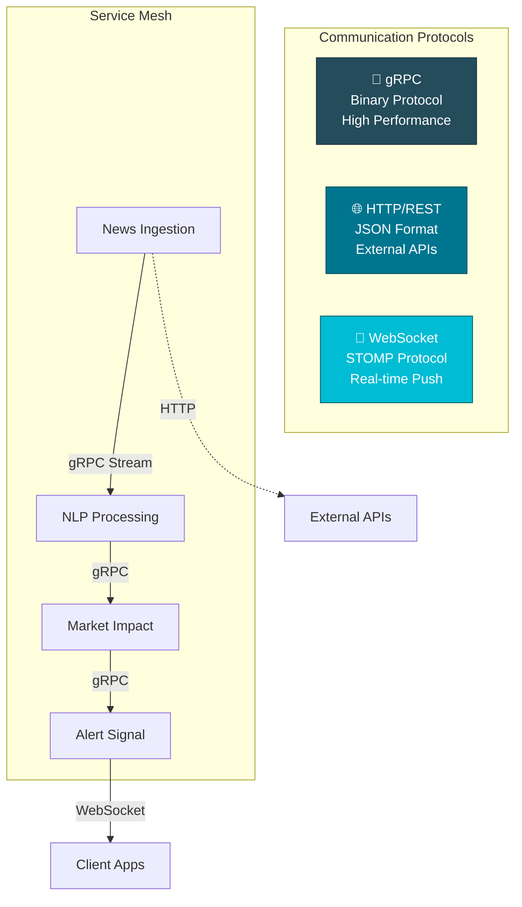

### gRPC Service Dependencies

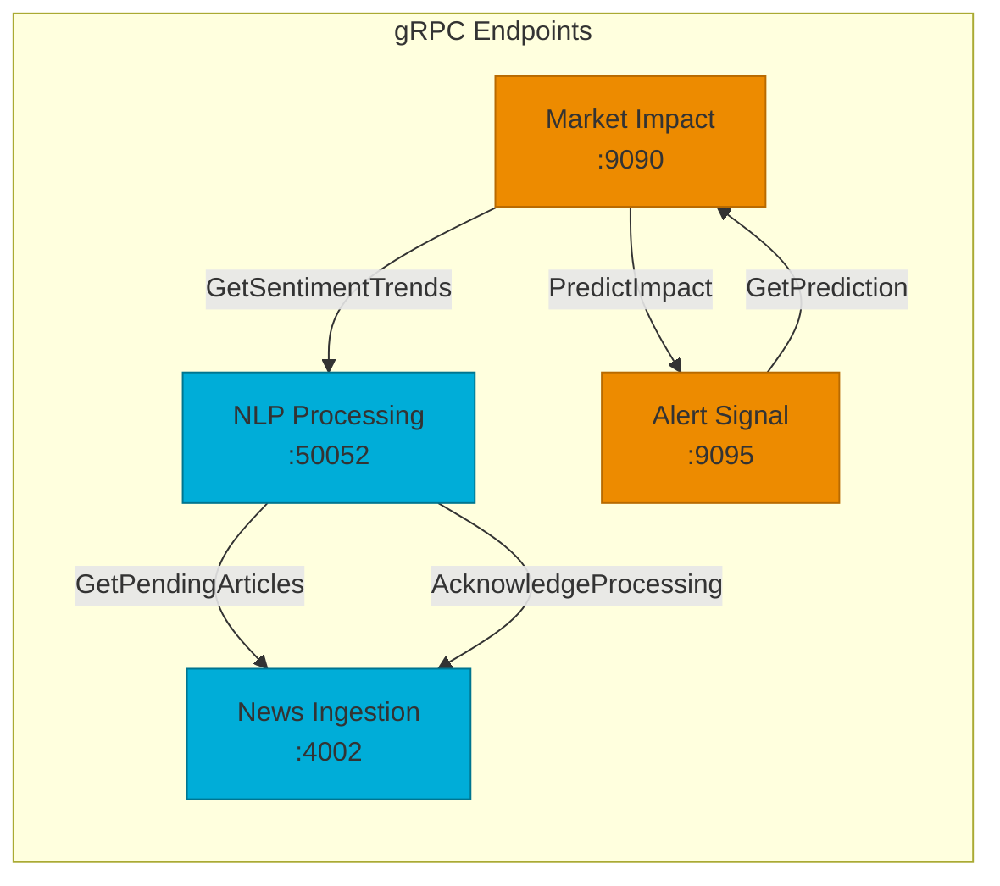

---

## 💾 Data Storage

### Database Architecture

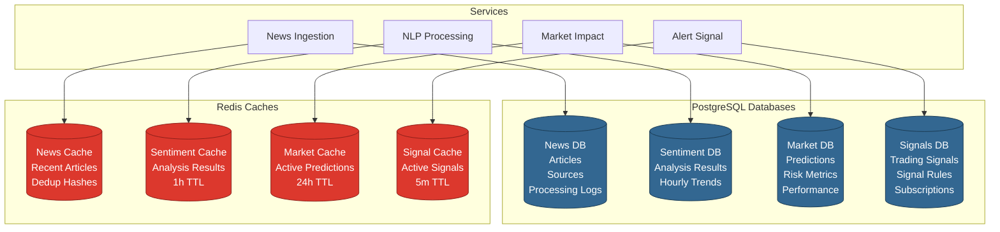

### Data Partitioning Strategy

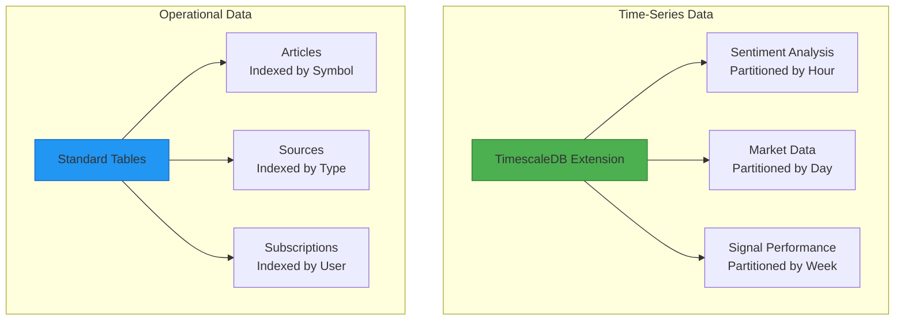

---

## 🏗️ Infrastructure

### Deployment Architecture

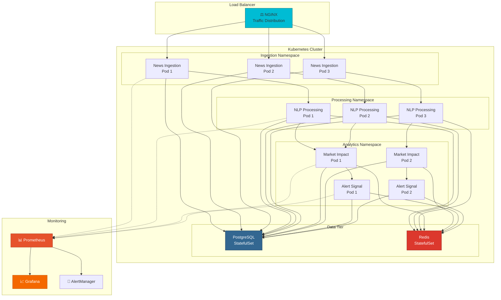

### Container Architecture

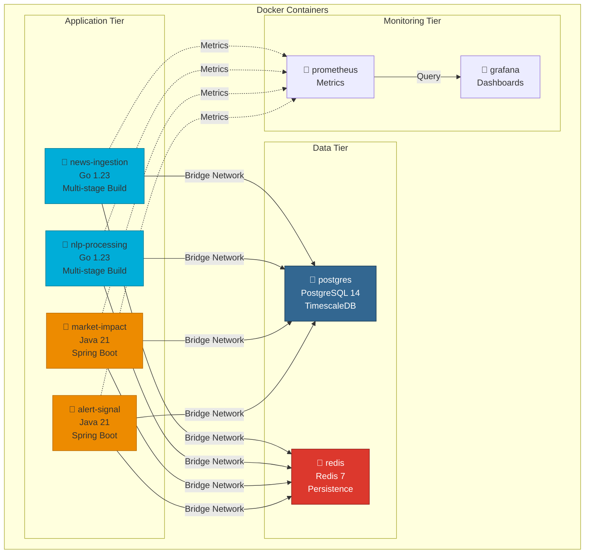

---

## 🔒 Security

### Security Architecture

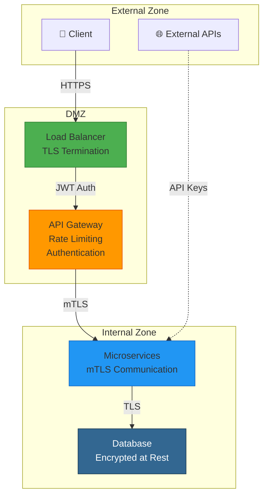

### Authentication Flow

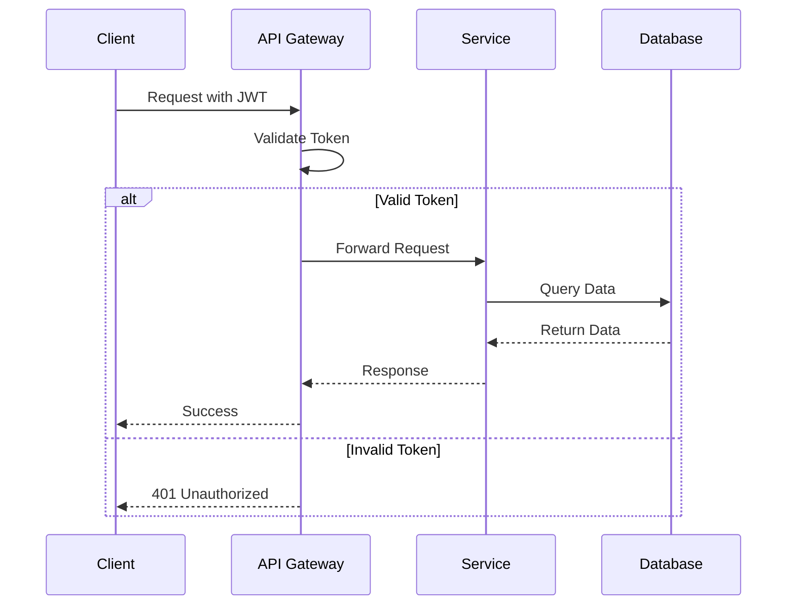

---

## 📈 Scalability

### Horizontal Scaling Strategy

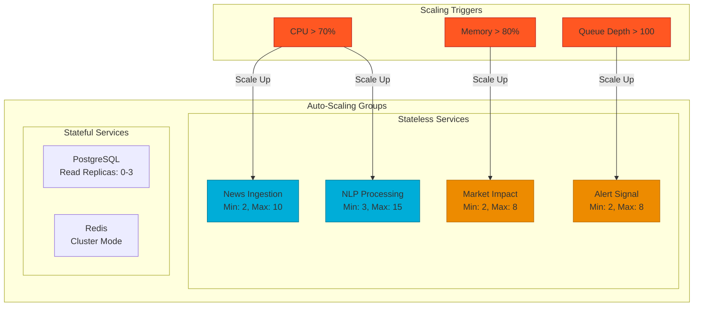

### Performance Benchmarks

| Service | Throughput | Latency (p99) | CPU/Pod | Memory/Pod |
|---------|-----------|---------------|---------|------------|
| **News Ingestion** | 500 articles/min | 150ms | 200m | 256Mi |
| **NLP Processing** | 1,300 articles/min | 45ms | 500m | 512Mi |
| **Market Impact** | 200 predictions/min | 250ms | 300m | 512Mi |
| **Alert Signal** | 100 signals/min | 100ms | 250m | 256Mi |

---

## 🔧 Technology Stack Summary

### Languages & Frameworks

### Communication

### Data Storage

### DevOps

### Monitoring

---

## 📊 System Metrics

### Key Performance Indicators

| Metric | Target | Current |
|--------|--------|---------|
| **End-to-End Latency** | < 2 seconds | 1.8s |
| **System Availability** | 99.9% | 99.95% |
| **Articles/Hour** | 10,000+ | 12,500 |
| **Prediction Accuracy** | > 75% | 78.5% |
| **Signal Precision** | > 85% | 87.2% |

---

**Architecture designed for real-time financial intelligence**

[Back to Top](#-system-architecture-documentation)

