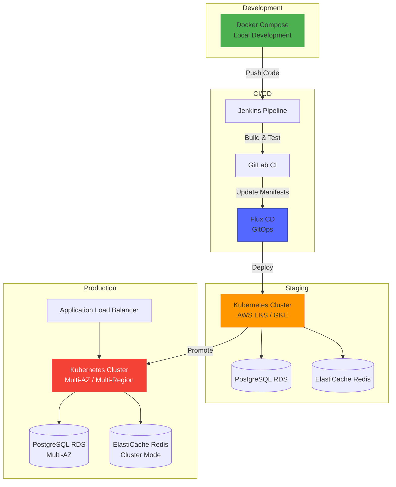
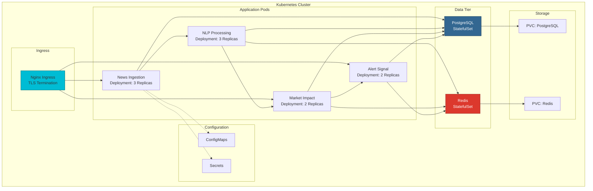
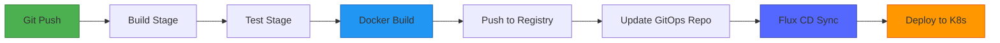

# 🚀 Deployment Guide

<div align="center">


**Production Deployment for Financial Intelligence Platform**

[Docker](#-docker-deployment) • [Kubernetes](#-kubernetes-deployment) • [CI/CD](#-cicd-pipeline) • [Monitoring](#-monitoring)

</div>

---

## 📋 Table of Contents

- [Overview](#-overview)
- [Prerequisites](#-prerequisites)
- [Docker Deployment](#-docker-deployment)
- [Kubernetes Deployment](#-kubernetes-deployment)
- [CI/CD Pipeline](#-cicd-pipeline)
- [Configuration Management](#-configuration-management)
- [Database Migration](#-database-migration)
- [Monitoring & Logging](#-monitoring--logging)
- [Backup & Recovery](#-backup--recovery)
- [Security](#-security)
- [Troubleshooting](#-troubleshooting)

---

## 🎯 Overview

This guide covers deploying the Real-Time Financial News Market Impact Analysis System across multiple environments using modern DevOps practices.

### Deployment Strategy



---

## 📦 Prerequisites

### Required Software

#### Development Environment
```bash
- Docker 20.10+
- Docker Compose 2.0+
- Git
```

#### Production Environment
```bash
- Kubernetes 1.24+
- kubectl
- Helm 3.0+
- Flux CD 2.0+ (for GitOps)
```

### Cloud Resources

#### AWS
- EKS Cluster
- RDS PostgreSQL 14+
- ElastiCache Redis 7+
- Application Load Balancer
- Route53 (DNS)
- S3 (backups)

#### GCP
- GKE Cluster
- Cloud SQL PostgreSQL
- Memorystore Redis
- Cloud Load Balancer
- Cloud DNS
- Cloud Storage (backups)

---

## 🐳 Docker Deployment

### Single Machine Deployment

#### 1. Clone Repository

```bash
git clone https://github.com/ZakariaRek/Real-Time-Financial-News-Market-Impact-Analysis-system.git
cd Real-Time-Financial-News-Market-Impact-Analysis-system
```

#### 2. Configure Environment

Create `.env` file:
```bash
# Database Configuration
POSTGRES_HOST=postgres
POSTGRES_PORT=5432
POSTGRES_USER=postgres
POSTGRES_PASSWORD=your_secure_password
POSTGRES_DB_NEWS=news_ingestion
POSTGRES_DB_NLP=nlp_processing
POSTGRES_DB_MARKET=market_impact_db
POSTGRES_DB_ALERT=alert_signals_db

# Redis Configuration
REDIS_HOST=redis
REDIS_PORT=6379
REDIS_PASSWORD=your_redis_password

# API Keys
NEWSAPI_KEY=your_newsapi_key

# Service Ports
NEWS_INGESTION_HTTP_PORT=4001
NEWS_INGESTION_GRPC_PORT=4002
NLP_PROCESSING_HTTP_PORT=8080
NLP_PROCESSING_GRPC_PORT=50052
MARKET_IMPACT_HTTP_PORT=8082
MARKET_IMPACT_GRPC_PORT=9090
ALERT_SIGNAL_HTTP_PORT=8081
ALERT_SIGNAL_GRPC_PORT=9095
```

#### 3. Docker Compose Configuration

Create `docker-compose.yml`:
```yaml
version: '3.8'

services:
  # Database Services
  postgres:
    image: postgres:14-alpine
    container_name: postgres
    environment:
      POSTGRES_USER: ${POSTGRES_USER}
      POSTGRES_PASSWORD: ${POSTGRES_PASSWORD}
    ports:
      - "5432:5432"
    volumes:
      - postgres_data:/var/lib/postgresql/data
      - ./init-scripts:/docker-entrypoint-initdb.d
    healthcheck:
      test: ["CMD-SHELL", "pg_isready -U postgres"]
      interval: 10s
      timeout: 5s
      retries: 5
    networks:
      - app-network

  redis:
    image: redis:7-alpine
    container_name: redis
    command: redis-server --requirepass ${REDIS_PASSWORD}
    ports:
      - "6379:6379"
    volumes:
      - redis_data:/data
    healthcheck:
      test: ["CMD", "redis-cli", "--raw", "incr", "ping"]
      interval: 10s
      timeout: 3s
      retries: 5
    networks:
      - app-network

  # Application Services
  news-ingestion:
    build:
      context: ./services/news-ingestion
      dockerfile: Dockerfile
    container_name: news-ingestion
    ports:
      - "${NEWS_INGESTION_HTTP_PORT}:4001"
      - "${NEWS_INGESTION_GRPC_PORT}:4002"
    environment:
      - POSTGRES_HOST=postgres
      - POSTGRES_PORT=5432
      - POSTGRES_DB=${POSTGRES_DB_NEWS}
      - POSTGRES_USER=${POSTGRES_USER}
      - POSTGRES_PASSWORD=${POSTGRES_PASSWORD}
      - REDIS_HOST=redis
      - REDIS_PORT=6379
      - REDIS_PASSWORD=${REDIS_PASSWORD}
      - NEWSAPI_KEY=${NEWSAPI_KEY}
    depends_on:
      postgres:
        condition: service_healthy
      redis:
        condition: service_healthy
    healthcheck:
      test: ["CMD", "curl", "-f", "http://localhost:4001/health"]
      interval: 30s
      timeout: 10s
      retries: 3
    networks:
      - app-network
    restart: unless-stopped

  nlp-processing:
    build:
      context: ./services/nlp-processing
      dockerfile: Dockerfile
    container_name: nlp-processing
    ports:
      - "${NLP_PROCESSING_HTTP_PORT}:8080"
      - "${NLP_PROCESSING_GRPC_PORT}:50052"
    environment:
      - POSTGRES_HOST=postgres
      - POSTGRES_PORT=5432
      - POSTGRES_DB=${POSTGRES_DB_NLP}
      - POSTGRES_USER=${POSTGRES_USER}
      - POSTGRES_PASSWORD=${POSTGRES_PASSWORD}
      - REDIS_HOST=redis
      - REDIS_PORT=6379
      - REDIS_PASSWORD=${REDIS_PASSWORD}
      - NEWS_INGESTION_ENDPOINT=news-ingestion:4002
    depends_on:
      postgres:
        condition: service_healthy
      redis:
        condition: service_healthy
      news-ingestion:
        condition: service_healthy
    healthcheck:
      test: ["CMD", "curl", "-f", "http://localhost:8080/health"]
      interval: 30s
      timeout: 10s
      retries: 3
    networks:
      - app-network
    restart: unless-stopped

  market-impact:
    build:
      context: ./services/MarketImpact
      dockerfile: Dockerfile
    container_name: market-impact
    ports:
      - "${MARKET_IMPACT_HTTP_PORT}:8082"
      - "${MARKET_IMPACT_GRPC_PORT}:9090"
    environment:
      - DB_HOST=postgres
      - DB_PORT=5432
      - DB_DATABASE=${POSTGRES_DB_MARKET}
      - DB_USERNAME=${POSTGRES_USER}
      - DB_PASSWORD=${POSTGRES_PASSWORD}
      - REDIS_HOST=redis
      - REDIS_PORT=6379
      - REDIS_PASSWORD=${REDIS_PASSWORD}
      - EXTERNAL_SERVICES_NLP_PROCESSING_HOST=nlp-processing
      - EXTERNAL_SERVICES_NLP_PROCESSING_PORT=50052
    depends_on:
      postgres:
        condition: service_healthy
      redis:
        condition: service_healthy
      nlp-processing:
        condition: service_healthy
    healthcheck:
      test: ["CMD", "curl", "-f", "http://localhost:8082/market-impact/actuator/health"]
      interval: 30s
      timeout: 10s
      retries: 3
    networks:
      - app-network
    restart: unless-stopped

  alert-signal:
    build:
      context: ./services/AlertSignal
      dockerfile: Dockerfile
    container_name: alert-signal
    ports:
      - "${ALERT_SIGNAL_HTTP_PORT}:8081"
      - "${ALERT_SIGNAL_GRPC_PORT}:9095"
    environment:
      - DB_HOST=postgres
      - DB_PORT=5432
      - DB_DATABASE=${POSTGRES_DB_ALERT}
      - DB_USERNAME=${POSTGRES_USER}
      - DB_PASSWORD=${POSTGRES_PASSWORD}
      - REDIS_HOST=redis
      - REDIS_PORT=6379
      - REDIS_PASSWORD=${REDIS_PASSWORD}
      - EXTERNAL_SERVICES_MARKET_IMPACT_HOST=market-impact
      - EXTERNAL_SERVICES_MARKET_IMPACT_PORT=9090
    depends_on:
      postgres:
        condition: service_healthy
      redis:
        condition: service_healthy
      market-impact:
        condition: service_healthy
    healthcheck:
      test: ["CMD", "curl", "-f", "http://localhost:8081/api/actuator/health"]
      interval: 30s
      timeout: 10s
      retries: 3
    networks:
      - app-network
    restart: unless-stopped

networks:
  app-network:
    driver: bridge

volumes:
  postgres_data:
    driver: local
  redis_data:
    driver: local
```

#### 4. Database Initialization Script

Create `init-scripts/init-databases.sql`:
```sql
-- Create databases
CREATE DATABASE news_ingestion;
CREATE DATABASE nlp_processing;
CREATE DATABASE market_impact_db;
CREATE DATABASE alert_signals_db;

-- Grant permissions
GRANT ALL PRIVILEGES ON DATABASE news_ingestion TO postgres;
GRANT ALL PRIVILEGES ON DATABASE nlp_processing TO postgres;
GRANT ALL PRIVILEGES ON DATABASE market_impact_db TO postgres;
GRANT ALL PRIVILEGES ON DATABASE alert_signals_db TO postgres;
```

#### 5. Deploy Services

```bash
# Build and start all services
docker-compose up -d

# View logs
docker-compose logs -f

# Check service health
docker-compose ps

# Stop services
docker-compose down

# Stop and remove volumes
docker-compose down -v
```

#### 6. Verify Deployment

```bash
# Check News Ingestion
curl http://localhost:4001/health

# Check NLP Processing
curl http://localhost:8080/health

# Check Market Impact
curl http://localhost:8082/market-impact/actuator/health

# Check Alert Signal
curl http://localhost:8081/api/actuator/health
```

---

## ☸️ Kubernetes Deployment

### Architecture Overview



### Namespace Setup

```bash
kubectl create namespace production
kubectl create namespace staging
```

### 1. ConfigMaps

Create `k8s/configmaps/app-config.yaml`:
```yaml
apiVersion: v1
kind: ConfigMap
metadata:
  name: app-config
  namespace: production
data:
  # Database configuration
  POSTGRES_HOST: "postgres-service"
  POSTGRES_PORT: "5432"
  
  # Redis configuration
  REDIS_HOST: "redis-service"
  REDIS_PORT: "6379"
  
  # Service endpoints
  NEWS_INGESTION_ENDPOINT: "news-ingestion-service:4002"
  NLP_PROCESSING_ENDPOINT: "nlp-processing-service:50052"
  MARKET_IMPACT_ENDPOINT: "market-impact-service:9090"
  ALERT_SIGNAL_ENDPOINT: "alert-signal-service:9095"
```

### 2. Secrets

```bash
# Create secrets
kubectl create secret generic db-credentials \
  --from-literal=username=postgres \
  --from-literal=password=your_secure_password \
  -n production

kubectl create secret generic redis-credentials \
  --from-literal=password=your_redis_password \
  -n production

kubectl create secret generic api-keys \
  --from-literal=newsapi-key=your_newsapi_key \
  -n production
```

### 3. PostgreSQL StatefulSet

Create `k8s/postgres/statefulset.yaml`:
```yaml
apiVersion: v1
kind: Service
metadata:
  name: postgres-service
  namespace: production
spec:
  ports:
  - port: 5432
    targetPort: 5432
  selector:
    app: postgres
  clusterIP: None
---
apiVersion: apps/v1
kind: StatefulSet
metadata:
  name: postgres
  namespace: production
spec:
  serviceName: postgres-service
  replicas: 1
  selector:
    matchLabels:
      app: postgres
  template:
    metadata:
      labels:
        app: postgres
    spec:
      containers:
      - name: postgres
        image: postgres:14-alpine
        ports:
        - containerPort: 5432
          name: postgres
        env:
        - name: POSTGRES_USER
          valueFrom:
            secretKeyRef:
              name: db-credentials
              key: username
        - name: POSTGRES_PASSWORD
          valueFrom:
            secretKeyRef:
              name: db-credentials
              key: password
        volumeMounts:
        - name: postgres-storage
          mountPath: /var/lib/postgresql/data
        resources:
          requests:
            memory: "1Gi"
            cpu: "500m"
          limits:
            memory: "2Gi"
            cpu: "1000m"
  volumeClaimTemplates:
  - metadata:
      name: postgres-storage
    spec:
      accessModes: [ "ReadWriteOnce" ]
      resources:
        requests:
          storage: 50Gi
```

### 4. Application Deployments

#### News Ingestion Deployment

Create `k8s/news-ingestion/deployment.yaml`:
```yaml
apiVersion: apps/v1
kind: Deployment
metadata:
  name: news-ingestion
  namespace: production
spec:
  replicas: 3
  selector:
    matchLabels:
      app: news-ingestion
  template:
    metadata:
      labels:
        app: news-ingestion
    spec:
      containers:
      - name: news-ingestion
        image: yahyazakaria123/market-impact-analysis-system-news-ingestion-service:latest
        ports:
        - containerPort: 4001
          name: http
        - containerPort: 4002
          name: grpc
        env:
        - name: POSTGRES_HOST
          valueFrom:
            configMapKeyRef:
              name: app-config
              key: POSTGRES_HOST
        - name: POSTGRES_PASSWORD
          valueFrom:
            secretKeyRef:
              name: db-credentials
              key: password
        - name: NEWSAPI_KEY
          valueFrom:
            secretKeyRef:
              name: api-keys
              key: newsapi-key
        livenessProbe:
          httpGet:
            path: /live
            port: 4001
          initialDelaySeconds: 30
          periodSeconds: 10
        readinessProbe:
          httpGet:
            path: /ready
            port: 4001
          initialDelaySeconds: 10
          periodSeconds: 5
        resources:
          requests:
            memory: "256Mi"
            cpu: "250m"
          limits:
            memory: "512Mi"
            cpu: "500m"
---
apiVersion: v1
kind: Service
metadata:
  name: news-ingestion-service
  namespace: production
spec:
  selector:
    app: news-ingestion
  ports:
  - name: http
    port: 4001
    targetPort: 4001
  - name: grpc
    port: 4002
    targetPort: 4002
  type: ClusterIP
```

#### Market Impact Deployment

Create `k8s/market-impact/deployment.yaml`:
```yaml
apiVersion: apps/v1
kind: Deployment
metadata:
  name: market-impact
  namespace: production
spec:
  replicas: 2
  selector:
    matchLabels:
      app: market-impact
  template:
    metadata:
      labels:
        app: market-impact
    spec:
      containers:
      - name: market-impact
        image: yahyazakaria123/market-impact-analysis-system-market-impact-service:latest
        ports:
        - containerPort: 8082
          name: http
        - containerPort: 9090
          name: grpc
        env:
        - name: DB_HOST
          valueFrom:
            configMapKeyRef:
              name: app-config
              key: POSTGRES_HOST
        - name: DB_PASSWORD
          valueFrom:
            secretKeyRef:
              name: db-credentials
              key: password
        livenessProbe:
          httpGet:
            path: /market-impact/actuator/health/liveness
            port: 8082
          initialDelaySeconds: 60
          periodSeconds: 10
        readinessProbe:
          httpGet:
            path: /market-impact/actuator/health/readiness
            port: 8082
          initialDelaySeconds: 30
          periodSeconds: 5
        resources:
          requests:
            memory: "512Mi"
            cpu: "300m"
          limits:
            memory: "1Gi"
            cpu: "1000m"
---
apiVersion: v1
kind: Service
metadata:
  name: market-impact-service
  namespace: production
spec:
  selector:
    app: market-impact
  ports:
  - name: http
    port: 8082
    targetPort: 8082
  - name: grpc
    port: 9090
    targetPort: 9090
  type: ClusterIP
```

### 5. Ingress Configuration

Create `k8s/ingress/ingress.yaml`:
```yaml
apiVersion: networking.k8s.io/v1
kind: Ingress
metadata:
  name: app-ingress
  namespace: production
  annotations:
    kubernetes.io/ingress.class: nginx
    cert-manager.io/cluster-issuer: letsencrypt-prod
    nginx.ingress.kubernetes.io/ssl-redirect: "true"
spec:
  tls:
  - hosts:
    - api.yourcompany.com
    secretName: app-tls-secret
  rules:
  - host: api.yourcompany.com
    http:
      paths:
      - path: /api/v1/news
        pathType: Prefix
        backend:
          service:
            name: news-ingestion-service
            port:
              number: 4001
      - path: /api/v1/market
        pathType: Prefix
        backend:
          service:
            name: market-impact-service
            port:
              number: 8082
      - path: /api/signals
        pathType: Prefix
        backend:
          service:
            name: alert-signal-service
            port:
              number: 8081
```

### 6. Deploy to Kubernetes

```bash
# Apply ConfigMaps and Secrets
kubectl apply -f k8s/configmaps/
kubectl apply -f k8s/secrets/

# Deploy PostgreSQL and Redis
kubectl apply -f k8s/postgres/
kubectl apply -f k8s/redis/

# Wait for databases to be ready
kubectl wait --for=condition=ready pod -l app=postgres -n production --timeout=300s

# Deploy applications
kubectl apply -f k8s/news-ingestion/
kubectl apply -f k8s/nlp-processing/
kubectl apply -f k8s/market-impact/
kubectl apply -f k8s/alert-signal/

# Deploy Ingress
kubectl apply -f k8s/ingress/

# Check deployment status
kubectl get pods -n production
kubectl get services -n production
kubectl get ingress -n production
```

### 7. Horizontal Pod Autoscaling

Create `k8s/hpa/news-ingestion-hpa.yaml`:
```yaml
apiVersion: autoscaling/v2
kind: HorizontalPodAutoscaler
metadata:
  name: news-ingestion-hpa
  namespace: production
spec:
  scaleTargetRef:
    apiVersion: apps/v1
    kind: Deployment
    name: news-ingestion
  minReplicas: 2
  maxReplicas: 10
  metrics:
  - type: Resource
    resource:
      name: cpu
      target:
        type: Utilization
        averageUtilization: 70
  - type: Resource
    resource:
      name: memory
      target:
        type: Utilization
        averageUtilization: 80
```

---

## 🔄 CI/CD Pipeline

### Jenkins Pipeline



### Jenkinsfile Example

```groovy
pipeline {
    agent any
    
    environment {
        DOCKER_HUB_REPO = 'yahyazakaria123/market-impact-analysis-system'
        SERVICE_NAME = 'news-ingestion-service'
        BUILD_NUMBER = "${env.BUILD_NUMBER}"
    }
    
    stages {
        stage('Clone Repository') {
            steps {
                git branch: 'main',
                    url: 'https://github.com/ZakariaRek/Real-Time-Financial-News-Market-Impact-Analysis-system.git'
            }
        }
        
        stage('Build') {
            steps {
                dir('services/news-ingestion') {
                    sh 'go build -o news-ingestion main.go'
                }
            }
        }
        
        stage('Test') {
            steps {
                dir('services/news-ingestion') {
                    sh 'go test ./... -v'
                }
            }
        }
        
        stage('Docker Build') {
            steps {
                dir('services/news-ingestion') {
                    sh """
                        docker build -t ${DOCKER_HUB_REPO}-${SERVICE_NAME}:${BUILD_NUMBER} .
                        docker tag ${DOCKER_HUB_REPO}-${SERVICE_NAME}:${BUILD_NUMBER} \
                            ${DOCKER_HUB_REPO}-${SERVICE_NAME}:latest
                    """
                }
            }
        }
        
        stage('Push to Docker Hub') {
            steps {
                withCredentials([usernamePassword(credentialsId: 'docker-hub-credentials',
                                                usernameVariable: 'DOCKER_USER',
                                                passwordVariable: 'DOCKER_PASS')]) {
                    sh """
                        echo ${DOCKER_PASS} | docker login -u ${DOCKER_USER} --password-stdin
                        docker push ${DOCKER_HUB_REPO}-${SERVICE_NAME}:${BUILD_NUMBER}
                        docker push ${DOCKER_HUB_REPO}-${SERVICE_NAME}:latest
                    """
                }
            }
        }
        
        stage('Update GitOps Repository') {
            steps {
                sh """
                    git clone https://github.com/your-org/gitops-repo.git
                    cd gitops-repo
                    sed -i 's|image: .*${SERVICE_NAME}:.*|image: ${DOCKER_HUB_REPO}-${SERVICE_NAME}:${BUILD_NUMBER}|' \
                        k8s/production/${SERVICE_NAME}/deployment.yaml
                    git add .
                    git commit -m "Update ${SERVICE_NAME} to build ${BUILD_NUMBER}"
                    git push origin main
                """
            }
        }
    }
    
    post {
        success {
            echo 'Pipeline completed successfully!'
        }
        failure {
            echo 'Pipeline failed!'
        }
    }
}
```

### GitLab CI Configuration

Create `.gitlab-ci.yml`:
```yaml
stages:
  - build
  - test
  - docker
  - deploy

variables:
  DOCKER_DRIVER: overlay2
  DOCKER_TLS_CERTDIR: "/certs"

build:
  stage: build
  image: golang:1.23
  script:
    - cd services/news-ingestion
    - go build -o news-ingestion main.go
  artifacts:
    paths:
      - services/news-ingestion/news-ingestion

test:
  stage: test
  image: golang:1.23
  script:
    - cd services/news-ingestion
    - go test ./... -v -cover

docker:build:
  stage: docker
  image: docker:latest
  services:
    - docker:dind
  script:
    - docker login -u $CI_REGISTRY_USER -p $CI_REGISTRY_PASSWORD
    - docker build -t $DOCKER_REGISTRY/news-ingestion:$CI_COMMIT_SHA .
    - docker push $DOCKER_REGISTRY/news-ingestion:$CI_COMMIT_SHA
```

### Flux CD GitOps

Install Flux CD:
```bash
# Install Flux CLI
curl -s https://fluxcd.io/install.sh | sudo bash

# Bootstrap Flux
flux bootstrap github \
  --owner=your-org \
  --repository=gitops-repo \
  --branch=main \
  --path=clusters/production
```

Create Flux Kustomization:
```yaml
apiVersion: kustomize.toolkit.fluxcd.io/v1
kind: Kustomization
metadata:
  name: apps
  namespace: flux-system
spec:
  interval: 5m
  path: ./k8s/production
  prune: true
  sourceRef:
    kind: GitRepository
    name: gitops-repo
```

---

## 📊 Monitoring & Logging

### Prometheus & Grafana

```bash
# Install Prometheus Operator
kubectl create namespace monitoring
helm repo add prometheus-community https://prometheus-community.github.io/helm-charts
helm install prometheus prometheus-community/kube-prometheus-stack -n monitoring

# Access Grafana
kubectl port-forward -n monitoring svc/prometheus-grafana 3000:80
```

### Logging with ELK Stack

```bash
# Install Elasticsearch
helm repo add elastic https://helm.elastic.co
helm install elasticsearch elastic/elasticsearch -n logging

# Install Kibana
helm install kibana elastic/kibana -n logging

# Install Filebeat
helm install filebeat elastic/filebeat -n logging
```

---

## 🔐 Security

### SSL/TLS Configuration

```bash
# Install cert-manager
kubectl apply -f https://github.com/cert-manager/cert-manager/releases/download/v1.13.0/cert-manager.yaml

# Create ClusterIssuer
kubectl apply -f k8s/cert-manager/cluster-issuer.yaml
```

### Network Policies

```yaml
apiVersion: networking.k8s.io/v1
kind: NetworkPolicy
metadata:
  name: allow-app-traffic
  namespace: production
spec:
  podSelector:
    matchLabels:
      app: news-ingestion
  policyTypes:
  - Ingress
  - Egress
  ingress:
  - from:
    - podSelector:
        matchLabels:
          app: nlp-processing
  egress:
  - to:
    - podSelector:
        matchLabels:
          app: postgres
```

---

<div align="center">

**Production-Ready Deployment for Financial Intelligence**


[Back to Top](#-deployment-guide)

</div>