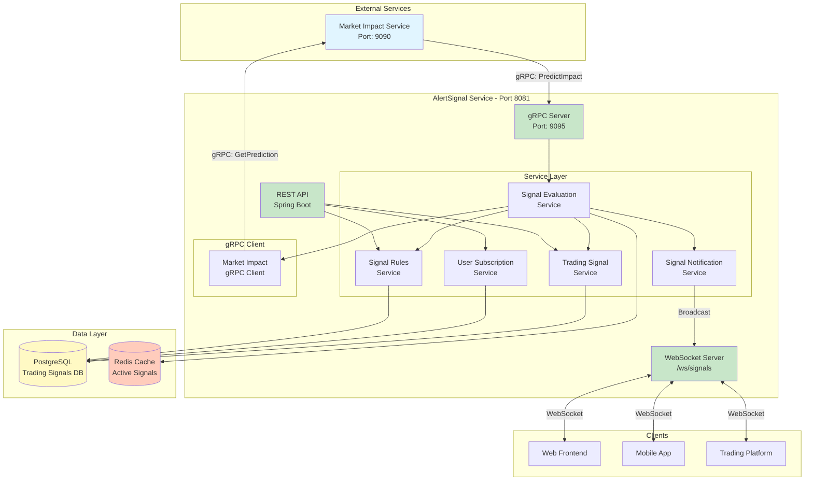
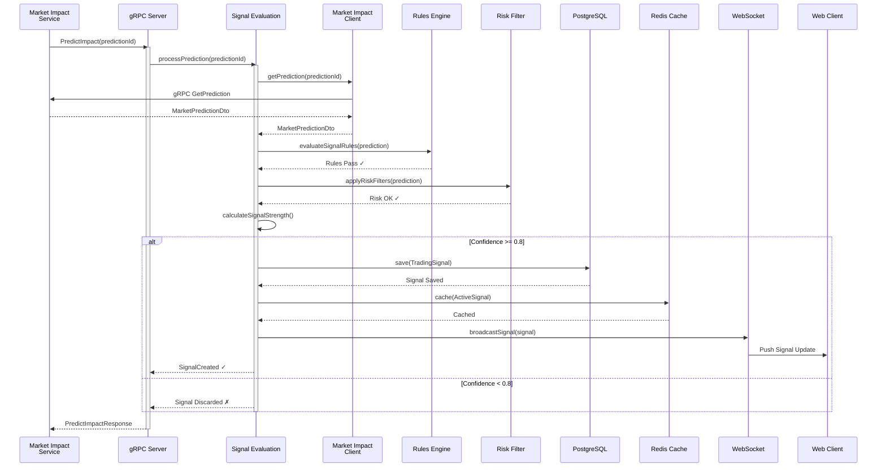
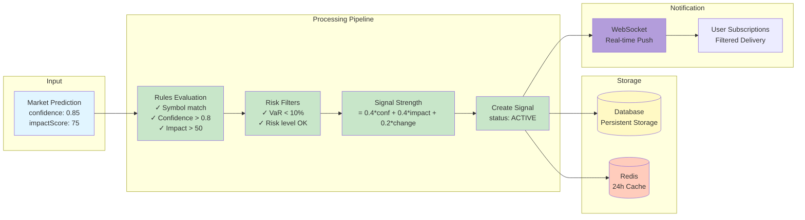
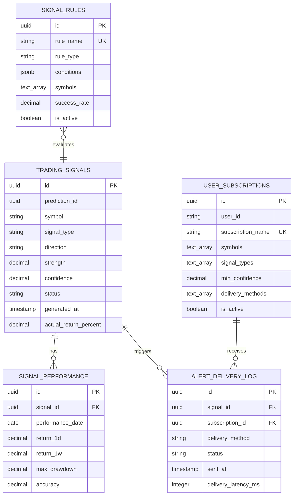

# 🚨 AlertSignal Service

<div align="center">


**Real-Time Financial Trading Signal Generation & Notification System**

[Features](#-features) • [Architecture](#-architecture) • [Quick Start](#-quick-start) • [API Documentation](#-api-documentation) • [Configuration](#-configuration)

</div>

---

## 📋 Table of Contents

- [Overview](#-overview)
- [Features](#-features)
- [Architecture](#-architecture)
- [Technology Stack](#-technology-stack)
- [Prerequisites](#-prerequisites)
- [Quick Start](#-quick-start)
- [Configuration](#-configuration)
- [API Documentation](#-api-documentation)
- [gRPC Services](#-grpc-services)
- [WebSocket Integration](#-websocket-integration)
- [Database Schema](#-database-schema)
- [Monitoring & Health Checks](#-monitoring--health-checks)
- [CI/CD Pipeline](#-cicd-pipeline)
- [Development](#-development)
- [Troubleshooting](#-troubleshooting)
- [Contributing](#-contributing)
- [License](#-license)

---

## 🎯 Overview

The **AlertSignal Service** is a critical component of the Real-Time Financial News Market Impact Analysis System. It receives market predictions from the MarketImpact service, evaluates them against configurable rules, and generates high-confidence trading signals that are broadcast to subscribers in real-time via WebSocket.

### Key Responsibilities

- 📊 **Signal Evaluation**: Analyze market predictions using rule-based filtering
- 🎯 **High-Confidence Detection**: Identify trading opportunities with confidence > 80%
- 🔔 **Real-Time Notifications**: Broadcast signals via WebSocket to connected clients
- 👥 **Subscription Management**: Handle user preferences for symbols, signal types, and delivery methods
- 📈 **Performance Tracking**: Monitor and record signal accuracy over time
- 📝 **Delivery Logging**: Track alert delivery status and latency metrics

---

## ✨ Features

### Core Features

- ⚡ **Real-Time Signal Generation**
    - Sub-second processing of incoming predictions
    - High-confidence threshold filtering (> 80%)
    - Risk-based signal validation

- 🔄 **WebSocket Broadcasting**
    - Live signal updates every 5 seconds
    - Per-symbol topic subscriptions
    - Automatic reconnection handling

- 📊 **Rule Engine**
    - Configurable signal rules (JSON-based conditions)
    - Symbol-specific rule sets
    - Success rate tracking

- 👤 **User Subscriptions**
    - Multi-symbol watchlists
    - Signal type filtering
    - Minimum confidence thresholds
    - Multiple delivery methods (WebSocket, Email, SMS)

- 📈 **Performance Analytics**
    - 1-day and 1-week return tracking
    - Accuracy metrics
    - Maximum drawdown calculation

- 🔍 **Comprehensive Logging**
    - Delivery status tracking
    - Latency monitoring
    - Success rate analysis

---

## 🏗 Architecture

### System Architecture



### Signal Processing Flow



### Data Flow Architecture



---

## 💻 Technology Stack

### Backend Framework
-  - Application framework
-  - Programming language
-  - Build tool

### Communication
-  - Inter-service communication
-  - Real-time client communication
-  - Serialization

### Data Storage
-  - Primary database
-  - Caching & session management

### Monitoring & Observability
-  - Metrics collection
-  - Health checks

### DevOps
-  - Containerization
-  - Continuous integration

---

## 📦 Prerequisites

### Required Software

- **Java Development Kit (JDK)**: 21 or higher
- **Maven**: 3.9 or higher
- **Docker**: 20.10+ and Docker Compose 2.0+
- **PostgreSQL**: 16+ (or use Docker)
- **Redis**: 7+ (or use Docker)

### Optional Tools

- **Git**: For version control
- **IntelliJ IDEA** / **Eclipse**: IDE with Spring Boot support
- **Postman** / **Insomnia**: API testing
- **BloomRPC** / **grpcurl**: gRPC testing

---

## 🚀 Quick Start

### 1. Clone the Repository

```bash
git clone https://github.com/ZakariaRek/Real-Time-Financial-News-Market-Impact-Analysis-system.git
cd Real-Time-Financial-News-Market-Impact-Analysis-system/services/AlertSignal
```

### 2. Set Up Environment Variables

Create a `.env` file in the project root:

```env
# Database Configuration
DB_HOST=localhost
DB_PORT=5432
DB_DATABASE=alert_signals_db
DB_SCHEMA=public
DB_USERNAME=postgres
DB_PASSWORD=your_password
DB_POOL_MAX_SIZE=20
DB_POOL_MIN_SIZE=5

# Redis Configuration
REDIS_HOST=localhost
REDIS_PORT=6379
REDIS_PASSWORD=
REDIS_DATABASE=3

# Server Configuration
SERVER_PORT=8081
GRPC_SERVER_PORT=9095

# External Services
EXTERNAL_SERVICES_MARKET_IMPACT_HOST=localhost
EXTERNAL_SERVICES_MARKET_IMPACT_PORT=9090
```

### 3. Start Dependencies with Docker Compose

```bash
docker-compose up -d postgres redis
```

**docker-compose.yml** (create this file):

```yaml
version: '3.8'

services:
  postgres:
    image: postgres:16-alpine
    container_name: alertsignal-postgres
    environment:
      POSTGRES_DB: alert_signals_db
      POSTGRES_USER: postgres
      POSTGRES_PASSWORD: your_password
    ports:
      - "5432:5432"
    volumes:
      - postgres_data:/var/lib/postgresql/data

  redis:
    image: redis:7-alpine
    container_name: alertsignal-redis
    ports:
      - "6379:6379"
    command: redis-server --appendonly yes
    volumes:
      - redis_data:/data

volumes:
  postgres_data:
  redis_data:
```

### 4. Build the Application

```bash
./mvnw clean package -DskipTests
```

### 5. Run the Application

```bash
./mvnw spring-boot:run
```

Or run the JAR directly:

```bash
java -jar target/AlertSignal-0.0.1-SNAPSHOT.jar
```

### 6. Verify the Application is Running

```bash
# Health check
curl http://localhost:8081/api/actuator/health

# Expected response:
# {"status":"UP"}
```

### 7. Access the Application

- **REST API**: http://localhost:8081/api
- **WebSocket**: ws://localhost:8081/ws/signals
- **Actuator**: http://localhost:8081/api/actuator
- **gRPC Server**: localhost:9095

---

## 🐳 Docker Deployment

### Build Docker Image

```bash
docker build -t alertsignal:latest .
```

### Run with Docker

```bash
docker run -d \
  --name alertsignal \
  -p 8081:8081 \
  -p 9095:9095 \
  -e DB_HOST=postgres \
  -e DB_PORT=5432 \
  -e DB_DATABASE=alert_signals_db \
  -e DB_USERNAME=postgres \
  -e DB_PASSWORD=your_password \
  -e REDIS_HOST=redis \
  -e REDIS_PORT=6379 \
  --network app-network \
  alertsignal:latest
```

### Docker Compose (Full Stack)

```bash
docker-compose up -d
```

---

## ⚙️ Configuration

### Application Configuration

The service is configured via `application.yaml`. Key configurations:

#### Database Configuration

```yaml
spring:
  datasource:
    url: jdbc:postgresql://${DB_HOST}:${DB_PORT}/${DB_DATABASE}
    username: ${DB_USERNAME}
    password: ${DB_PASSWORD}
    hikari:
      maximum-pool-size: 20
      minimum-idle: 5
```

#### Redis Configuration

```yaml
spring:
  data:
    redis:
      host: ${REDIS_HOST}
      port: ${REDIS_PORT}
      database: 3
      timeout: 2000ms
```

#### gRPC Configuration

```yaml
spring:
  grpc:
    server:
      port: 9095
    client:
      market-impact-service:
        address: 'static://localhost:9090'
        negotiationType: plaintext
```

#### Signal Evaluation Configuration

```yaml
app:
  signals:
    high-confidence-threshold: 0.8
    min-impact-score: 50.0
    cache-ttl-hours: 24
    websocket-update-interval: 5000
```

---

## 📚 API Documentation

### REST Endpoints

#### Signal Query Endpoints

##### Get Active Signals
```http
GET /api/signals/active
```

**Response:**
```json
{
  "success": true,
  "message": "Operation completed successfully",
  "data": [
    {
      "id": "123e4567-e89b-12d3-a456-426614174000",
      "predictionId": "987e6543-e21b-12d3-a456-426614174000",
      "symbol": "AAPL",
      "signalType": "PREDICTION_BASED",
      "direction": "UP",
      "strength": 0.85,
      "confidence": 0.92,
      "status": "ACTIVE",
      "generatedAt": "2025-10-28 14:30:00"
    }
  ],
  "timestamp": "2025-10-28 14:35:00"
}
```

##### Get Signals by Symbol
```http
GET /api/signals/symbol/{symbol}?status=ACTIVE
```

**Parameters:**
- `symbol` (path): Stock symbol (e.g., AAPL, TSLA)
- `status` (query, optional): Filter by status (ACTIVE, INACTIVE, EXECUTED, EXPIRED)

##### Get Signal by ID
```http
GET /api/signals/{id}
```

##### Get High-Confidence Signals
```http
GET /api/signals/high-confidence?minConfidence=0.8
```

##### Get Signal Performance
```http
GET /api/signals/performance/signal/{signalId}
```

**Response:**
```json
{
  "success": true,
  "data": [
    {
      "id": "perf-123",
      "signalId": "signal-456",
      "performanceDate": "2025-10-28",
      "return1d": 2.35,
      "return1w": 5.67,
      "maxDrawdown": -1.23,
      "accuracy": 0.89
    }
  ]
}
```

#### User Subscription Endpoints

##### Create Subscription
```http
POST /api/user-subscriptions
Content-Type: application/json

{
  "userId": "user123",
  "subscriptionName": "My Trading Alerts",
  "symbols": ["AAPL", "TSLA", "MSFT"],
  "signalTypes": ["PREDICTION_BASED"],
  "minConfidence": 0.85,
  "deliveryMethods": ["WEBSOCKET", "EMAIL"],
  "isActive": true
}
```

##### Get User Subscriptions
```http
GET /api/user-subscriptions/user/{userId}
```

##### Get Active Subscriptions by Symbol
```http
GET /api/user-subscriptions/symbol/{symbol}
```

#### Signal Rules Endpoints

##### Create Rule
```http
POST /api/signal-rules
Content-Type: application/json

{
  "ruleName": "High Impact Apple Signals",
  "ruleType": "CONFIDENCE_THRESHOLD",
  "conditions": "{\"minConfidence\":0.8,\"minImpactScore\":50.0,\"requiredDirection\":\"UP\"}",
  "symbols": ["AAPL"],
  "successRate": 0.75,
  "isActive": true
}
```

##### Get Active Rules
```http
GET /api/signal-rules/active
```

##### Get Rules by Symbol
```http
GET /api/signal-rules/active/symbol/{symbol}
```

---

## 🔌 gRPC Services

### Signal Processing Service

The service exposes gRPC endpoints for receiving predictions from the Market Impact Service.

#### PredictImpact

**Request:**
```protobuf
message PredictImpactRequest {
  string prediction_id = 1;
  string symbol = 2;
  double confidence = 3;
  double impact_score = 4;
}
```

**Response:**
```protobuf
message PredictImpactResponse {
  bool success = 1;
  string signal_id = 2;
  string message = 3;
  double confidence = 4;
  double strength = 5;
}
```

**Example (grpcurl):**
```bash
grpcurl -plaintext \
  -d '{
    "prediction_id": "123e4567-e89b-12d3-a456-426614174000",
    "symbol": "AAPL",
    "confidence": 0.92,
    "impact_score": 75.5
  }' \
  localhost:9095 \
  com.alert_signals.SignalProcessingService/PredictImpact
```

### Trading Signal Service

#### CreateSignal

```bash
grpcurl -plaintext \
  -d '{
    "prediction_id": "pred-123",
    "symbol": "AAPL",
    "signal_type": "PREDICTION_BASED",
    "direction": "UP",
    "strength": 0.85,
    "confidence": 0.92,
    "status": "ACTIVE"
  }' \
  localhost:9095 \
  com.alert_signals.grpc.TradingSignalGrpcService/CreateSignal
```

#### GetSignal

```bash
grpcurl -plaintext \
  -d '{"id": "signal-123"}' \
  localhost:9095 \
  com.alert_signals.grpc.TradingSignalGrpcService/GetSignal
```

---

## 🌐 WebSocket Integration

### Connect to WebSocket

#### Using JavaScript/TypeScript

```javascript
import SockJS from 'sockjs-client';
import { Stomp } from '@stomp/stompjs';

// Create WebSocket connection
const socket = new SockJS('http://localhost:8081/ws/signals');
const stompClient = Stomp.over(socket);

// Connect
stompClient.connect({}, (frame) => {
  console.log('Connected: ' + frame);
  
  // Subscribe to all signals
  stompClient.subscribe('/topic/signals', (message) => {
    const signal = JSON.parse(message.body);
    console.log('New signal received:', signal);
    // Handle signal update
    updateUI(signal);
  });
  
  // Subscribe to specific symbol
  stompClient.subscribe('/topic/signals/AAPL', (message) => {
    const signal = JSON.parse(message.body);
    console.log('AAPL signal:', signal);
  });
  
  // Subscribe to periodic updates
  stompClient.subscribe('/topic/signals/updates', (message) => {
    const signals = JSON.parse(message.body);
    console.log('Active signals update:', signals);
  });
});

// Send message to request signal details
stompClient.send('/app/signals/details', {}, 
  JSON.stringify({ signalId: 'signal-123' })
);
```

#### Using React

```tsx
import { useEffect, useState } from 'react';
import SockJS from 'sockjs-client';
import { Stomp } from '@stomp/stompjs';

function SignalDashboard() {
  const [signals, setSignals] = useState([]);
  
  useEffect(() => {
    const socket = new SockJS('http://localhost:8081/ws/signals');
    const client = Stomp.over(socket);
    
    client.connect({}, () => {
      client.subscribe('/topic/signals', (message) => {
        const newSignal = JSON.parse(message.body);
        setSignals(prev => [newSignal, ...prev]);
      });
    });
    
    return () => {
      if (client.connected) {
        client.disconnect();
      }
    };
  }, []);
  
  return (
    <div>
      <h1>Live Trading Signals</h1>
      {signals.map(signal => (
        <SignalCard key={signal.signalId} signal={signal} />
      ))}
    </div>
  );
}
```

### WebSocket Message Format

#### Signal Notification
```json
{
  "signalId": "123e4567-e89b-12d3-a456-426614174000",
  "predictionId": "987e6543-e21b-12d3-a456-426614174000",
  "symbol": "AAPL",
  "signalType": "PREDICTION_BASED",
  "direction": "UP",
  "confidence": 0.92,
  "strength": 0.85,
  "triggeredRule": "High-Confidence Prediction",
  "timestamp": "2025-10-28T14:30:00"
}
```

### WebSocket Topics

| Topic | Description | Update Frequency |
|-------|-------------|------------------|
| `/topic/signals` | All new signals | Real-time |
| `/topic/signals/{symbol}` | Symbol-specific signals | Real-time |
| `/topic/signals/updates` | Active signals snapshot | Every 5 seconds |
| `/queue/signal-details` | Signal detail responses | On-demand |

---

## 🗄️ Database Schema

### Entity Relationship Diagram



### Table Descriptions

#### trading_signals
Stores all generated trading signals.

| Column | Type | Description |
|--------|------|-------------|
| id | UUID | Primary key |
| prediction_id | UUID | Reference to market prediction |
| symbol | VARCHAR(10) | Stock ticker symbol |
| signal_type | VARCHAR(50) | Type of signal |
| direction | VARCHAR(10) | UP, DOWN, or HOLD |
| strength | DECIMAL(10,4) | Signal strength (0-1) |
| confidence | DECIMAL(10,4) | Confidence level (0-1) |
| status | VARCHAR(20) | ACTIVE, INACTIVE, EXECUTED, EXPIRED |
| generated_at | TIMESTAMP | Creation timestamp |
| actual_return_percent | DECIMAL(10,4) | Actual return after execution |

#### signal_rules
Configurable rules for signal generation.

| Column | Type | Description |
|--------|------|-------------|
| id | UUID | Primary key |
| rule_name | VARCHAR(100) | Unique rule name |
| rule_type | VARCHAR(50) | Type of rule |
| conditions | JSONB | Rule conditions in JSON format |
| symbols | TEXT[] | Applicable symbols |
| success_rate | DECIMAL(10,4) | Historical success rate |
| is_active | BOOLEAN | Rule activation status |

**Example conditions JSON:**
```json
{
  "minConfidence": 0.8,
  "minImpactScore": 50.0,
  "requiredDirection": "UP"
}
```

---

## 📊 Monitoring & Health Checks

### Actuator Endpoints

| Endpoint | Description |
|----------|-------------|
| `/api/actuator/health` | Overall health status |
| `/api/actuator/health/liveness` | Kubernetes liveness probe |
| `/api/actuator/health/readiness` | Kubernetes readiness probe |
| `/api/actuator/metrics` | Application metrics |
| `/api/actuator/prometheus` | Prometheus metrics |
| `/api/actuator/info` | Application information |

### Health Check Examples

```bash
# Basic health check
curl http://localhost:8081/api/actuator/health

# Detailed health with components
curl http://localhost:8081/api/actuator/health | jq

# Liveness probe
curl http://localhost:8081/api/actuator/health/liveness

# Readiness probe
curl http://localhost:8081/api/actuator/health/readiness
```

### Prometheus Metrics

Key metrics exposed:

- `http_server_requests_seconds` - HTTP request duration
- `jvm_memory_used_bytes` - JVM memory usage
- `jvm_threads_live` - Active thread count
- `process_cpu_usage` - CPU usage
- `hikaricp_connections_active` - Active DB connections
- `redis_commands_duration_seconds` - Redis command latency

**Scrape Configuration (prometheus.yml):**
```yaml
scrape_configs:
  - job_name: 'alertsignal'
    metrics_path: '/api/actuator/prometheus'
    static_configs:
      - targets: ['localhost:8081']
```

---

## 🔄 CI/CD Pipeline


**Pipeline Stages:**

1. **Test** - Run unit tests
2. **Build** - Compile JAR
3. **Docker** - Build and push image
4. **GitOps** - Update Helm values

### Jenkins Pipeline

```groovy
pipeline {
    agent any
    stages {
        stage('Build') {
            steps {
                sh 'mvnw.cmd clean package -DskipTests'
            }
        }
        stage('Docker Build') {
            steps {
                sh 'docker build -t alertsignal:${BUILD_NUMBER} .'
            }
        }
        stage('Push to Registry') {
            steps {
                sh 'docker push alertsignal:${BUILD_NUMBER}'
            }
        }
        stage('Update GitOps') {
            steps {
                sh 'update-helm-values.sh ${BUILD_NUMBER}'
            }
        }
    }
}
```

---

## 👨‍💻 Development

### Project Structure

```
services/AlertSignal/
├── src/
│   ├── main/
│   │   ├── java/com/alert_signals/AlertSignal/
│   │   │   ├── client/              # gRPC clients
│   │   │   │   └── MarketImpactClient.java
│   │   │   ├── config/              # Configuration classes
│   │   │   │   ├── RedisConfig.java
│   │   │   │   └── WebSocketConfig.java
│   │   │   ├── controller/          # REST controllers
│   │   │   │   ├── SignalQueryController.java
│   │   │   │   ├── SignalWebSocketController.java
│   │   │   │   └── TradingSignalController.java
│   │   │   ├── dto/                 # Data Transfer Objects
│   │   │   ├── entity/              # JPA entities
│   │   │   ├── grpc/                # gRPC service implementations
│   │   │   │   ├── SignalProcessingGrpcServiceImpl.java
│   │   │   │   └── TradingSignalGrpcServiceImpl.java
│   │   │   ├── mapper/              # Entity-DTO mappers
│   │   │   ├── repository/          # JPA repositories
│   │   │   └── service/             # Business logic
│   │   │       ├── SignalEvaluationService.java
│   │   │       ├── SignalNotificationService.java
│   │   │       └── TradingSignalService.java
│   │   ├── proto/                   # Protocol Buffer definitions
│   │   │   ├── SignalProcessing.proto
│   │   │   ├── TradingSignalGrpcService.proto
│   │   │   └── market_prediction_client.proto
│   │   └── resources/
│   │       └── application.yaml
│   └── test/                        # Unit and integration tests
├── Dockerfile
├── docker-compose.yml
├── pom.xml
└── README.md
```

### Code Style Guidelines

- Follow **Java Code Conventions**
- Use **Lombok** for boilerplate reduction
- Write **Javadoc** for public APIs
- Maintain **80% test coverage**
- Use **Slf4j** for logging

### Adding a New Signal Rule

1. **Create Rule via API:**
```bash
curl -X POST http://localhost:8081/api/signal-rules \
  -H "Content-Type: application/json" \
  -d '{
    "ruleName": "My Custom Rule",
    "ruleType": "CUSTOM",
    "conditions": "{\"minConfidence\":0.9}",
    "symbols": ["AAPL"],
    "successRate": 0.0,
    "isActive": true
  }'
```

2. **Verify Rule:**
```bash
curl http://localhost:8081/api/signal-rules/active
```

### Logging

The service uses structured logging:

```java
@Slf4j
public class SignalEvaluationService {
    public TradingSignal processPrediction(UUID predictionId) {
        log.info("Processing prediction: {}", predictionId);
        // ... processing logic
        log.info("High-confidence signal created: {}", signal.getId());
    }
}
```

**Log Levels:**
- `DEBUG` - Detailed debugging information
- `INFO` - General information
- `WARN` - Warning messages
- `ERROR` - Error messages with stack traces

---

## 🧪 Testing

### Run All Tests

```bash
./mvnw test
```

### Run Specific Test Class

```bash
./mvnw test -Dtest=SignalEvaluationServiceTest
```

### Integration Tests

```bash
./mvnw verify
```

### Test Coverage

```bash
./mvnw jacoco:report
```

View report at: `target/site/jacoco/index.html`

### Manual Testing

#### Test gRPC Endpoint

```bash
grpcurl -plaintext \
  -d '{
    "prediction_id": "test-123",
    "symbol": "AAPL",
    "confidence": 0.95,
    "impact_score": 80.0
  }' \
  localhost:9095 \
  com.alert_signals.SignalProcessingService/PredictImpact
```

#### Test WebSocket

```javascript
// Open browser console on http://localhost:8081
const socket = new SockJS('http://localhost:8081/ws/signals');
const client = Stomp.over(socket);
client.connect({}, () => {
  client.subscribe('/topic/signals', (msg) => {
    console.log('Received:', JSON.parse(msg.body));
  });
});
```

---

## 🔧 Troubleshooting

### Common Issues

#### 1. Application Won't Start

**Symptoms:**
```
Failed to connect to database
```

**Solutions:**
- Check PostgreSQL is running: `docker ps | grep postgres`
- Verify credentials in `.env` file
- Check database exists: `psql -U postgres -l`

#### 2. gRPC Connection Failed

**Symptoms:**
```
UNAVAILABLE: io exception
```

**Solutions:**
- Verify Market Impact Service is running on port 9090
- Check network connectivity
- Review gRPC client configuration in `application.yaml`

#### 3. WebSocket Connection Fails

**Symptoms:**
```
WebSocket connection failed
```

**Solutions:**
- Check CORS configuration in `WebSocketConfig`
- Verify SockJS endpoint: `/ws/signals`
- Check browser console for errors

#### 4. Redis Connection Error

**Symptoms:**
```
Unable to connect to Redis
```

**Solutions:**
- Start Redis: `docker start alertsignal-redis`
- Check Redis port: `redis-cli ping`
- Verify Redis configuration in `application.yaml`

### Debug Mode

Enable debug logging:

```yaml
logging:
  level:
    com.alert_signals.AlertSignal: DEBUG
    io.grpc: DEBUG
```

### Health Check Troubleshooting

```bash
# Check all health indicators
curl http://localhost:8081/api/actuator/health | jq

# Check database connection
curl http://localhost:8081/api/actuator/health/db | jq

# Check Redis connection
curl http://localhost:8081/api/actuator/health/redis | jq
```

---

## 🤝 Contributing

We welcome contributions! Please follow these guidelines:

1. **Fork the repository**
2. **Create a feature branch**
   ```bash
   git checkout -b feature/amazing-feature
   ```
3. **Commit your changes**
   ```bash
   git commit -m 'Add amazing feature'
   ```
4. **Push to the branch**
   ```bash
   git push origin feature/amazing-feature
   ```
5. **Open a Pull Request**

### Code Review Process

- All PRs require at least one approval
- CI/CD pipeline must pass
- Code coverage should not decrease
- Update documentation as needed

---

## 📄 License

This project is licensed under the MIT License - see the [LICENSE](LICENSE) file for details.

---


---

## 🙏 Acknowledgments

- Spring Boot Team for the excellent framework
- gRPC Team for high-performance RPC
- PostgreSQL Community
- Redis Team

---

<div align="center">

Made with ❤️ by the AlertSignal Team

**⭐ Star us on GitHub — it motivates us a lot!**

[Report Bug](https://github.com/ZakariaRek/Real-Time-Financial-News-Market-Impact-Analysis-system/issues) • [Request Feature](https://github.com/ZakariaRek/Real-Time-Financial-News-Market-Impact-Analysis-system/issues)

</div>
