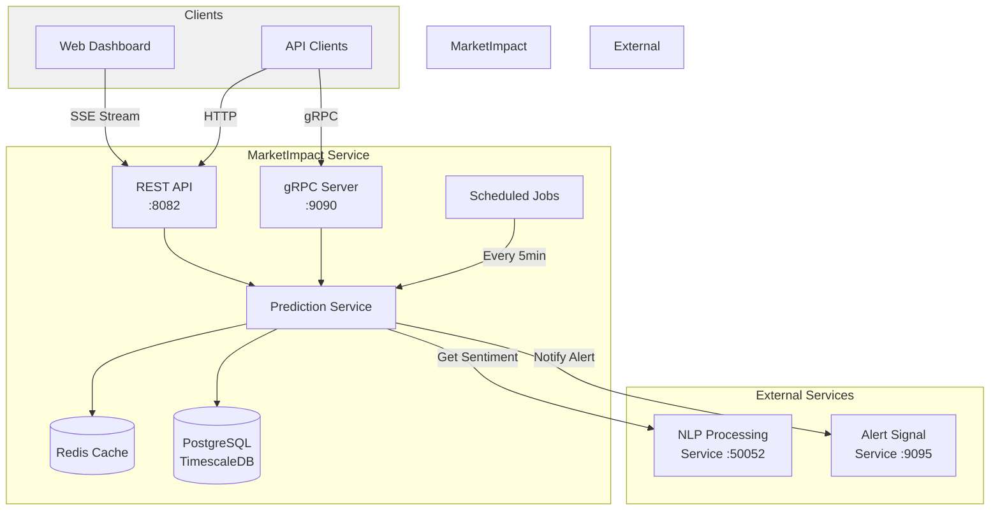
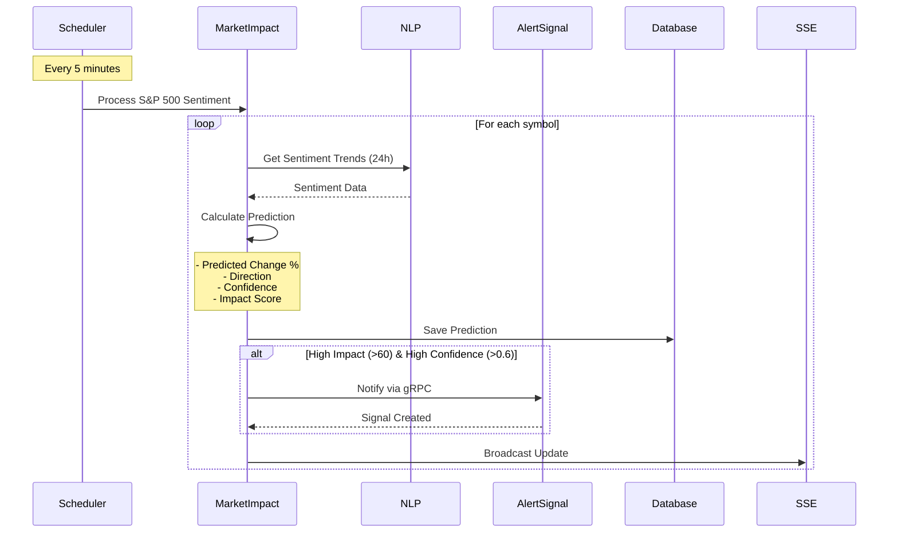
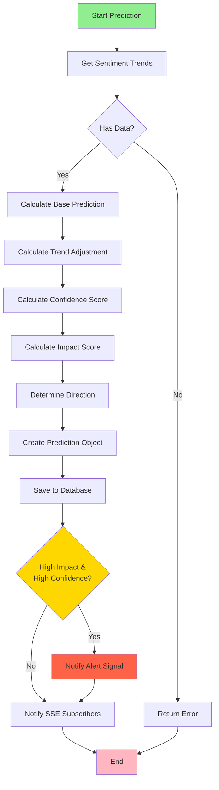
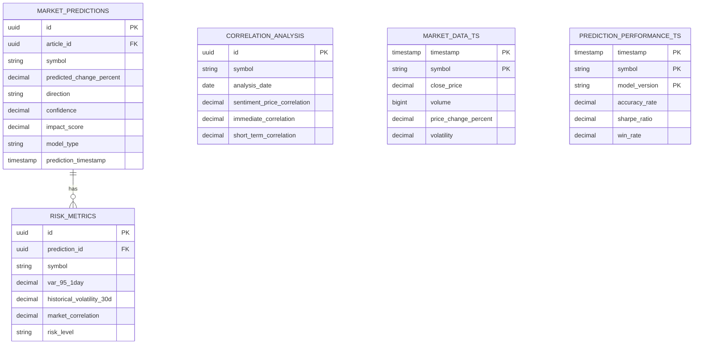

# 📈 MarketImpact Service

<div align="center">


**Real-Time Financial News Market Impact Analysis System**

[Features](#-features) •
[Architecture](#-architecture) •
[Installation](#-installation) •
[API Documentation](#-api-documentation) •
[Configuration](#%EF%B8%8F-configuration)

</div>

---

## 📋 Table of Contents

- [Overview](#-overview)
- [Features](#-features)
- [Architecture](#-architecture)
- [Tech Stack](#-tech-stack)
- [Installation](#-installation)
- [Configuration](#%EF%B8%8F-configuration)
- [API Documentation](#-api-documentation)
- [Usage Examples](#-usage-examples)
- [Monitoring](#-monitoring)
- [Development](#-development)
- [Deployment](#-deployment)

---

## 🎯 Overview

**MarketImpact** is a sophisticated microservice that analyzes financial news sentiment and generates market impact predictions for S&P 500 stocks. It processes sentiment data in real-time, generates predictions with confidence scores, and sends alerts for high-impact events.

### Key Capabilities

- 🔮 **Predictive Analytics**: Generates market predictions based on sentiment analysis
- 📊 **S&P 500 Coverage**: Monitors top 50 S&P 500 stocks
- ⚡ **Real-time Processing**: Scheduled sentiment processing every 5 minutes
- 🎯 **Risk Assessment**: Calculates risk metrics and confidence scores
- 🔔 **Alert Integration**: Notifies Alert Signal service for high-impact predictions
- 📡 **Server-Sent Events**: Real-time prediction updates via SSE

---

## ✨ Features

### Core Functionalities

| Feature | Description |
|---------|-------------|
| **Sentiment-Based Predictions** | Converts sentiment analysis into market impact predictions |
| **Trend Analysis** | Analyzes 24-hour sentiment trends for prediction generation |
| **Confidence Scoring** | Calculates prediction confidence (0.0 to 1.0) |
| **Impact Scoring** | Measures potential market impact (0 to 100) |
| **Direction Classification** | Predicts UP, DOWN, or NEUTRAL market movement |
| **Risk Metrics** | Value at Risk (VaR), volatility, and correlation analysis |
| **Batch Processing** | Handles multiple predictions concurrently |
| **gRPC Communication** | High-performance inter-service communication |
| **REST APIs** | HTTP endpoints for external integration |
| **SSE Streaming** | Real-time updates for market predictions |

### Prediction Models

- **SENTIMENT_BASED_v1.0**: Article-specific sentiment predictions
- **SENTIMENT_TREND_v1.0**: Aggregate trend-based predictions

---

## 🏗 Architecture

### System Architecture



### Service Flow



### Prediction Algorithm Flow



### Data Model



---

## 🛠 Tech Stack

### Core Technologies

| Technology | Version | Purpose |
|------------|---------|---------|
|  | 21 | Runtime Environment |
|  | 3.5.6 | Application Framework |
|  | Latest | Primary Database |
|  | Latest | Caching Layer |

### Key Dependencies

```xml
<!-- gRPC Communication -->
<dependency>
    <groupId>io.grpc</groupId>
    <artifactId>grpc-services</artifactId>
    <version>1.74.0</version>
</dependency>

<!-- Spring gRPC -->
<dependency>
    <groupId>org.springframework.grpc</groupId>
    <artifactId>spring-grpc-server-spring-boot-starter</artifactId>
    <version>0.11.0</version>
</dependency>

<!-- Monitoring -->
<dependency>
    <groupId>io.micrometer</groupId>
    <artifactId>micrometer-registry-prometheus</artifactId>
</dependency>
```

---

## 🚀 Installation

### Prerequisites

- ☕ **Java 21** or higher
- 🐳 **Docker** and Docker Compose
- 📦 **Maven 3.9+**
- 🗄️ **PostgreSQL 14+** (or use Docker)
- 🔴 **Redis 7+** (or use Docker)

### Local Development Setup

#### 1. Clone the Repository

```bash
git clone <repository-url>
cd services/MarketImpact
```

#### 2. Configure Environment Variables

Create `.env` file:

```bash
# Database Configuration
DB_HOST=localhost
DB_PORT=5432
DB_DATABASE=market_impact_db
DB_USERNAME=postgres
DB_PASSWORD=your_password
DB_SCHEMA=public

# Redis Configuration
REDIS_HOST=localhost
REDIS_PORT=6379
REDIS_PASSWORD=
REDIS_DATABASE=2

# External Services
EXTERNAL_SERVICES_NLP_PROCESSING_HOST=localhost
EXTERNAL_SERVICES_NLP_PROCESSING_PORT=50052
EXTERNAL_SERVICES_ALERT_SIGNAL_HOST=localhost
EXTERNAL_SERVICES_ALERT_SIGNAL_PORT=9095

# Server Configuration
SERVER_PORT=8082
GRPC_SERVER_PORT=9090
```

#### 3. Build the Application

```bash
# Build with Maven
./mvnw clean package -DskipTests

# Or on Windows
mvnw.cmd clean package -DskipTests
```

#### 4. Run with Docker Compose

```bash
# Start all services
docker-compose up -d

# View logs
docker-compose logs -f market-impact
```

#### 5. Run Locally (Without Docker)

```bash
# Start the application
./mvnw spring-boot:run

# Or run the JAR
java -jar target/MarketImpact-0.0.1-SNAPSHOT.jar
```

### Docker Build

```bash
# Build Docker image
docker build -t market-impact:latest .

# Run container
docker run -p 8082:8082 -p 9090:9090 \
  -e DB_HOST=postgres \
  -e DB_PORT=5432 \
  market-impact:latest
```

---

## ⚙️ Configuration

### Application Configuration (`application.yaml`)

#### Database Settings

```yaml
spring:
  datasource:
    url: jdbc:postgresql://${DB_HOST}:${DB_PORT}/${DB_DATABASE}
    username: ${DB_USERNAME}
    password: ${DB_PASSWORD}
    hikari:
      maximum-pool-size: 20
      minimum-idle: 5
```

#### gRPC Configuration

```yaml
spring:
  grpc:
    server:
      port: 9090
      max-inbound-message-size: 4MB
      keep-alive-time: 30s
```

#### External Services

```yaml
external:
  services:
    nlp-processing:
      host: ${EXTERNAL_SERVICES_NLP_PROCESSING_HOST:localhost}
      port: ${EXTERNAL_SERVICES_NLP_PROCESSING_PORT:50052}
    alert-signal:
      host: ${EXTERNAL_SERVICES_ALERT_SIGNAL_HOST:localhost}
      port: ${EXTERNAL_SERVICES_ALERT_SIGNAL_PORT:9095}
```

#### S&P 500 Configuration

```yaml
market-impact:
  sp500:
    symbols:
      - AAPL
      - MSFT
      - GOOGL
      # ... more symbols
    batch-size: 10
    max-concurrent: 5
```

---

## 📡 API Documentation

### REST API Endpoints

#### Base URL
```
http://localhost:8082/market-impact
```

### Market Impact Endpoints

#### 1. Generate Prediction

**POST** `/api/v1/market-impact/predict`

Generate prediction for a specific article or based on trends.

**Request Body:**
```json
{
  "articleId": "550e8400-e29b-41d4-a716-446655440000",
  "symbol": "AAPL"
}
```

**Response:**
```json
{
  "id": "660e8400-e29b-41d4-a716-446655440001",
  "articleId": "550e8400-e29b-41d4-a716-446655440000",
  "symbol": "AAPL",
  "predictedChangePercent": 2.45,
  "direction": "UP",
  "confidence": 0.85,
  "impactScore": 72.5,
  "modelType": "SENTIMENT_BASED_v1.0",
  "predictionTimestamp": "2025-10-28T14:30:00"
}
```

#### 2. Generate Prediction from Trends

**POST** `/api/v1/market-impact/predict/trends`

Generate prediction based on sentiment trends only (no article required).

**Request Body:**
```json
{
  "symbol": "TSLA",
  "hoursBack": 24
}
```

#### 3. Test Prediction

**POST** `/api/v1/market-impact/predict/test?symbol=AAPL`

Create a test prediction with mock data.

#### 4. High Confidence Test

**POST** `/api/v1/market-impact/predict/test-high?symbol=AAPL&confidence=0.85&impactScore=75`

Create a high-confidence test prediction (triggers Alert Signal).

#### 5. Get S&P 500 Market Impact

**GET** `/api/v1/sp500/market-impact`

Get current market impact for all tracked S&P 500 stocks.

**Response:**
```json
[
  {
    "symbol": "AAPL",
    "predictedChangePercent": 2.45,
    "direction": "UP",
    "confidence": 0.85,
    "impactScore": 72.5,
    "modelType": "SENTIMENT_BASED_v1.0",
    "timestamp": "2025-10-28T14:30:00"
  }
]
```

#### 6. Get Top Movers

**GET** `/api/v1/sp500/market-impact/top-movers?limit=20`

Get stocks with highest impact scores.

#### 7. Get Market Sentiment Summary

**GET** `/api/v1/sp500/market-impact/summary`

**Response:**
```json
{
  "timestamp": "2025-10-28T14:30:00",
  "totalStocks": 50,
  "bullishCount": 28,
  "bearishCount": 15,
  "neutralCount": 7,
  "bullishPercentage": 56.0,
  "bearishPercentage": 30.0,
  "averageImpactScore": 45.2,
  "averageConfidence": 0.72,
  "marketSentiment": "BULLISH"
}
```

#### 8. Real-time Stream (SSE)

**GET** `/api/v1/sp500/market-impact/stream`

Server-Sent Events endpoint for real-time prediction updates.

**Example (JavaScript):**
```javascript
const eventSource = new EventSource('http://localhost:8082/market-impact/api/v1/sp500/market-impact/stream');

eventSource.addEventListener('prediction-update', (event) => {
  const prediction = JSON.parse(event.data);
  console.log('New prediction:', prediction);
});

eventSource.addEventListener('market-summary', (event) => {
  const summary = JSON.parse(event.data);
  console.log('Market summary:', summary);
});
```

### Market Prediction CRUD Endpoints

#### Get Prediction by ID

**GET** `/api/v1/market-predictions/{id}`

#### Get Predictions by Symbol

**GET** `/api/v1/market-predictions/symbol/{symbol}`

#### Get Recent Predictions

**GET** `/api/v1/market-predictions/recent?hours=24`

#### Get High Confidence Predictions

**GET** `/api/v1/market-predictions/high-confidence?minConfidence=0.8`

#### Get Latest Prediction for Symbol

**GET** `/api/v1/market-predictions/symbol/{symbol}/latest`

### gRPC API

#### Service Definition

```protobuf
service MarketPredictionService {
  rpc CreatePrediction(CreateMarketPredictionRequest) returns (MarketPrediction);
  rpc GetPrediction(GetMarketPredictionRequest) returns (GetMarketPredictionResponse);
  rpc GetPredictionsBySymbol(GetPredictionsBySymbolRequest) returns (GetPredictionsBySymbolResponse);
  rpc GetRecentPredictions(GetRecentPredictionsRequest) returns (GetRecentPredictionsResponse);
}
```

---

## 💡 Usage Examples

### cURL Examples

#### Generate Prediction
```bash
curl -X POST http://localhost:8082/market-impact/api/v1/market-impact/predict \
  -H "Content-Type: application/json" \
  -d '{
    "symbol": "AAPL"
  }'
```

#### Generate Test Prediction
```bash
curl -X POST "http://localhost:8082/market-impact/api/v1/market-impact/predict/test?symbol=TSLA"
```

#### Get Market Summary
```bash
curl http://localhost:8082/market-impact/api/v1/sp500/market-impact/summary
```

### Python Example

```python
import requests
import json

# Generate prediction
url = "http://localhost:8082/market-impact/api/v1/market-impact/predict"
payload = {
    "symbol": "AAPL"
}
response = requests.post(url, json=payload)
prediction = response.json()

print(f"Prediction for {prediction['symbol']}:")
print(f"  Direction: {prediction['direction']}")
print(f"  Confidence: {prediction['confidence']}")
print(f"  Impact Score: {prediction['impactScore']}")
```

### Java Client Example

```java
// gRPC Client
ManagedChannel channel = ManagedChannelBuilder
    .forAddress("localhost", 9090)
    .usePlaintext()
    .build();

MarketPredictionServiceGrpc.MarketPredictionServiceBlockingStub stub = 
    MarketPredictionServiceGrpc.newBlockingStub(channel);

GetLatestPredictionRequest request = GetLatestPredictionRequest.newBuilder()
    .setSymbol("AAPL")
    .build();

GetLatestPredictionResponse response = stub.getLatestPrediction(request);
System.out.println("Latest prediction: " + response.getPrediction());
```

---

## 📊 Monitoring

### Health Checks

```bash
# Application health
curl http://localhost:8082/market-impact/actuator/health

# Readiness probe
curl http://localhost:8082/market-impact/actuator/health/readiness

# Liveness probe
curl http://localhost:8082/market-impact/actuator/health/liveness
```

### Prometheus Metrics

```bash
# Metrics endpoint
curl http://localhost:8082/market-impact/actuator/prometheus
```

### Available Metrics

- `http_server_requests_seconds` - HTTP request duration
- `grpc_server_calls_total` - gRPC call count
- `jvm_memory_used_bytes` - JVM memory usage
- `jdbc_connections_active` - Active database connections
- `redis_commands_total` - Redis command count

### Logging

Log levels can be configured via environment variables:

```yaml
logging:
  level:
    root: INFO
    com.market_impact.MarketImpact: DEBUG
    io.grpc: INFO
```

---

## 🔧 Development

### Project Structure

```
services/MarketImpact/
├── src/
│   ├── main/
│   │   ├── java/
│   │   │   └── com/market_impact/MarketImpact/
│   │   │       ├── Config/              # Configuration classes
│   │   │       ├── Repositories/        # Data access layer
│   │   │       ├── Services/            # Business logic
│   │   │       ├── controller/          # REST controllers
│   │   │       ├── grpc/               # gRPC services
│   │   │       ├── entity/             # JPA entities
│   │   │       ├── dto/                # Data transfer objects
│   │   │       ├── client/             # External service clients
│   │   │       ├── scheduler/          # Scheduled jobs
│   │   │       └── Mappers/            # Entity-DTO mappers
│   │   ├── proto/                      # Protocol buffer definitions
│   │   └── resources/
│   │       └── application.yaml        # Application configuration
│   └── test/
├── Dockerfile                          # Docker image definition
├── Jenkinsfile                        # CI/CD pipeline
├── pom.xml                            # Maven dependencies
└── README.md                          # This file
```

### Running Tests

```bash
# Run all tests
./mvnw test

# Run specific test class
./mvnw test -Dtest=MarketPredictionServiceTest

# Run with coverage
./mvnw clean verify
```

### Code Style

This project follows:
- ☕ Java Code Conventions
- 🔧 Google Java Style Guide
- 📝 Lombok for reducing boilerplate

---

## 🚢 Deployment

### Docker Deployment

```bash
# Build image
docker build -t market-impact:latest .

# Run container
docker run -d \
  --name market-impact \
  -p 8082:8082 \
  -p 9090:9090 \
  -e DB_HOST=postgres \
  -e REDIS_HOST=redis \
  market-impact:latest
```

### Kubernetes Deployment

```yaml
apiVersion: apps/v1
kind: Deployment
metadata:
  name: market-impact
spec:
  replicas: 3
  selector:
    matchLabels:
      app: market-impact
  template:
    metadata:
      labels:
        app: market-impact
    spec:
      containers:
      - name: market-impact
        image: market-impact:latest
        ports:
        - containerPort: 8082
          name: http
        - containerPort: 9090
          name: grpc
        env:
        - name: DB_HOST
          value: "postgres-service"
        - name: REDIS_HOST
          value: "redis-service"
        livenessProbe:
          httpGet:
            path: /market-impact/actuator/health/liveness
            port: 8082
          initialDelaySeconds: 60
        readinessProbe:
          httpGet:
            path: /market-impact/actuator/health/readiness
            port: 8082
          initialDelaySeconds: 30
```

### CI/CD Pipeline (Jenkins)

The service includes a complete Jenkinsfile for automated builds and deployments:

1. **Clone Repository**
2. **Build with Maven**
3. **Build Docker Image**
4. **Push to Docker Hub**
5. **Update GitOps Repository**
6. **Create Pull Request**

---

## 📝 Environment Variables Reference

| Variable | Description | Default |
|----------|-------------|---------|
| `DB_HOST` | PostgreSQL host | `localhost` |
| `DB_PORT` | PostgreSQL port | `5432` |
| `DB_DATABASE` | Database name | - |
| `DB_USERNAME` | Database username | - |
| `DB_PASSWORD` | Database password | - |
| `DB_SCHEMA` | Database schema | `public` |
| `REDIS_HOST` | Redis host | `localhost` |
| `REDIS_PORT` | Redis port | `6379` |
| `REDIS_PASSWORD` | Redis password | - |
| `REDIS_DATABASE` | Redis database number | `2` |
| `SERVER_PORT` | HTTP server port | `8082` |
| `GRPC_SERVER_PORT` | gRPC server port | `9090` |
| `EXTERNAL_SERVICES_NLP_PROCESSING_HOST` | NLP service host | `localhost` |
| `EXTERNAL_SERVICES_NLP_PROCESSING_PORT` | NLP service port | `50052` |
| `EXTERNAL_SERVICES_ALERT_SIGNAL_HOST` | Alert service host | `localhost` |
| `EXTERNAL_SERVICES_ALERT_SIGNAL_PORT` | Alert service port | `9095` |

---

## 🤝 Contributing

1. Fork the repository
2. Create a feature branch (`git checkout -b feature/amazing-feature`)
3. Commit your changes (`git commit -m 'Add amazing feature'`)
4. Push to the branch (`git push origin feature/amazing-feature`)
5. Open a Pull Request

---

## 📄 License

This project is part of the Real-Time Financial News Market Impact Analysis System.

---


---

## 🙏 Acknowledgments

- Spring Boot Team for the excellent framework
- gRPC Team for high-performance RPC
- PostgreSQL and Redis communities

---

<div align="center">

**Built with ❤️ using Spring Boot and gRPC**

⭐ Star this repository if you find it helpful!

</div>
