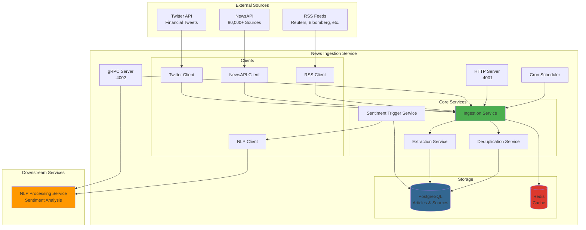
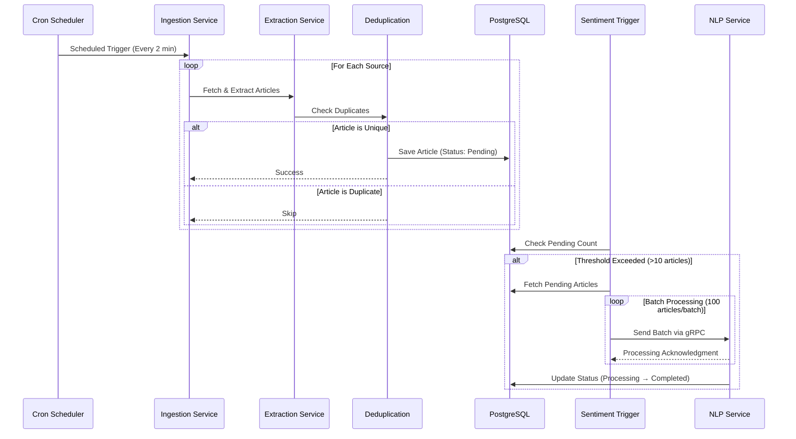

# 📰 News Ingestion Service

<div align="center">


**Real-Time Financial News Ingestion & Processing Pipeline**

[Features](#-features) • [Quick Start](#-quick-start) • [API Docs](#-api-documentation) • [Architecture](#-architecture) • [Configuration](#-configuration)

</div>

---

## 📋 Table of Contents

- [Overview](#-overview)
- [Features](#-features)
- [Architecture](#-architecture)
- [Tech Stack](#-tech-stack)
- [Getting Started](#-getting-started)
- [API Documentation](#-api-documentation)
- [Configuration](#-configuration)
- [Development](#-development)
- [Deployment](#-deployment)
- [Testing](#-testing)
- [Contributing](#-contributing)
- [License](#-license)

---

## 🎯 Overview

The **News Ingestion Service** is a core component of the Real-Time Financial News Market Impact Analysis System. It handles the automated collection, processing, and storage of financial news from multiple sources including RSS feeds, NewsAPI, and Twitter.

### Key Capabilities

- 🔄 **Multi-Source Ingestion**: RSS, NewsAPI, Twitter integration
- 🔍 **Intelligent Deduplication**: Content-based duplicate detection
- 🎯 **Symbol Extraction**: Automatic stock ticker identification
- 📊 **Relevance Scoring**: Article importance calculation
- 🚀 **Real-time Processing**: Streaming gRPC APIs
- 🧠 **NLP Integration**: Seamless connection to sentiment analysis
- ⚡ **High Performance**: Batch processing and concurrent ingestion
- 🔐 **Production Ready**: Health checks, metrics, graceful shutdown

---

## ✨ Features

### Ingestion Capabilities

- ✅ **RSS Feed Parsing**: Support for major financial news sources
- ✅ **NewsAPI Integration**: Access to 80,000+ news sources
- ✅ **Twitter Monitoring**: Real-time social media tracking
- ✅ **Scheduled Ingestion**: Cron-based automatic updates
- ✅ **Manual Triggers**: On-demand ingestion via HTTP/gRPC
- ✅ **Rate Limiting**: Per-source request throttling

### Data Processing

- ✅ **Content Extraction**: Title, content, author, metadata
- ✅ **Symbol Recognition**: $AAPL, GOOGL, TSLA detection
- ✅ **Keyword Extraction**: Financial term identification
- ✅ **Relevance Scoring**: Article importance metrics
- ✅ **Deduplication**: Hash-based and similarity detection
- ✅ **Content Validation**: Length and quality checks

### Integration

- ✅ **gRPC Streaming**: Real-time article streaming to NLP service
- ✅ **HTTP REST API**: Traditional RESTful endpoints
- ✅ **Batch Processing**: Efficient bulk operations
- ✅ **Acknowledgment System**: Processing confirmation tracking
- ✅ **Sentiment Triggers**: Automatic NLP processing triggers

### Observability

- ✅ **Health Checks**: Liveness and readiness probes
- ✅ **Metrics Endpoint**: Service statistics
- ✅ **Structured Logging**: JSON/text format support
- ✅ **Processing Logs**: Detailed audit trail
- ✅ **Error Tracking**: Comprehensive error reporting

---

## 🏗️ Architecture

### System Overview



### Data Flow Pipeline



### Database Schema


---

## 🛠️ Tech Stack

<div align="center">

### Core Technologies

| Technology | Purpose | Version |
|------------|---------|---------|
|  | Backend Language | 1.23.0 |
|  | RPC Framework | Latest |
|  | Database | 14 |
|  | Cache | 7 |
|  | Containerization | Latest |

### Frameworks & Libraries

| Library | Purpose |
|---------|---------|
| **Gin** | HTTP Web Framework |
| **GORM** | ORM for PostgreSQL |
| **Viper** | Configuration Management |
| **Logrus** | Structured Logging |
| **Cron** | Job Scheduling |
| **Protocol Buffers** | API Serialization |

### External Integrations

| Service | Purpose |
|---------|---------|
| **NewsAPI** | 80,000+ News Sources |
| **RSS Feeds** | Direct Feed Parsing |
| **Twitter API** | Social Media Monitoring |

</div>

---

## 🚀 Getting Started

### Prerequisites

```bash
# Required
- Go 1.23+
- PostgreSQL 14+
- Redis 7+
- Docker & Docker Compose (optional)

# Recommended
- Make
- Protocol Buffer Compiler (protoc)
```

### Installation

#### 1️⃣ Clone the Repository

```bash
git clone https://github.com/ZakariaRek/Real-Time-Financial-News-Market-Impact-Analysis-system.git
cd Real-Time-Financial-News-Market-Impact-Analysis-system/services/news-ingestion
```

#### 2️⃣ Install Dependencies

```bash
go mod download
```

#### 3️⃣ Configure Environment

```bash
# Copy example config
cp .env.example .env

# Edit configuration
nano .env
```

**Required Configuration:**

```bash
# Database
POSTGRES_HOST=localhost
POSTGRES_PORT=5432
POSTGRES_DB=news_ingestion
POSTGRES_USER=postgres
POSTGRES_PASSWORD=your_password

# API Keys
NEWSAPI_KEY=your_newsapi_key_here

# NLP Service
NLP_SERVICE_ENDPOINT=localhost:50052
```

#### 4️⃣ Start Services

**Option A: Docker Compose (Recommended)**

```bash
docker-compose up -d
```

**Option B: Manual Setup**

```bash
# Start PostgreSQL
docker run -d \
  --name postgres \
  -e POSTGRES_DB=news_ingestion \
  -e POSTGRES_PASSWORD=postgres123 \
  -p 5432:5432 \
  postgres:14-alpine

# Start Redis
docker run -d \
  --name redis \
  -p 6379:6379 \
  redis:7-alpine

# Run the service
go run main.go
```

#### 5️⃣ Verify Installation

```bash
# Check health
curl http://localhost:4001/health

# Expected response:
{
  "status": "healthy",
  "service": "news-ingestion",
  "version": "1.0.0",
  "database": "connected"
}
```

---

## 📚 API Documentation

### HTTP REST API

Base URL: `http://localhost:4001/api/v1`

#### Health & Metrics

```bash
# Health check
GET /health

# Readiness probe
GET /ready

# Liveness probe
GET /live

# Service metrics
GET /metrics
```

#### Article Endpoints

```bash
# Create article
POST /articles
Content-Type: application/json

{
  "source_id": 1,
  "title": "Stock Market Update",
  "content": "Market analysis...",
  "url": "https://example.com/article",
  "symbols": ["AAPL", "GOOGL"],
  "published_at": "2025-10-28T10:00:00Z"
}

# Get article by ID
GET /articles/{id}

# List articles
GET /articles?limit=50&status=pending&symbols=AAPL,GOOGL

# Update article status
PUT /articles/{id}/status
{
  "status": "completed"
}
```

#### Source Endpoints

```bash
# Create source
POST /sources
{
  "name": "Reuters Business",
  "source_type": "RSS",
  "base_url": "https://reuters.com/feed",
  "rate_limit_per_minute": 60
}

# Get source
GET /sources/{id}

# List sources
GET /sources?active=true

# Update source
PUT /sources/{id}
```

#### Ingestion Triggers

```bash
# Trigger manual ingestion
POST /ingestion/trigger
{
  "source_type": "rss"
}

# Trigger RSS ingestion
POST /ingestion/trigger/rss

# Trigger NewsAPI ingestion
POST /ingestion/trigger/newsapi

# Get ingestion status
GET /ingestion/status
```

### gRPC API

Server: `localhost:4002`

#### Service Definition

```protobuf
service NewsService {
  // Article operations
  rpc CreateArticle(CreateArticleRequest) returns (CreateArticleResponse);
  rpc GetArticle(GetArticleRequest) returns (GetArticleResponse);
  rpc ListArticles(ListArticlesRequest) returns (ListArticlesResponse);
  
  // Streaming operations
  rpc StreamArticles(StreamArticlesRequest) returns (stream StreamArticlesResponse);
  rpc StreamArticlesByDateRange(StreamArticlesByDateRangeRequest) 
      returns (stream StreamArticlesByDateRangeResponse);
  
  // Processing acknowledgment
  rpc AcknowledgeArticleProcessing(AcknowledgeArticleProcessingRequest) 
      returns (AcknowledgeArticleProcessingResponse);
}
```

#### Example Usage (grpcurl)

```bash
# List articles
grpcurl -plaintext localhost:4002 news.v1.NewsService/ListArticles

# Stream pending articles
grpcurl -plaintext \
  -d '{"status": "pending", "batch_size": 10}' \
  localhost:4002 news.v1.NewsService/StreamArticles

# Health check
grpcurl -plaintext localhost:4002 news.v1.NewsService/HealthCheck
```

---

## ⚙️ Configuration

### Configuration File (`config.yaml`)

```yaml
server:
  port: 4001
  grpc_port: 4002
  environment: development

database:
  postgres:
    host: localhost
    port: 5432
    database: news_ingestion
    username: postgres
    password: ${POSTGRES_PASSWORD}
    ssl_mode: disable
    max_open_conns: 25
    max_idle_conns: 5

redis:
  host: localhost
  port: 6379
  database: 0

logging:
  level: info
  format: text

processing:
  enable_auto_ingestion: true
  sentiment_trigger_threshold: 10
  rss_schedule: "0 */2 * * * *"      # Every 2 minutes
  newsapi_schedule: "0 */7 * * * *"  # Every 7 minutes
  cleanup_schedule: "0 0 0 * * *"    # Daily at midnight
  batch_size: 100
  worker_count: 5
  retry_attempts: 3

news_sources:
  newsapi:
    api_key: ${NEWSAPI_KEY}
    base_url: https://newsapi.org/v2
    enabled: true

  rss_feeds:
    - name: "Reuters Business"
      url: "https://www.reutersagency.com/feed/?best-topics=business-finance"
      enabled: true
    
    - name: "BBC News - Business"
      url: "http://feeds.bbci.co.uk/news/business/rss.xml"
      enabled: true

external_services:
  nlp_service:
    grpc_endpoint: localhost:50052
    timeout: 30s
    max_retry: 3
```

### Environment Variables

The service supports environment variable substitution using `${VAR:default}` syntax:

```bash
# Database
POSTGRES_HOST=localhost
POSTGRES_PORT=5432
POSTGRES_DB=news_ingestion
POSTGRES_USER=postgres
POSTGRES_PASSWORD=yahyasd56

# Redis
REDIS_HOST=localhost
REDIS_PORT=6379

# Server
SERVER_HTTP_PORT=4001
SERVER_GRPC_PORT=4002
SERVER_ENVIRONMENT=development

# Logging
LOG_LEVEL=info
LOG_FORMAT=text

# Processing
ENABLE_AUTO_INGESTION=true
SENTIMENT_TRIGGER_THRESHOLD=10
BATCH_SIZE=100

# API Keys
NEWSAPI_KEY=your_api_key_here
TWITTER_BEARER_TOKEN=your_token_here

# External Services
NLP_SERVICE_ENDPOINT=localhost:50052
```

---

## 💻 Development

### Project Structure

```
news-ingestion/
├── cmd/
│   └── analysis/           # Analysis service (future)
├── config/
│   └── config.yaml         # Configuration file
├── internal/
│   ├── client/            # External API clients
│   │   ├── interfaces.go
│   │   ├── news_api_client.go
│   │   ├── rss_client.go
│   │   ├── twitter_client.go
│   │   └── nlp_client.go
│   ├── database/          # Database connection & migrations
│   │   ├── connection.go
│   │   └── seed.go
│   ├── handler/           # HTTP & gRPC handlers
│   │   ├── http_handler.go
│   │   ├── grpc_handler.go
│   │   └── grpc_streaming_handler.go
│   ├── model/             # Data models
│   │   ├── article.go
│   │   └── source.go
│   ├── repository/        # Database repositories
│   │   ├── article_repository.go
│   │   ├── cache_repository.go
│   │   ├── processing_log_repository.go
│   │   └── rate_limit_repository.go
│   └── service/           # Business logic
│       ├── ingestion_service.go
│       ├── deduplication_service.go
│       ├── extraction_service.go
│       └── sentiment_trigger_service.go
├── proto/                 # Protocol Buffer definitions
│   ├── NewsService.proto
│   └── nlp_processing.proto
├── test/
│   ├── integration/       # Integration tests
│   └── unit/              # Unit tests
├── Dockerfile
├── docker-compose.yaml
├── Jenkinsfile
├── go.mod
└── main.go
```

### Building from Source

```bash
# Build binary
go build -o news-ingestion-service main.go

# Build with optimizations
CGO_ENABLED=0 GOOS=linux GOARCH=amd64 go build \
  -ldflags='-w -s -extldflags "-static"' \
  -a -installsuffix cgo \
  -o news-ingestion-service main.go

# Build Docker image
docker build -t news-ingestion:latest .
```

### Running Tests

```bash
# Run all tests
go test ./...

# Run with coverage
go test -cover ./...

# Run specific package
go test ./internal/service/...

# Generate coverage report
go test -coverprofile=coverage.out ./...
go tool cover -html=coverage.out
```

### Code Generation

```bash
# Generate Protocol Buffer code
protoc --go_out=. --go_opt=paths=source_relative \
       --go-grpc_out=. --go-grpc_opt=paths=source_relative \
       proto/NewsService.proto

# Generate mocks (if using mockgen)
go generate ./...
```

### Development Workflow

```bash
# 1. Start dependencies
docker-compose up postgres redis

# 2. Run service in development mode
go run main.go

# 3. Watch for changes (using air)
air

# 4. Run tests on change (using goconvey)
goconvey
```

---

## 🚢 Deployment

### Docker Deployment

#### Build & Run

```bash
# Build image
docker build -t news-ingestion:1.0.0 .

# Run container
docker run -d \
  --name news-ingestion \
  -p 4001:4001 \
  -p 4002:4002 \
  -e POSTGRES_HOST=postgres \
  -e POSTGRES_PASSWORD=secret \
  -e NEWSAPI_KEY=your_key \
  news-ingestion:1.0.0
```

#### Docker Compose

```bash
# Start all services
docker-compose up -d

# View logs
docker-compose logs -f news-ingestion

# Stop services
docker-compose down

# Start with optional services (pgAdmin)
docker-compose --profile tools up -d
```

### Kubernetes Deployment

#### Prerequisites

- Flux CD installed
- Kubernetes cluster (AWS EKS, GKE, etc.)
- kubectl configured

#### Deployment Files

```yaml
# deployment.yaml
apiVersion: apps/v1
kind: Deployment
metadata:
  name: news-ingestion
  namespace: production
spec:
  replicas: 3
  selector:
    matchLabels:
      app: news-ingestion
  template:
    metadata:
      labels:
        app: news-ingestion
    spec:
      containers:
      - name: news-ingestion
        image: yahyazakaria123/market-impact-analysis-system-news-ingestion-service:latest
        ports:
        - containerPort: 4001
          name: http
        - containerPort: 4002
          name: grpc
        env:
        - name: POSTGRES_HOST
          value: postgres-service
        - name: POSTGRES_PASSWORD
          valueFrom:
            secretKeyRef:
              name: postgres-secret
              key: password
        livenessProbe:
          httpGet:
            path: /live
            port: 4001
          initialDelaySeconds: 30
          periodSeconds: 10
        readinessProbe:
          httpGet:
            path: /ready
            port: 4001
          initialDelaySeconds: 10
          periodSeconds: 5
        resources:
          requests:
            memory: "256Mi"
            cpu: "250m"
          limits:
            memory: "512Mi"
            cpu: "500m"
```

#### Deploy to Kubernetes

```bash
# Apply configurations
kubectl apply -f k8s/

# Check deployment
kubectl get pods -n production

# View logs
kubectl logs -f deployment/news-ingestion -n production

# Scale replicas
kubectl scale deployment/news-ingestion --replicas=5 -n production
```

### CI/CD Pipeline

The service includes a Jenkins pipeline that automatically:

1. ✅ Builds Docker image
2. ✅ Pushes to Docker Hub
3. ✅ Updates GitOps repository
4. ✅ Creates pull request for review

**Pipeline Configuration**: See `Jenkinsfile` for details

---

## 🧪 Testing

### Unit Tests

```bash
# Run unit tests
go test ./internal/service/...

# Example test structure
func TestIngestionService_IngestFromRSS(t *testing.T) {
    // Setup
    service := setupTestService()
    
    // Execute
    err := service.IngestFromRSS(context.Background())
    
    // Assert
    assert.NoError(t, err)
    assert.Greater(t, service.articleRepo.Count(), 0)
}
```

### Integration Tests

```bash
# Start test database
docker-compose -f docker-compose.test.yml up -d

# Run integration tests
go test -tags=integration ./test/integration/...
```

### Load Testing

```bash
# Using k6
k6 run test/load/ingestion_test.js

# Using hey
hey -n 1000 -c 10 http://localhost:4001/api/v1/articles
```

### API Testing

```bash
# HTTP endpoints
curl -X POST http://localhost:4001/api/v1/ingestion/trigger/rss

# gRPC endpoints
grpcurl -plaintext localhost:4002 news.v1.NewsService/HealthCheck
```

---

## 📊 Monitoring & Observability

### Health Checks

```bash
# Liveness probe (is service alive?)
curl http://localhost:4001/live

# Readiness probe (is service ready to accept traffic?)
curl http://localhost:4001/ready

# Detailed health check
curl http://localhost:4001/health
```

### Metrics

```bash
# Get service metrics
curl http://localhost:4001/metrics

# Response includes:
{
  "articles_ingested": 1250,
  "articles_processed": 1180,
  "errors": 5,
  "last_ingestion": "2025-10-28T10:30:00Z",
  "uptime": "48h15m30s"
}
```

### Logging

```bash
# View logs (Docker)
docker-compose logs -f news-ingestion

# View logs (Kubernetes)
kubectl logs -f deployment/news-ingestion -n production

# Filter logs by level
kubectl logs deployment/news-ingestion | grep ERROR
```

### Troubleshooting

#### Common Issues

**Issue**: Service can't connect to database

```bash
# Check database connection
docker-compose exec postgres psql -U postgres -d news_ingestion -c "\dt"

# Verify credentials
echo $POSTGRES_PASSWORD
```

**Issue**: No articles being ingested

```bash
# Check cron jobs
curl http://localhost:4001/ingestion/status

# Manually trigger ingestion
curl -X POST http://localhost:4001/api/v1/ingestion/trigger/rss

# Check logs for errors
docker-compose logs news-ingestion | grep ERROR
```

**Issue**: High memory usage

```bash
# Adjust batch size in config
BATCH_SIZE=50

# Reduce concurrent workers
WORKER_COUNT=3
```

---

## 🤝 Contributing

We welcome contributions! Please follow these guidelines:

### Development Process

1. **Fork** the repository
2. **Create** a feature branch (`git checkout -b feature/amazing-feature`)
3. **Commit** your changes (`git commit -m 'Add amazing feature'`)
4. **Push** to the branch (`git push origin feature/amazing-feature`)
5. **Open** a Pull Request

### Code Standards

- Follow Go best practices and idioms
- Add unit tests for new features
- Update documentation as needed
- Run `go fmt` before committing
- Ensure all tests pass

### Pull Request Checklist

- [ ] Tests added/updated
- [ ] Documentation updated
- [ ] Code formatted with `go fmt`
- [ ] All tests passing
- [ ] No breaking changes (or documented)
- [ ] Commit messages follow conventional commits

---

## 📄 License

This project is licensed under the MIT License - see the [LICENSE](LICENSE) file for details.

---

## 👥 Authors

- **Zakaria Rekik** - *Initial work* - [ZakariaRek](https://github.com/ZakariaRek)

---

## 🙏 Acknowledgments

- NewsAPI for providing access to news sources
- Go community for excellent libraries
- Contributors and testers

---

## 📞 Support

- 📧 Email: support@example.com
- 🐛 Issues: [GitHub Issues](https://github.com/ZakariaRek/Real-Time-Financial-News-Market-Impact-Analysis-system/issues)
- 💬 Discussions: [GitHub Discussions](https://github.com/ZakariaRek/Real-Time-Financial-News-Market-Impact-Analysis-system/discussions)
- 📖 Documentation: [Wiki](https://github.com/ZakariaRek/Real-Time-Financial-News-Market-Impact-Analysis-system/wiki)

---

## 🗺️ Roadmap

### Phase 1 - Core Features ✅
- [x] RSS feed ingestion
- [x] NewsAPI integration
- [x] Basic deduplication
- [x] PostgreSQL storage
- [x] HTTP & gRPC APIs

### Phase 2 - Enhancement 🚧
- [x] Sentiment trigger service
- [x] Batch processing
- [x] Rate limiting
- [ ] Advanced deduplication
- [ ] Web scraping

### Phase 3 - Scale 📅
- [ ] Horizontal scaling
- [ ] Caching optimization
- [ ] ML-based relevance scoring
- [ ] Real-time streaming
- [ ] GraphQL API

### Phase 4 - Intelligence 🔮
- [ ] Trend detection
- [ ] Anomaly detection
- [ ] Predictive ingestion
- [ ] Auto-source discovery

---

<div align="center">

**Made with ❤️ by the Market Impact Analysis Team**

⭐ Star us on GitHub — it helps!

[Report Bug](https://github.com/ZakariaRek/Real-Time-Financial-News-Market-Impact-Analysis-system/issues) · [Request Feature](https://github.com/ZakariaRek/Real-Time-Financial-News-Market-Impact-Analysis-system/issues) · [Documentation](https://github.com/ZakariaRek/Real-Time-Financial-News-Market-Impact-Analysis-system/wiki)

</div>
