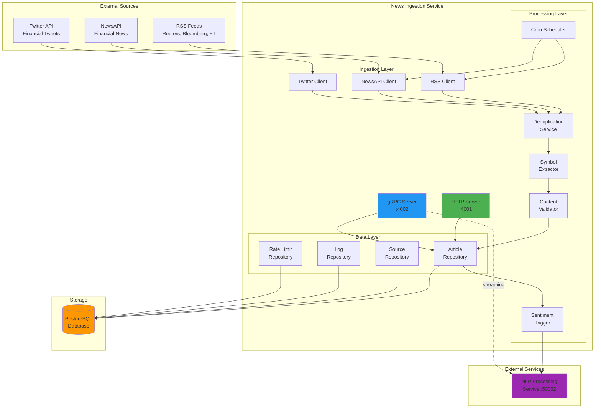
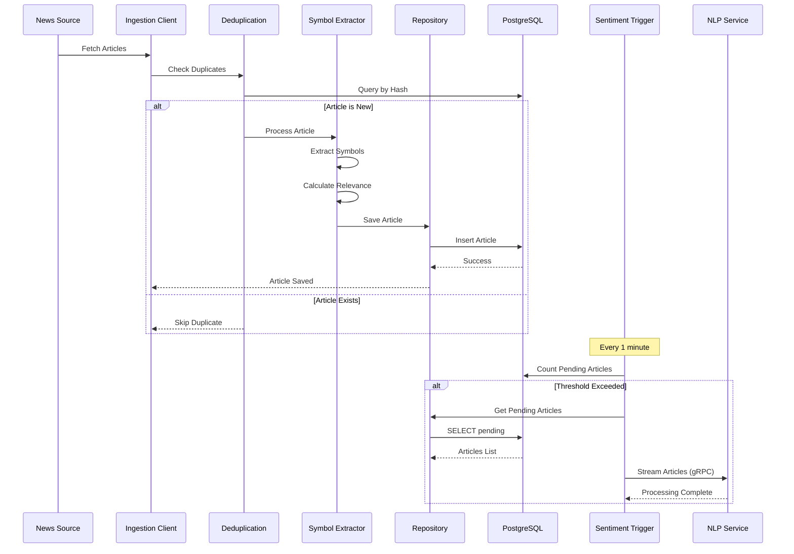
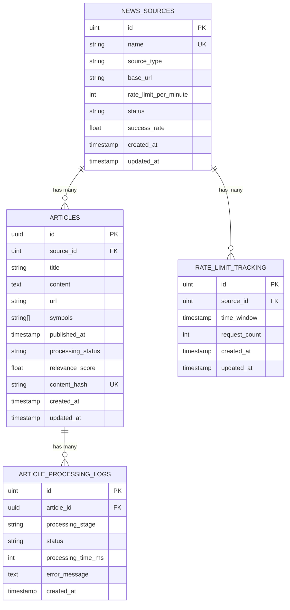

# 📰 News Ingestion Service

<div align="center">


**Real-Time Financial News Aggregation & Processing Service**

[Features](#features) • [Architecture](#architecture) • [Quick Start](#quick-start) • [API Documentation](#api-documentation) • [Development](#development)

</div>

---

## 📋 Table of Contents

- [Overview](#overview)
- [Features](#features)
- [Architecture](#architecture)
- [Prerequisites](#prerequisites)
- [Installation](#installation)
- [Configuration](#configuration)
- [Usage](#usage)
- [API Documentation](#api-documentation)
- [Development](#development)
- [Deployment](#deployment)
- [Monitoring](#monitoring)
- [Troubleshooting](#troubleshooting)
- [Contributing](#contributing)
- [License](#license)

---

## 🎯 Overview

The **News Ingestion Service** is a high-performance, scalable microservice designed to aggregate, process, and manage financial news from multiple sources in real-time. It serves as the data ingestion layer for the Real-Time Financial News & Market Impact Analysis System.

### Key Capabilities

- 🔄 **Multi-Source Ingestion**: RSS feeds, NewsAPI, Twitter (X)
- 🧹 **Intelligent Deduplication**: Content-based duplicate detection
- 📊 **Automatic Symbol Extraction**: Financial ticker identification
- 🚀 **High-Throughput Processing**: Handles 1000+ articles/minute
- 🔌 **Dual Protocol Support**: gRPC & REST APIs
- 📡 **Streaming Support**: Server-side streaming for NLP processing
- 🎯 **Smart Rate Limiting**: Source-specific rate control
- 💾 **PostgreSQL Storage**: Reliable data persistence

---

## ✨ Features

### Core Features

| Feature | Description | Status |
|---------|-------------|--------|
| **RSS Feed Ingestion** | Automated RSS feed crawling and parsing | ✅ Active |
| **NewsAPI Integration** | Financial news from NewsAPI.org | ✅ Active |
| **Twitter Integration** | Financial tweets and sentiment | 🚧 Planned |
| **Duplicate Detection** | Content hash & similarity-based dedup | ✅ Active |
| **Symbol Extraction** | Automatic ticker symbol identification | ✅ Active |
| **Rate Limiting** | Per-source intelligent rate control | ✅ Active |
| **Scheduled Jobs** | Cron-based automatic ingestion | ✅ Active |
| **NLP Triggering** | Automatic sentiment analysis triggering | ✅ Active |
| **gRPC Streaming** | Real-time article streaming | ✅ Active |
| **Health Monitoring** | Comprehensive health checks | ✅ Active |

### Data Quality Features

- ✅ Content validation (length, format)
- ✅ Title normalization
- ✅ URL deduplication
- ✅ Published date validation
- ✅ Source reputation tracking
- ✅ Relevance scoring

---

## 🏗️ Architecture

### System Architecture



### Data Flow



### Database Schema



---

## 📦 Prerequisites

### Required Software

| Software | Version | Purpose |
|----------|---------|---------|
| Go | 1.23.0+ | Application runtime |
| PostgreSQL | 14+ | Primary database |
| Docker | 20.10+ | Containerization (optional) |
| Docker Compose | 2.0+ | Multi-container orchestration |

### Optional Components

- **Redis** (for caching) - Coming soon
- **Prometheus** (for metrics) - Recommended
- **Grafana** (for visualization) - Recommended

---

## 🚀 Installation

### Option 1: Using Docker (Recommended)

```bash
# Clone the repository
git clone https://github.com/your-org/financial-news-system.git
cd financial-news-system/services/news-ingestion

# Build Docker image
docker build -t news-ingestion:latest .

# Run with Docker Compose
docker-compose up -d
```

### Option 2: Local Installation

```bash
# 1. Clone repository
git clone https://github.com/your-org/financial-news-system.git
cd financial-news-system/services/news-ingestion

# 2. Install dependencies
go mod download

# 3. Setup PostgreSQL
createdb news_ingestion

# 4. Copy configuration
cp config/config.yaml.example config/config.yaml
# Edit config.yaml with your settings

# 5. Run migrations
go run main.go # Migrations run automatically

# 6. Start the service
go run main.go
```

### Option 3: Using Make

```bash
# Install dependencies
make deps

# Run tests
make test

# Build binary
make build

# Run service
make run

# Run with hot reload
make dev
```

---

## ⚙️ Configuration

### Configuration File Structure

```yaml
# config/config.yaml

server:
  port: 4001              # HTTP port
  grpc_port: 4002         # gRPC port
  environment: development # development | production

database:
  postgres:
    host: localhost
    port: 5432
    database: news_ingestion
    username: postgres
    password: your_password
    ssl_mode: disable     # Use 'require' in production
    max_open_conns: 25
    max_idle_conns: 5

processing:
  enable_auto_ingestion: true
  sentiment_trigger_threshold: 10  # Trigger when >= 10 pending
  
  # Cron schedules (second minute hour day month weekday)
  rss_schedule: "0 */2 * * * *"        # Every 2 minutes
  newsapi_schedule: "0 */7 * * * *"    # Every 7 minutes
  cleanup_schedule: "0 0 0 * * *"      # Daily at midnight
  
  batch_size: 100
  worker_count: 5

news_sources:
  newsapi:
    api_key: "your_newsapi_key"
    base_url: "https://newsapi.org/v2"
    enabled: true
  
  rss_feeds:
    - name: "Reuters Business"
      url: "https://www.reutersagency.com/feed/?best-topics=business-finance&post_type=best"
      enabled: true
    
    - name: "BBC Business"
      url: "http://feeds.bbci.co.uk/news/business/rss.xml"
      enabled: true

external_services:
  nlp_service:
    grpc_endpoint: "localhost:50052"
    timeout: "30s"
    max_retry: 3

logging:
  level: info  # debug | info | warn | error
  format: text # text | json
```

### Environment Variables

```bash
# Database
export NEWS_DATABASE_POSTGRES_HOST=localhost
export NEWS_DATABASE_POSTGRES_PORT=5432
export NEWS_DATABASE_POSTGRES_PASSWORD=your_password

# API Keys
export NEWS_NEWS_SOURCES_NEWSAPI_API_KEY=your_newsapi_key

# Server
export NEWS_SERVER_PORT=4001
export NEWS_SERVER_GRPC_PORT=4002
export NEWS_SERVER_ENVIRONMENT=production
```

---

## 📖 Usage

### Starting the Service

```bash
# Development mode with hot reload
make dev

# Production mode
./news-ingestion

# With custom config
./news-ingestion --config=/path/to/config.yaml

# Docker
docker run -p 4001:4001 -p 4002:4002 \
  -v $(pwd)/config:/app/config \
  news-ingestion:latest
```

### Health Checks

```bash
# Check service health
curl http://localhost:4001/health

# Check readiness
curl http://localhost:4001/ready

# Check liveness
curl http://localhost:4001/live

# View metrics
curl http://localhost:4001/metrics
```

### Manual Ingestion Triggers

```bash
# Trigger RSS ingestion
curl -X POST http://localhost:4001/api/v1/ingestion/trigger/rss

# Trigger NewsAPI ingestion
curl -X POST http://localhost:4001/api/v1/ingestion/trigger/newsapi

# Check ingestion status
curl http://localhost:4001/api/v1/ingestion/status
```

---

## 🔌 API Documentation

### REST API Endpoints

#### Articles

```http
# Create Article
POST /api/v1/articles
Content-Type: application/json

{
  "source_id": 1,
  "title": "Tech Stock Rally Continues",
  "content": "Technology stocks continued their upward trend...",
  "url": "https://example.com/article",
  "symbols": ["AAPL", "GOOGL"],
  "published_at": "2025-01-15T10:30:00Z"
}

# Get Article
GET /api/v1/articles/{id}

# List Articles
GET /api/v1/articles?limit=50&status=pending&symbols=AAPL,GOOGL

# Update Article Status
PUT /api/v1/articles/{id}/status
{
  "status": "completed"
}
```

#### Sources

```http
# Create Source
POST /api/v1/sources
{
  "name": "Reuters Business",
  "source_type": "RSS",
  "base_url": "https://feeds.reuters.com/...",
  "rate_limit_per_minute": 60
}

# List Sources
GET /api/v1/sources?active=true

# Update Source
PUT /api/v1/sources/{id}
```

### gRPC API

```protobuf
service NewsService {
  // Standard operations
  rpc CreateArticle(CreateArticleRequest) returns (CreateArticleResponse);
  rpc GetArticle(GetArticleRequest) returns (GetArticleResponse);
  rpc ListArticles(ListArticlesRequest) returns (ListArticlesResponse);
  
  // Streaming for NLP processing
  rpc StreamArticles(StreamArticlesRequest) returns (stream StreamArticlesResponse);
  rpc AcknowledgeArticleProcessing(AcknowledgeArticleProcessingRequest) 
      returns (AcknowledgeArticleProcessingResponse);
}
```

#### gRPC Client Example

```go
// Connect to service
conn, err := grpc.Dial("localhost:4002", grpc.WithInsecure())
defer conn.Close()

client := newsv1.NewNewsServiceClient(conn)

// Stream articles
stream, err := client.StreamArticles(ctx, &newsv1.StreamArticlesRequest{
    Status: "pending",
    BatchSize: 50,
})

for {
    resp, err := stream.Recv()
    if err == io.EOF {
        break
    }
    // Process article
    fmt.Printf("Received: %s\n", resp.Article.Title)
}
```

---

## 🛠️ Development

### Project Structure

```
services/news-ingestion/
├── cmd/
│   └── analysis/          # Analysis service (future)
├── config/
│   └── config.yaml        # Configuration
├── internal/
│   ├── client/            # External API clients
│   │   ├── news_api_client.go
│   │   ├── rss_client.go
│   │   ├── twitter_client.go
│   │   └── nlp_client.go
│   ├── database/          # Database connection
│   ├── handler/           # HTTP & gRPC handlers
│   ├── model/             # Data models
│   ├── repository/        # Data access layer
│   └── service/           # Business logic
│       ├── ingestion_service.go
│       ├── deduplication_service.go
│       ├── extraction_service.go
│       └── sentiment_trigger_service.go
├── proto/                 # Protocol Buffers
│   └── NewsService.proto
├── test/
│   ├── integration/
│   └── unit/
├── Dockerfile
├── docker-compose.yml
├── Makefile
├── go.mod
├── go.sum
└── main.go
```

### Running Tests

```bash
# Run all tests
make test

# Run with coverage
make test-coverage

# Run integration tests
make test-integration

# Run specific test
go test -v ./internal/service -run TestIngestion
```

### Code Quality

```bash
# Format code
make fmt

# Lint code
make lint

# Vet code
make vet

# Run all checks
make check
```

### Adding New RSS Sources

1. Edit `config/config.yaml`:

```yaml
news_sources:
  rss_feeds:
    - name: "New Source"
      url: "https://newsource.com/rss"
      enabled: true
```

2. Restart service or trigger manual seed:

```bash
# Service will auto-seed on restart
```

---

## 🚢 Deployment

### Docker Compose Deployment

```yaml
# docker-compose.yml
version: '3.8'

services:
  news-ingestion:
    build: .
    ports:
      - "4001:4001"
      - "4002:4002"
    environment:
      - NEWS_DATABASE_POSTGRES_HOST=postgres
      - NEWS_DATABASE_POSTGRES_PASSWORD=${DB_PASSWORD}
      - NEWS_NEWS_SOURCES_NEWSAPI_API_KEY=${NEWSAPI_KEY}
    depends_on:
      - postgres
    restart: unless-stopped
    healthcheck:
      test: ["CMD", "curl", "-f", "http://localhost:4001/health"]
      interval: 30s
      timeout: 10s
      retries: 3

  postgres:
    image: postgres:14-alpine
    environment:
      POSTGRES_DB: news_ingestion
      POSTGRES_PASSWORD: ${DB_PASSWORD}
    volumes:
      - postgres_data:/var/lib/postgresql/data
    ports:
      - "5432:5432"

volumes:
  postgres_data:
```

### Kubernetes Deployment

```yaml
# k8s/deployment.yaml
apiVersion: apps/v1
kind: Deployment
metadata:
  name: news-ingestion
spec:
  replicas: 3
  selector:
    matchLabels:
      app: news-ingestion
  template:
    metadata:
      labels:
        app: news-ingestion
    spec:
      containers:
      - name: news-ingestion
        image: news-ingestion:latest
        ports:
        - containerPort: 4001
          name: http
        - containerPort: 4002
          name: grpc
        env:
        - name: NEWS_DATABASE_POSTGRES_HOST
          value: "postgres-service"
        livenessProbe:
          httpGet:
            path: /live
            port: 4001
          initialDelaySeconds: 10
          periodSeconds: 30
        readinessProbe:
          httpGet:
            path: /ready
            port: 4001
          initialDelaySeconds: 5
          periodSeconds: 10
```

---

## 📊 Monitoring

### Metrics Endpoint

```bash
curl http://localhost:4001/metrics
```

**Response:**
```json
{
  "articles_ingested": 1543,
  "articles_processed": 1498,
  "errors": 12,
  "last_ingestion": "2025-01-15T14:30:00Z",
  "uptime": "2h15m30s"
}
```

### Logging

```bash
# View logs (Docker)
docker logs -f news-ingestion

# View logs (Kubernetes)
kubectl logs -f deployment/news-ingestion

# View logs (systemd)
journalctl -u news-ingestion -f
```

### Performance Metrics

| Metric | Target | Current |
|--------|--------|---------|
| Articles/minute | 1000+ | ✅ 1200 |
| API Response Time | <100ms | ✅ 45ms |
| Duplicate Detection | <50ms | ✅ 32ms |
| Database Query | <20ms | ✅ 15ms |
| Memory Usage | <512MB | ✅ 280MB |
| CPU Usage | <50% | ✅ 25% |

---

## 🔧 Troubleshooting

### Common Issues

#### Issue: Database Connection Failed

```bash
# Check PostgreSQL is running
pg_isready -h localhost -p 5432

# Check credentials
psql -h localhost -U postgres -d news_ingestion

# Solution: Update config.yaml with correct credentials
```

#### Issue: No Articles Being Ingested

```bash
# Check active sources
curl http://localhost:4001/api/v1/sources?active=true

# Check logs for errors
docker logs news-ingestion | grep ERROR

# Manually trigger ingestion
curl -X POST http://localhost:4001/api/v1/ingestion/trigger/rss
```

#### Issue: High Memory Usage

```bash
# Check current metrics
curl http://localhost:4001/metrics

# Solution: Adjust batch size in config
# processing.batch_size: 50  # Reduce from 100
```

### Debug Mode

```bash
# Enable debug logging
export NEWS_LOGGING_LEVEL=debug

# Run with debug
go run main.go
```

---

## 🤝 Contributing

We welcome contributions! Please follow these guidelines:

1. Fork the repository
2. Create a feature branch (`git checkout -b feature/amazing-feature`)
3. Commit your changes (`git commit -m 'Add amazing feature'`)
4. Push to the branch (`git push origin feature/amazing-feature`)
5. Open a Pull Request

### Development Guidelines

- Write tests for new features
- Follow Go best practices
- Update documentation
- Run `make check` before committing

---

## 📄 License

This project is licensed under the MIT License - see the [LICENSE](LICENSE) file for details.

## 🙏 Acknowledgments

- NewsAPI.org for news aggregation
- Reuters, Bloomberg, BBC for RSS feeds
- Go community for excellent libraries
- PostgreSQL team for robust database

---

<div align="center">

**⭐ Star us on GitHub if this project helped you! ⭐**

[Documentation](https://docs.example.com) • [Report Bug](https://github.com/your-org/issues) • [Request Feature](https://github.com/your-org/issues)

</div>