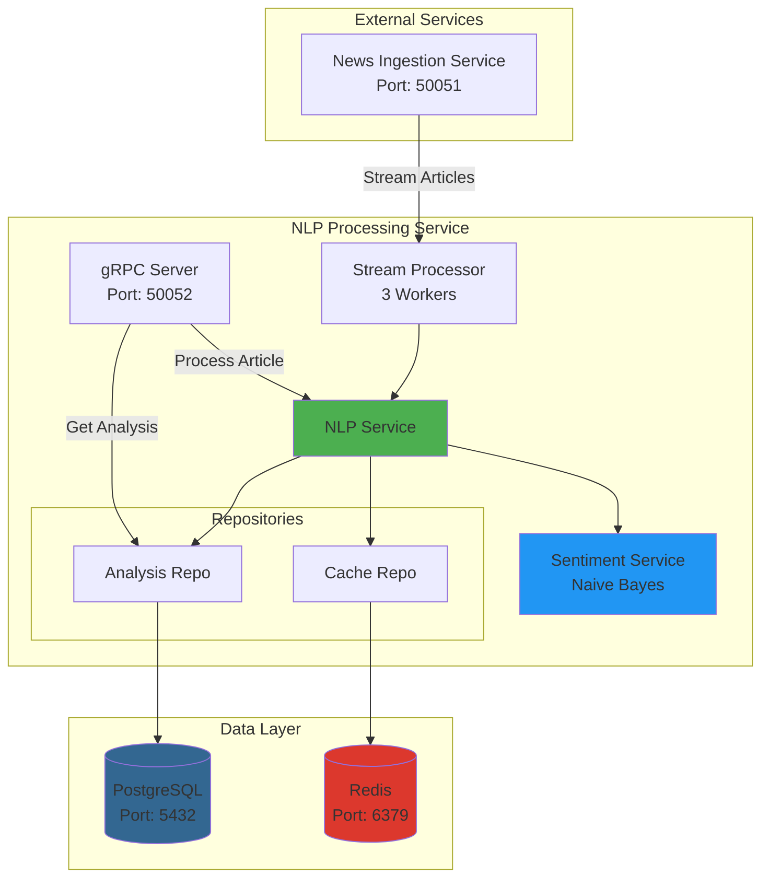
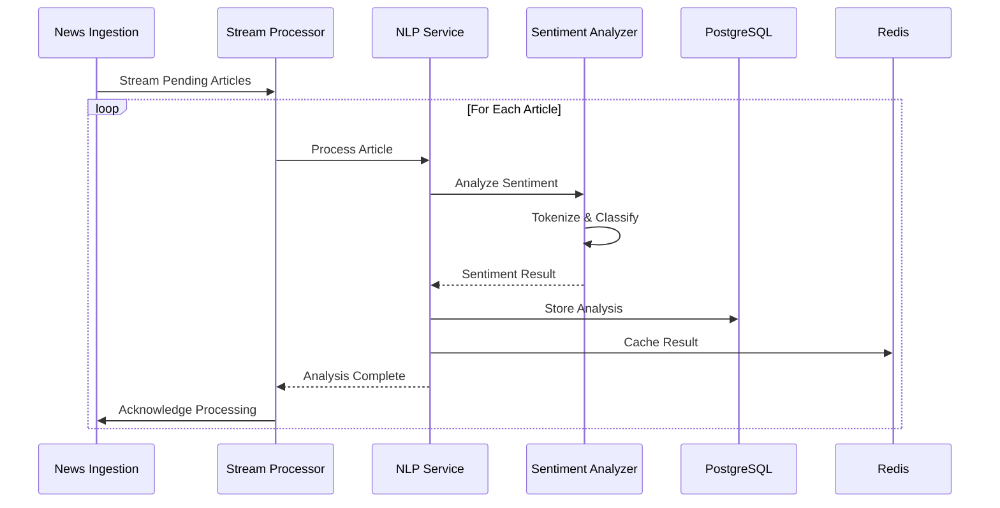
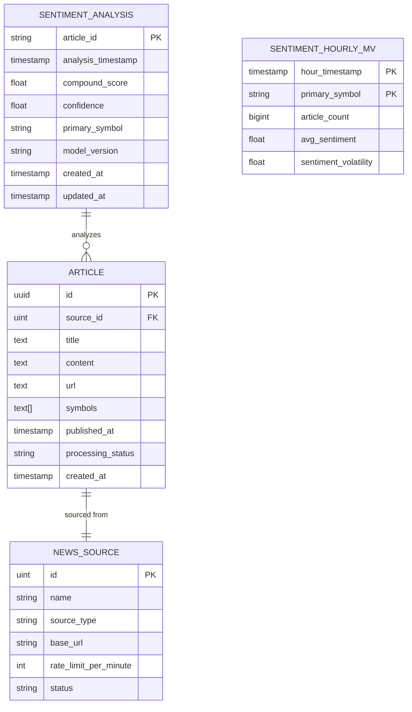

# 🧠 NLP Processing Service

<div align="center">


**Real-Time Financial News Sentiment Analysis for S&P 500 Stocks**

[Features](#-features) • [Architecture](#-architecture) • [Quick Start](#-quick-start) • [API Documentation](#-api-documentation) • [Configuration](#%EF%B8%8F-configuration)

</div>

---

## 📋 Overview

The **NLP Processing Service** is a high-performance microservice designed for real-time sentiment analysis of financial news articles. Built with Go, it processes news related to S&P 500 companies and provides actionable sentiment insights for trading and investment decisions.

### 🎯 Key Highlights

- **🚀 Real-Time Processing**: Streams and processes articles from the News Ingestion Service
- **🤖 Pure Go NLP**: Custom Naive Bayes sentiment classifier trained on financial news
- **📊 S&P 500 Focus**: Specialized analysis for major US stock market companies
- **⚡ High Performance**: Concurrent processing with configurable worker pools
- **🔄 Stream Processing**: gRPC streaming for continuous article analysis
- **💾 PostgreSQL Storage**: Persistent storage with optimized indexes for analytics
- **🚄 Redis Caching**: Fast result retrieval and reduced database load

---

## 🏗️ Architecture



### 🔄 Processing Flow



### 🗄️ Database Schema



---

## ✨ Features

### 🎯 Core Capabilities

| Feature | Description |
|---------|-------------|
| **Sentiment Analysis** | Custom Naive Bayes classifier trained on 180+ financial news examples |
| **S&P 500 Optimized** | Symbol prioritization for major market movers |
| **Batch Processing** | Process up to 100 articles per batch request |
| **Stream Processing** | Real-time article consumption from News Ingestion Service |
| **Trend Analytics** | Hourly sentiment aggregation via materialized views |
| **High Confidence** | Configurable confidence thresholds (default: 0.3) |

### 🛠️ Technical Features

- ✅ **Pure Go Implementation** - No external ML dependencies
- ✅ **gRPC APIs** - High-performance binary protocol
- ✅ **Concurrent Processing** - Multi-worker architecture
- ✅ **Result Caching** - Redis-based caching layer
- ✅ **Health Checks** - Built-in monitoring endpoints
- ✅ **Graceful Shutdown** - Clean resource cleanup
- ✅ **Docker Ready** - Containerized deployment

---

## 🚀 Quick Start

### Prerequisites

```bash
# Required
- Go 1.23+
- PostgreSQL 14+
- Redis 6+
- Docker & Docker Compose (optional)

# Service Dependencies
- News Ingestion Service (Port 50051)
```

### 🐳 Docker Deployment (Recommended)

1. **Build the Docker image:**

```bash
docker build -t nlp-processing:latest .
```

2. **Run with Docker Compose:**

```yaml
version: '3.8'

services:
  nlp-processing:
    image: nlp-processing:latest
    ports:
      - "50052:50052"
    environment:
      - DATABASE_HOST=postgres
      - DATABASE_PORT=5432
      - DATABASE_NAME=nlp_processing
      - DATABASE_USER=postgres
      - DATABASE_PASSWORD=your_password
      - REDIS_HOST=redis
      - REDIS_PORT=6379
      - NEWS_INGESTION_ENDPOINT=news-ingestion:50051
    depends_on:
      - postgres
      - redis
    restart: unless-stopped

  postgres:
    image: postgres:14-alpine
    environment:
      POSTGRES_DB: nlp_processing
      POSTGRES_USER: postgres
      POSTGRES_PASSWORD: your_password
    volumes:
      - postgres_data:/var/lib/postgresql/data

  redis:
    image: redis:7-alpine
    volumes:
      - redis_data:/data

volumes:
  postgres_data:
  redis_data:
```

```bash
docker-compose up -d
```

### 💻 Local Development

1. **Clone and navigate:**

```bash
cd services/nlp-processing
```

2. **Install dependencies:**

```bash
go mod download
```

3. **Configure the service:**

Edit `config/config.yaml`:

```yaml
server:
  port: 4002
  environment: development

database:
  postgres:
    host: localhost
    port: 5432
    database: nlp_processing
    username: postgres
    password: your_password

redis:
  host: localhost
  port: 6379
  database: 1

processing:
  batch_size: 50
  worker_count: 3
  retry_attempts: 3

grpc:
  port: 50052

external_services:
  news_ingestion_service:
    grpc_endpoint: "localhost:50051"
    timeout: "30s"
```

4. **Setup database:**

```bash
# Create database
createdb nlp_processing

# Run migrations (automatic on startup)
go run main.go
```

5. **Run the service:**

```bash
go run main.go
```

---

## 📡 API Documentation

### gRPC Service Definition

The service exposes the following gRPC endpoints:

#### 1. Process Single Article

```protobuf
rpc ProcessArticle(ProcessArticleRequest) returns (ProcessArticleResponse)
```

**Request:**
```json
{
  "article": {
    "id": "uuid",
    "title": "Apple Stock Surges on Strong Earnings",
    "content": "Apple Inc. reported record quarterly earnings...",
    "url": "https://example.com/article",
    "symbols": ["AAPL", "SPY"],
    "published_at": "2025-01-15T10:30:00Z"
  }
}
```

**Response:**
```json
{
  "result": {
    "article_id": "uuid",
    "sentiment": {
      "compound_score": 0.85,
      "confidence": 0.92,
      "primary_symbol": "AAPL",
      "model_version": "naive-bayes-financial-1.0"
    },
    "processing_time_ms": 45,
    "status": "completed"
  },
  "success": true
}
```

#### 2. Batch Processing

```protobuf
rpc ProcessBatch(BatchProcessRequest) returns (BatchProcessResponse)
```

**Request:**
```json
{
  "articles": [
    { /* article 1 */ },
    { /* article 2 */ }
  ],
  "options": {
    "enable_sentiment": true,
    "confidence_threshold": 0.3
  }
}
```

#### 3. Get Sentiment Trends

```protobuf
rpc GetSentimentTrends(SentimentTrendsRequest) returns (SentimentTrendsResponse)
```

**Request:**
```json
{
  "symbol": "AAPL",
  "start_time": "2025-01-01T00:00:00Z",
  "end_time": "2025-01-15T23:59:59Z",
  "interval": "hour"
}
```

#### 4. Health Check

```protobuf
rpc HealthCheck(Empty) returns (HealthCheckResponse)
```

**Response:**
```json
{
  "status": "healthy",
  "service": "nlp-processing",
  "database_status": "connected",
  "model_status": {
    "finbert_loaded": true,
    "finbert_version": "naive-bayes-financial-1.0"
  }
}
```

### Testing with grpcurl

```bash
# Health check
grpcurl -plaintext localhost:50052 nlp.v1.NLPProcessingService/HealthCheck

# Process article
grpcurl -plaintext -d @ localhost:50052 nlp.v1.NLPProcessingService/ProcessArticle <<EOM
{
  "article": {
    "id": "test-123",
    "title": "Tesla Stock Rises",
    "content": "Tesla shares gained 5% today...",
    "symbols": ["TSLA"]
  }
}
EOM
```

---

## ⚙️ Configuration

### Environment Variables

| Variable | Description | Default |
|----------|-------------|---------|
| `DATABASE_HOST` | PostgreSQL host | localhost |
| `DATABASE_PORT` | PostgreSQL port | 5432 |
| `DATABASE_NAME` | Database name | nlp_processing |
| `DATABASE_USER` | Database user | postgres |
| `DATABASE_PASSWORD` | Database password | - |
| `REDIS_HOST` | Redis host | localhost |
| `REDIS_PORT` | Redis port | 6379 |
| `GRPC_PORT` | gRPC server port | 50052 |
| `NEWS_INGESTION_ENDPOINT` | News service endpoint | localhost:50051 |
| `WORKER_COUNT` | Processing workers | 3 |
| `BATCH_SIZE` | Articles per batch | 50 |

### Processing Options

```yaml
processing:
  batch_size: 50              # Articles to fetch per batch
  worker_count: 3             # Concurrent processing workers
  retry_attempts: 3           # Failed processing retries
  timeout_seconds: 60         # Processing timeout
```

---

## 🧪 Sentiment Model

### Naive Bayes Classifier

The service uses a **custom-trained Naive Bayes classifier** optimized for financial news:

- **Training Data**: 180 labeled financial headlines
    - 60 Positive examples (surges, growth, beats expectations)
    - 60 Negative examples (plunges, losses, disappoints)
    - 60 Neutral examples (maintains, stable, unchanged)

- **Features**:
    - Tokenization with stop word removal
    - Laplace smoothing for unseen words
    - Log probability calculation
    - Softmax normalization

- **Performance**:
    - Vocabulary size: 513 unique financial terms
    - Confidence threshold: 0.3 (configurable)
    - Processing speed: ~45ms per article

### Model Training

The model is automatically trained on startup if no pre-trained model exists:

```go
// Training happens in sentiment_service.go
classifier := TrainDefaultFinancialSentimentModel()
```

Pre-trained model saved at: `models/sentiment/naive_bayes.json`

---

## 📊 Database Optimization

### Indexes

```sql
-- Sentiment analysis indexes
CREATE INDEX idx_sentiment_symbol_timestamp 
ON sentiment_analysis(primary_symbol, analysis_timestamp DESC);

CREATE INDEX idx_sentiment_compound_score 
ON sentiment_analysis(compound_score);

-- Hourly aggregation view
CREATE MATERIALIZED VIEW sentiment_hourly_mv AS
SELECT 
    date_trunc('hour', analysis_timestamp) as hour_timestamp,
    primary_symbol,
    COUNT(*) as article_count,
    AVG(compound_score) as avg_sentiment,
    STDDEV(compound_score) as sentiment_volatility
FROM sentiment_analysis 
WHERE primary_symbol IS NOT NULL 
GROUP BY date_trunc('hour', analysis_timestamp), primary_symbol;
```

### Refresh Materialized Views

```bash
# Manual refresh
psql -d nlp_processing -c "REFRESH MATERIALIZED VIEW CONCURRENTLY sentiment_hourly_mv;"

# Or via API (if implemented)
grpcurl -plaintext localhost:50052 nlp.v1.NLPProcessingService/RefreshAnalytics
```

---

## 🔍 Monitoring & Logging

### Logs

```bash
# Follow logs
docker logs -f nlp-processing

# Filter by level
docker logs nlp-processing 2>&1 | grep "level=error"
```

### Metrics

```bash
# Processing statistics (logged every 30s)
INFO[0030] S&P 500 sentiment analysis statistics  
  processed=1247 failed=3 success_rate=99.76%
```

### Health Checks

```bash
# Docker health check
docker ps --filter name=nlp-processing

# gRPC health check
grpcurl -plaintext localhost:50052 nlp.v1.NLPProcessingService/HealthCheck
```

---

## 🚦 Performance Tuning

### Worker Configuration

```yaml
processing:
  worker_count: 5      # Increase for higher throughput
  batch_size: 100      # Larger batches for bulk processing
```

### Database Connection Pool

```yaml
database:
  postgres:
    max_open_conns: 30    # Concurrent connections
    max_idle_conns: 10    # Idle connections
    conn_max_lifetime: 5m
```

### Redis Caching

```go
// Cache TTL configuration
cacheRepo.SetAnalysisResult(ctx, articleID, result, time.Hour)
```

---

## 🛠️ Development

### Project Structure

```
services/nlp-processing/
├── cmd/
│   └── server/
│       └── main.go              # Entry point
├── internal/
│   ├── client/                  # gRPC clients
│   │   └── news_ingestion_client.go
│   ├── database/                # Database setup
│   │   └── connection.go
│   ├── handler/                 # gRPC handlers
│   │   └── nlp_grpc_handler.go
│   ├── model/                   # Data models
│   │   ├── analysis.go
│   │   ├── sentiment.go
│   │   └── request_response.go
│   ├── repository/              # Data access layer
│   │   ├── analysis_repository.go
│   │   └── cache_repository.go
│   └── service/                 # Business logic
│       ├── nlp_service.go
│       ├── sentiment_service.go
│       └── stream_processor.go
├── proto/                       # Protocol buffers
│   └── nlp_processing.proto
├── models/                      # Pre-trained models
│   └── sentiment/
│       └── naive_bayes.json
├── config/
│   └── config.yaml
├── Dockerfile
├── docker-compose.yml
└── README.md
```

### Running Tests

```bash
# Unit tests
go test ./internal/service/...

# Integration tests
go test ./test/integration/... -v

# Coverage
go test ./... -coverprofile=coverage.out
go tool cover -html=coverage.out
```

### Code Generation

```bash
# Generate protocol buffers
buf generate proto/

# Generate mocks
mockgen -source=internal/service/nlp_service.go -destination=test/mocks/nlp_service_mock.go
```

---

## 🐛 Troubleshooting

### Common Issues

**1. Failed to connect to database**
```bash
# Check PostgreSQL is running
docker ps | grep postgres

# Test connection
psql -h localhost -U postgres -d nlp_processing
```

**2. Failed to connect to news-ingestion service**
```bash
# Verify service is running
grpcurl -plaintext localhost:50051 list

# Check network connectivity
docker network inspect bridge
```

**3. Model not loading**
```bash
# Check models directory
ls -la models/sentiment/

# Verify permissions
chmod 644 models/sentiment/naive_bayes.json
```

---

## 📈 Roadmap

- [ ] **Enhanced Models**: Add transformer-based models (FinBERT)
- [ ] **Entity Recognition**: Extract companies, executives, and financial instruments
- [ ] **Topic Classification**: Categorize by market events
- [ ] **Multi-language Support**: Process non-English news
- [ ] **Anomaly Detection**: Flag unusual sentiment patterns
- [ ] **REST API**: Add HTTP endpoints alongside gRPC
- [ ] **Metrics Dashboard**: Prometheus/Grafana integration
- [ ] **Model Retraining**: Automated model updates

---

## 📄 License

This project is part of the Real-Time Financial News Market Impact Analysis System.

---

## 🤝 Contributing

1. Fork the repository
2. Create a feature branch (`git checkout -b feature/amazing-feature`)
3. Commit your changes (`git commit -m 'Add amazing feature'`)
4. Push to the branch (`git push origin feature/amazing-feature`)
5. Open a Pull Request

---

## 📞 Support

- **Documentation**: [Internal Wiki]
- **Issues**: [GitHub Issues]
- **Slack**: #nlp-processing-support

---

<div align="center">

**Made with ❤️ for Financial Market Analysis**


</div>