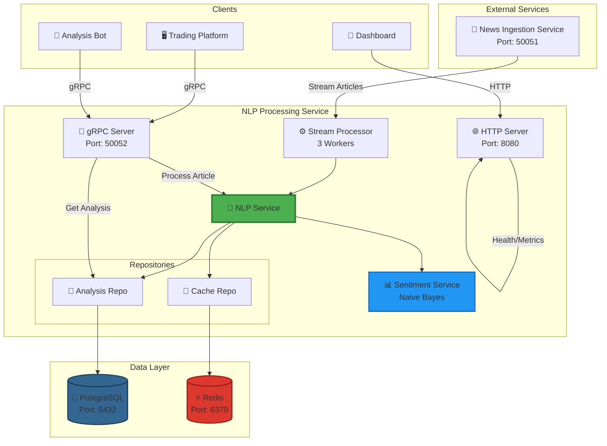
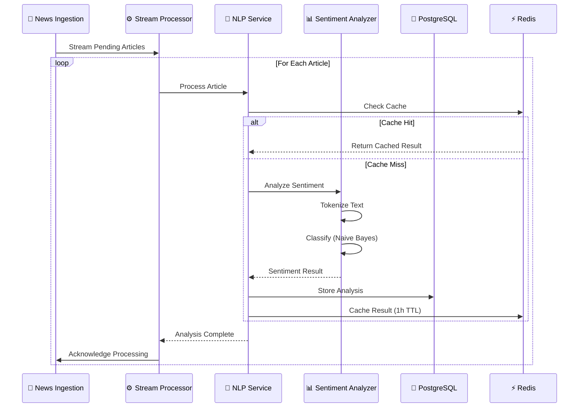
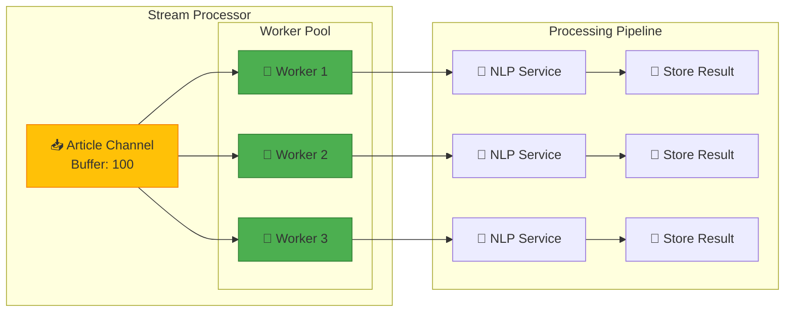
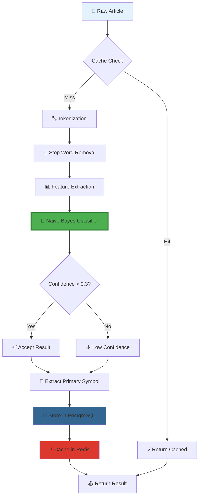
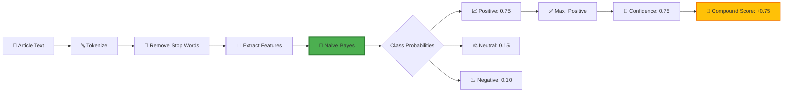
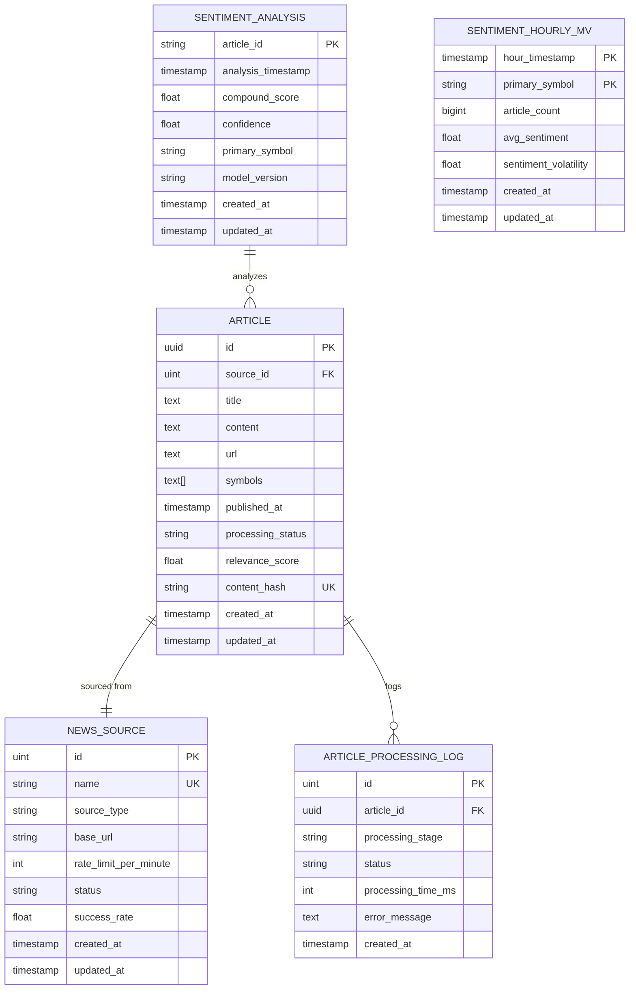

# 🧠 NLP Processing Service

<div align="center">


**Real-Time Financial News Sentiment Analysis for S&P 500 Stocks**

[Features](#-features) • [Architecture](#-architecture) • [Quick Start](#-quick-start) • [API Documentation](#-api-documentation) • [Configuration](#%EF%B8%8F-configuration)

</div>

---

## 📋 Table of Contents

- [Overview](#-overview)
- [Features](#-features)
- [Architecture](#-architecture)
- [Quick Start](#-quick-start)
  - [Docker Deployment](#-docker-deployment)
  - [Local Development](#-local-development)
- [API Documentation](#-api-documentation)
- [Configuration](#%EF%B8%8F-configuration)
- [Sentiment Model](#-sentiment-model)
- [Database Schema](#-database-schema)
- [Performance Tuning](#-performance-tuning)
- [Monitoring](#-monitoring--logging)
- [Development](#-development)
- [Troubleshooting](#-troubleshooting)
- [Contributing](#-contributing)

---

## 🎯 Overview

The **NLP Processing Service** is a high-performance microservice designed for real-time sentiment analysis of financial news articles. Built with Go, it processes news related to S&P 500 companies and provides actionable sentiment insights for trading and investment decisions.

### Key Highlights

- 🚀 **Real-Time Processing**: Streams and processes articles from the News Ingestion Service
- 🤖 **Pure Go NLP**: Custom Naive Bayes sentiment classifier trained on financial news
- 📊 **S&P 500 Focus**: Specialized analysis for major US stock market companies
- ⚡ **High Performance**: Concurrent processing with configurable worker pools
- 🔄 **Stream Processing**: gRPC streaming for continuous article analysis
- 💾 **PostgreSQL Storage**: Persistent storage with optimized indexes for analytics
- 🚄 **Redis Caching**: Fast result retrieval and reduced database load

---

## ✨ Features

### 🎯 Core Capabilities

| Feature | Description |
|---------|-------------|
| **Sentiment Analysis** | Custom Naive Bayes classifier trained on 180+ financial news examples |
| **S&P 500 Optimized** | Symbol prioritization for major market movers |
| **Batch Processing** | Process up to 100 articles per batch request |
| **Stream Processing** | Real-time article consumption from News Ingestion Service |
| **Trend Analytics** | Hourly sentiment aggregation via materialized views |
| **High Confidence** | Configurable confidence thresholds (default: 0.3) |

### 🛠️ Technical Features

- ✅ **Pure Go Implementation** - No external ML dependencies
- ✅ **gRPC APIs** - High-performance binary protocol
- ✅ **Concurrent Processing** - Multi-worker architecture
- ✅ **Result Caching** - Redis-based caching layer
- ✅ **Health Checks** - Built-in monitoring endpoints
- ✅ **Graceful Shutdown** - Clean resource cleanup
- ✅ **Docker Ready** - Containerized deployment

---

## 🏗️ Architecture

### System Overview


### Processing Flow


### Worker Architecture


### Data Flow


---

## 🚀 Quick Start

### Prerequisites
```bash
# Required
- Go 1.23+
- PostgreSQL 14+
- Redis 6+
- Docker & Docker Compose (optional)

# Service Dependencies
- News Ingestion Service (Port 50051)
```

### 🐳 Docker Deployment (Recommended)

#### 1. Build the Docker image
```bash
docker build -t nlp-processing:latest .
```

#### 2. Create `docker-compose.yml`
```yaml
version: '3.8'

services:
  nlp-processing:
    image: nlp-processing:latest
    container_name: nlp-processing-service
    ports:
      - "50052:50052"  # gRPC
      - "8080:8080"    # HTTP Health/Metrics
    environment:
      # Database Configuration
      - POSTGRES_HOST=postgres
      - POSTGRES_PORT=5432
      - POSTGRES_DB=nlp_processing
      - POSTGRES_USER=postgres
      - POSTGRES_PASSWORD=your_secure_password

      # Redis Configuration
      - REDIS_HOST=redis
      - REDIS_PORT=6379
      - REDIS_PASSWORD=
      - REDIS_DATABASE=1

      # Service Configuration
      - SERVER_PORT=4002
      - GRPC_PORT=50052
      - ENVIRONMENT=production

      # Processing Configuration
      - PROCESSING_WORKER_COUNT=3
      - PROCESSING_BATCH_SIZE=50
      - PROCESSING_RETRY_ATTEMPTS=3
      - PROCESSING_TIMEOUT_SECONDS=60

      # External Services
      - NEWS_INGESTION_ENDPOINT=news-ingestion:50051
      - NEWS_INGESTION_TIMEOUT=30s

      # Logging
      - LOG_LEVEL=info
      - LOG_FORMAT=json
    volumes:
      - ./config:/app/config
      - ./models:/app/models
      - nlp_logs:/app/logs
    depends_on:
      postgres:
        condition: service_healthy
      redis:
        condition: service_healthy
    networks:
      - nlp-network
    restart: unless-stopped
    healthcheck:
      test: ["CMD", "curl", "-f", "http://localhost:8080/health"]
      interval: 30s
      timeout: 10s
      retries: 3
      start_period: 40s

  postgres:
    image: postgres:14-alpine
    container_name: nlp-postgres
    environment:
      POSTGRES_DB: nlp_processing
      POSTGRES_USER: postgres
      POSTGRES_PASSWORD: your_secure_password
      POSTGRES_INITDB_ARGS: "-E UTF8"
    ports:
      - "5432:5432"
    volumes:
      - postgres_data:/var/lib/postgresql/data
    networks:
      - nlp-network
    healthcheck:
      test: ["CMD-SHELL", "pg_isready -U postgres"]
      interval: 10s
      timeout: 5s
      retries: 5
    restart: unless-stopped

  redis:
    image: redis:7-alpine
    container_name: nlp-redis
    command: redis-server --appendonly yes
    ports:
      - "6379:6379"
    volumes:
      - redis_data:/data
    networks:
      - nlp-network
    healthcheck:
      test: ["CMD", "redis-cli", "ping"]
      interval: 10s
      timeout: 3s
      retries: 5
    restart: unless-stopped

networks:
  nlp-network:
    driver: bridge

volumes:
  postgres_data:
    driver: local
  redis_data:
    driver: local
  nlp_logs:
    driver: local
```

#### 3. Start services
```bash
# Start all services
docker-compose up -d

# Check logs
docker-compose logs -f nlp-processing

# Check health
curl http://localhost:8080/health
```

### 💻 Local Development

#### 1. Clone and navigate
```bash
cd services/nlp-processing
```

#### 2. Install dependencies
```bash
go mod download
```

#### 3. Configure the service

Create `config/config.yaml`:
```yaml
server:
  port: 4002
  http_port: 8080
  environment: development

database:
  postgres:
    host: localhost
    port: 5432
    database: nlp_processing
    username: postgres
    password: your_password
    ssl_mode: disable
    max_open_conns: 30
    max_idle_conns: 10
    conn_max_lifetime: 5m
    conn_max_idle_time: 2m

redis:
  host: localhost
  port: 6379
  database: 1
  password: ""

processing:
  batch_size: 50
  worker_count: 3
  retry_attempts: 3
  timeout_seconds: 60

grpc:
  port: 50052
  max_receive_message_size: 4194304
  max_send_message_size: 4194304

external_services:
  news_ingestion_service:
    grpc_endpoint: "localhost:50051"
    timeout: "30s"

logging:
  level: info
  format: json
```

#### 4. Setup database
```bash
# Create database
createdb nlp_processing

# Migrations run automatically on startup
```

#### 5. Run the service
```bash
go run main.go
```

#### 6. Verify it's running
```bash
# Check health
curl http://localhost:8080/health

# Check readiness
curl http://localhost:8080/ready

# Check metrics
curl http://localhost:8080/metrics
```

---

## 📡 API Documentation

### gRPC Endpoints

The service exposes the following gRPC endpoints on port `50052`:

#### 1. 📝 Process Single Article
```protobuf
rpc ProcessArticle(ProcessArticleRequest) returns (ProcessArticleResponse)
```

**Request Example:**
```json
{
  "article": {
    "id": "550e8400-e29b-41d4-a716-446655440000",
    "title": "Apple Stock Surges on Strong Earnings Beat",
    "content": "Apple Inc. reported record quarterly earnings today, beating analyst expectations...",
    "url": "https://example.com/article",
    "symbols": ["AAPL", "SPY"],
    "published_at": "2025-01-15T10:30:00Z",
    "source_id": 1
  },
  "options": {
    "enable_sentiment": true,
    "confidence_threshold": 0.3,
    "model_version": "1.0"
  }
}
```

**Response Example:**
```json
{
  "result": {
    "article_id": "550e8400-e29b-41d4-a716-446655440000",
    "sentiment": {
      "article_id": "550e8400-e29b-41d4-a716-446655440000",
      "compound_score": 0.85,
      "confidence": 0.92,
      "primary_symbol": "AAPL",
      "model_version": "naive-bayes-financial-1.0",
      "analysis_timestamp": "2025-01-15T10:30:15Z"
    },
    "processing_time_ms": 45,
    "status": "completed",
    "created_at": "2025-01-15T10:30:15Z"
  },
  "success": true,
  "message": "Article processed successfully"
}
```

#### 2. 📦 Batch Processing
```protobuf
rpc ProcessBatch(BatchProcessRequest) returns (BatchProcessResponse)
```

**Request Example:**
```json
{
  "articles": [
    {
      "id": "uuid-1",
      "title": "Tesla Stock Rises on Delivery Numbers",
      "content": "Tesla delivered more vehicles than expected...",
      "symbols": ["TSLA"],
      "published_at": "2025-01-15T10:00:00Z"
    },
    {
      "id": "uuid-2",
      "title": "Microsoft Azure Revenue Soars",
      "content": "Microsoft's cloud business continues to grow...",
      "symbols": ["MSFT"],
      "published_at": "2025-01-15T11:00:00Z"
    }
  ],
  "options": {
    "enable_sentiment": true,
    "confidence_threshold": 0.3
  }
}
```

**Response Example:**
```json
{
  "results": [
    {
      "article_id": "uuid-1",
      "sentiment": {
        "compound_score": 0.75,
        "confidence": 0.88,
        "primary_symbol": "TSLA"
      },
      "processing_time_ms": 42,
      "status": "completed"
    },
    {
      "article_id": "uuid-2",
      "sentiment": {
        "compound_score": 0.82,
        "confidence": 0.91,
        "primary_symbol": "MSFT"
      },
      "processing_time_ms": 38,
      "status": "completed"
    }
  ],
  "successful_count": 2,
  "failed_count": 0,
  "errors": []
}
```

#### 3. 📊 Get Sentiment Trends
```protobuf
rpc GetSentimentTrends(SentimentTrendsRequest) returns (SentimentTrendsResponse)
```

**Request Example:**
```json
{
  "symbol": "AAPL",
  "start_time": "2025-01-01T00:00:00Z",
  "end_time": "2025-01-15T23:59:59Z",
  "interval": "hour",
  "limit": 100
}
```

**Response Example:**
```json
{
  "trends": [
    {
      "timestamp": "2025-01-15T10:00:00Z",
      "symbol": "AAPL",
      "avg_sentiment": 0.78,
      "article_count": 15,
      "volatility": 0.12
    },
    {
      "timestamp": "2025-01-15T11:00:00Z",
      "symbol": "AAPL",
      "avg_sentiment": 0.82,
      "article_count": 18,
      "volatility": 0.09
    }
  ],
  "total_count": 100
}
```

#### 4. 🔍 Get Analysis Result
```protobuf
rpc GetAnalysisResult(GetAnalysisRequest) returns (GetAnalysisResponse)
```

**Request Example:**
```json
{
  "article_id": "550e8400-e29b-41d4-a716-446655440000"
}
```

#### 5. ❤️ Health Check
```protobuf
rpc HealthCheck(Empty) returns (HealthCheckResponse)
```

**Response Example:**
```json
{
  "status": "healthy",
  "service": "nlp-processing",
  "timestamp": "2025-01-15T12:00:00Z",
  "database_status": "connected",
  "model_status": {
    "finbert_loaded": true,
    "finbert_version": "naive-bayes-financial-1.0"
  },
  "details": {
    "version": "1.0.0",
    "mode": "s&p500-sentiment-only"
  }
}
```

### HTTP Endpoints

The service also exposes HTTP endpoints on port `8080`:

#### Health Endpoint
```bash
GET http://localhost:8080/health
```

**Response:**
```json
{
  "status": "healthy",
  "service": "nlp-processing",
  "version": "1.0.0",
  "timestamp": "2025-01-15T12:00:00Z",
  "database": "connected",
  "servers": {
    "http": "running",
    "grpc": "running"
  },
  "metrics": {
    "articles_processed": 1247,
    "articles_succeeded": 1244,
    "articles_failed": 3,
    "success_rate": "99.76%",
    "avg_processing_ms": 42,
    "last_processing": "2025-01-15T11:59:45Z",
    "uptime": "2h15m30s"
  }
}
```

#### Ready Endpoint
```bash
GET http://localhost:8080/ready
```

#### Live Endpoint
```bash
GET http://localhost:8080/live
```

#### Metrics Endpoint
```bash
GET http://localhost:8080/metrics
```

### Testing with grpcurl
```bash
# Install grpcurl
go install github.com/fullstorydev/grpcurl/cmd/grpcurl@latest

# Health check
grpcurl -plaintext localhost:50052 nlp.v1.NLPProcessingService/HealthCheck

# Process article
grpcurl -plaintext -d @ localhost:50052 nlp.v1.NLPProcessingService/ProcessArticle <<EOM
{
  "article": {
    "id": "test-123",
    "title": "Tesla Stock Rises on Strong Delivery Numbers",
    "content": "Tesla Inc. delivered more vehicles than expected in Q4...",
    "symbols": ["TSLA"],
    "published_at": "2025-01-15T10:00:00Z",
    "source_id": 1
  }
}
EOM

# Get sentiment trends
grpcurl -plaintext -d @ localhost:50052 nlp.v1.NLPProcessingService/GetSentimentTrends <<EOM
{
  "symbol": "AAPL",
  "start_time": "2025-01-01T00:00:00Z",
  "end_time": "2025-01-15T23:59:59Z",
  "interval": "hour"
}
EOM
```

---

## ⚙️ Configuration

### Environment Variables

| Variable | Description | Default |
|----------|-------------|---------|
| `POSTGRES_HOST` | PostgreSQL host | localhost |
| `POSTGRES_PORT` | PostgreSQL port | 5432 |
| `POSTGRES_DB` | Database name | nlp_processing |
| `POSTGRES_USER` | Database user | postgres |
| `POSTGRES_PASSWORD` | Database password | - |
| `REDIS_HOST` | Redis host | localhost |
| `REDIS_PORT` | Redis port | 6379 |
| `REDIS_PASSWORD` | Redis password (optional) | "" |
| `REDIS_DATABASE` | Redis database number | 1 |
| `GRPC_PORT` | gRPC server port | 50052 |
| `SERVER_PORT` | HTTP server port | 8080 |
| `NEWS_INGESTION_ENDPOINT` | News service endpoint | localhost:50051 |
| `PROCESSING_WORKER_COUNT` | Processing workers | 3 |
| `PROCESSING_BATCH_SIZE` | Articles per batch | 50 |
| `LOG_LEVEL` | Log level (debug/info/warn/error) | info |
| `LOG_FORMAT` | Log format (json/text) | json |
| `ENVIRONMENT` | Environment (development/production) | development |

### Configuration File

The service supports YAML configuration with environment variable expansion:
```yaml
server:
  port: ${SERVER_PORT:4002}
  http_port: ${SERVER_HTTP_PORT:8080}
  environment: ${ENVIRONMENT:development}

database:
  postgres:
    host: ${POSTGRES_HOST:localhost}
    port: ${POSTGRES_PORT:5432}
    database: ${POSTGRES_DB:nlp_processing}
    username: ${POSTGRES_USER:postgres}
    password: ${POSTGRES_PASSWORD:postgres}
    ssl_mode: ${DATABASE_SSL_MODE:disable}
    max_open_conns: ${DATABASE_MAX_OPEN_CONNS:30}
    max_idle_conns: ${DATABASE_MAX_IDLE_CONNS:10}
    conn_max_lifetime: ${DATABASE_CONN_MAX_LIFETIME:5m}
    conn_max_idle_time: ${DATABASE_CONN_MAX_IDLE_TIME:2m}

redis:
  host: ${REDIS_HOST:localhost}
  port: ${REDIS_PORT:6379}
  database: ${REDIS_DATABASE:1}
  password: ${REDIS_PASSWORD:}

processing:
  batch_size: ${PROCESSING_BATCH_SIZE:50}
  worker_count: ${PROCESSING_WORKER_COUNT:3}
  retry_attempts: ${PROCESSING_RETRY_ATTEMPTS:3}
  timeout_seconds: ${PROCESSING_TIMEOUT_SECONDS:60}

grpc:
  port: ${GRPC_PORT:50052}
  max_receive_message_size: ${GRPC_MAX_RECEIVE_MESSAGE_SIZE:4194304}
  max_send_message_size: ${GRPC_MAX_SEND_MESSAGE_SIZE:4194304}

external_services:
  news_ingestion_service:
    grpc_endpoint: ${NEWS_INGESTION_ENDPOINT:localhost:50051}
    timeout: ${NEWS_INGESTION_TIMEOUT:30s}

logging:
  level: ${LOG_LEVEL:info}
  format: ${LOG_FORMAT:json}
```

### Processing Options
```yaml
processing:
  worker_count: 5          # Increase for higher throughput
  batch_size: 100          # Larger batches for bulk processing
  retry_attempts: 3        # Failed processing retries
  timeout_seconds: 60      # Processing timeout
```

---

## 🧪 Sentiment Model

### Naive Bayes Classifier

The service uses a **custom-trained Naive Bayes classifier** optimized for financial news:

#### Training Data

- **Total Examples**: 180 labeled financial headlines
  - 60 Positive examples (surges, growth, beats expectations)
  - 60 Negative examples (plunges, losses, disappoints)
  - 60 Neutral examples (maintains, stable, unchanged)

#### Features

- **Tokenization**: Stop word removal and lowercase normalization
- **Laplace Smoothing**: Handles unseen words gracefully
- **Log Probabilities**: Prevents numerical underflow
- **Softmax Normalization**: Produces calibrated confidence scores

#### Performance

- **Vocabulary Size**: 513 unique financial terms
- **Confidence Threshold**: 0.3 (configurable)
- **Processing Speed**: ~45ms per article
- **Model Version**: naive-bayes-financial-1.0

#### Sentiment Scoring


#### Model Files

The pre-trained model is stored at:
```
models/sentiment/naive_bayes.json
```

Structure:
```json
{
  "positive_words": { "surge": 5, "growth": 8, ... },
  "neutral_words": { "maintain": 12, "stable": 6, ... },
  "negative_words": { "plunge": 4, "loss": 9, ... },
  "positive_docs": 60,
  "neutral_docs": 60,
  "negative_docs": 60,
  "vocab_size": 513
}
```

---

## 🗄️ Database Schema

### Entity Relationship Diagram


### Key Indexes
```sql
-- Sentiment analysis indexes (optimized for time-series queries)
CREATE INDEX idx_sentiment_symbol_timestamp 
ON sentiment_analysis(primary_symbol, analysis_timestamp DESC);

CREATE INDEX idx_sentiment_compound_score 
ON sentiment_analysis(compound_score) 
WHERE compound_score IS NOT NULL;

-- Article indexes
CREATE INDEX idx_article_status ON articles(processing_status);
CREATE INDEX idx_article_published ON articles(published_at DESC);
CREATE INDEX idx_article_symbols ON articles USING GIN(symbols);

-- Materialized view for hourly aggregation
CREATE INDEX idx_sentiment_hourly_symbol_time 
ON sentiment_hourly_mv(primary_symbol, hour_timestamp DESC);
```

### Materialized Views

The service creates a materialized view for fast analytics:
```sql
CREATE MATERIALIZED VIEW sentiment_hourly_mv AS
SELECT 
    date_trunc('hour', analysis_timestamp) as hour_timestamp,
    primary_symbol,
    COUNT(*)::bigint as article_count,
    AVG(compound_score)::double precision as avg_sentiment,
    STDDEV(compound_score)::double precision as sentiment_volatility,
    NOW() as created_at,
    NOW() as updated_at
FROM sentiment_analysis 
WHERE primary_symbol IS NOT NULL 
  AND analysis_timestamp >= NOW() - INTERVAL '30 days'
GROUP BY date_trunc('hour', analysis_timestamp), primary_symbol
ORDER BY hour_timestamp DESC, primary_symbol;
```

Refresh the view:
```sql
REFRESH MATERIALIZED VIEW CONCURRENTLY sentiment_hourly_mv;
```

---

## 🚀 Performance Tuning

### Worker Configuration

Adjust worker count based on CPU cores and workload:
```yaml
processing:
  worker_count: 5      # Recommended: Number of CPU cores
  batch_size: 100      # Larger batches for bulk processing
```

**Guidelines:**
- **Low Volume** (< 100 articles/min): 2-3 workers
- **Medium Volume** (100-500 articles/min): 3-5 workers
- **High Volume** (> 500 articles/min): 5-10 workers

### Database Connection Pool
```yaml
database:
  postgres:
    max_open_conns: 30    # Maximum concurrent connections
    max_idle_conns: 10    # Idle connections to maintain
    conn_max_lifetime: 5m  # Connection lifetime
    conn_max_idle_time: 2m # Idle connection timeout
```

### Redis Caching

Cache TTL is set to 1 hour by default:
```go
// Cache analysis results
cacheRepo.SetAnalysisResult(ctx, articleID, result, time.Hour)
```

Adjust based on your needs:
- **High-frequency updates**: 15-30 minutes
- **Standard usage**: 1 hour
- **Low-frequency updates**: 2-4 hours

### Performance Benchmarks

| Metric | Value |
|--------|-------|
| **Processing Speed** | 45ms per article |
| **Throughput** | ~1,300 articles/minute (with 3 workers) |
| **Memory Usage** | ~150MB base + ~50MB per worker |
| **CPU Usage** | ~25% per worker (single core) |
| **Cache Hit Rate** | ~60% (typical) |

---

## 📊 Monitoring & Logging

### Health Endpoints
```bash
# Overall health
curl http://localhost:8080/health

# Readiness (Kubernetes-style)
curl http://localhost:8080/ready

# Liveness
curl http://localhost:8080/live

# Metrics
curl http://localhost:8080/metrics
```

### Logs

View logs based on format:
```bash
# JSON logs (production)
docker logs nlp-processing | jq

# Text logs (development)
docker logs -f nlp-processing

# Filter by level
docker logs nlp-processing 2>&1 | grep "level=error"

# Follow specific article
docker logs -f nlp-processing 2>&1 | grep "article_id=uuid-123"
```

### Metrics

Key metrics exposed at `/metrics`:
```json
{
  "articles_processed": 1247,
  "articles_succeeded": 1244,
  "articles_failed": 3,
  "success_rate": "99.76%",
  "avg_processing_ms": 42,
  "last_processing": "2025-01-15T11:59:45Z",
  "uptime": "2h15m30s"
}
```

### Prometheus Integration (Optional)

Add Prometheus scraping configuration:
```yaml
scrape_configs:
  - job_name: 'nlp-processing'
    static_configs:
      - targets: ['localhost:8080']
    metrics_path: '/metrics'
    scrape_interval: 15s
```

### Grafana Dashboard (Optional)

Create dashboards with these metrics:
- Articles processed per minute
- Success rate over time
- Average processing time
- Cache hit rate
- Worker utilization

---

## 🛠️ Development

### Project Structure
```
services/nlp-processing/
├── cmd/
│   └── server/
│       └── main.go              # Entry point
├── internal/
│   ├── client/                  # gRPC clients
│   │   └── news_ingestion_client.go
│   ├── database/                # Database setup
│   │   └── connection.go
│   ├── handler/                 # gRPC handlers
│   │   └── nlp_grpc_handler.go
│   ├── model/                   # Data models
│   │   ├── analysis.go
│   │   ├── sentiment.go
│   │   └── request_response.go
│   ├── repository/              # Data access layer
│   │   ├── analysis_repository.go
│   │   └── cache_repository.go
│   └── service/                 # Business logic
│       ├── nlp_service.go
│       ├── sentiment_service.go
│       └── stream_processor.go
├── proto/                       # Protocol buffers
│   ├── nlp_processing.proto
│   ├── NewsService.proto
│   └── gen/                     # Generated code
├── models/                      # Pre-trained models
│   └── sentiment/
│       └── naive_bayes.json
├── config/
│   ├── config.yaml
│   └── config.example.yaml
├── test/
│   ├── unit/
│   └── integration/
├── Dockerfile
├── docker-compose.yaml
├── go.mod
├── go.sum
└── README.md
```

### Running Tests
```bash
# Unit tests
go test ./internal/service/... -v

# Integration tests
go test ./test/integration/... -v

# All tests
go test ./... -v

# Coverage
go test ./... -coverprofile=coverage.out
go tool cover -html=coverage.out -o coverage.html
```

### Code Generation
```bash
# Generate protocol buffers
buf generate proto/

# Generate mocks (if using mockgen)
go generate ./...
```

### Local Development Tips

1. **Use Air for hot reload:**
```bash
go install github.com/cosmtrek/air@latest
air
```

2. **Use grpcui for testing:**
```bash
go install github.com/fullstorydev/grpcui/cmd/grpcui@latest
grpcui -plaintext localhost:50052
```

3. **Debug with Delve:**
```bash
go install github.com/go-delve/delve/cmd/dlv@latest
dlv debug main.go
```

---

## 🔧 Troubleshooting

### Common Issues

#### 1. Database Connection Failed

**Symptom:**
```
Failed to connect to database: connection refused
```

**Solution:**
```bash
# Check PostgreSQL is running
docker ps | grep postgres

# Test connection
psql -h localhost -U postgres -d nlp_processing

# Verify credentials
echo $POSTGRES_PASSWORD
```

#### 2. News Ingestion Service Unreachable

**Symptom:**
```
Failed to connect to news-ingestion service: dial tcp: connection refused
```

**Solution:**
```bash
# Verify news-ingestion service is running
grpcurl -plaintext localhost:50051 list

# Check network connectivity
docker network inspect bridge

# Verify endpoint configuration
echo $NEWS_INGESTION_ENDPOINT
```

#### 3. Model Not Loading

**Symptom:**
```
Failed to load sentiment model: file not found
```

**Solution:**
```bash
# Check models directory
ls -la models/sentiment/

# Verify permissions
chmod 644 models/sentiment/naive_bayes.json

# Rebuild model if missing
# The service will auto-generate on first run
```

#### 4. High Memory Usage

**Symptom:**
```
Service using > 1GB RAM
```

**Solution:**
```yaml
# Reduce worker count
processing:
  worker_count: 2  # Instead of 5
  batch_size: 25   # Instead of 100
```

#### 5. Slow Processing

**Symptom:**
```
avg_processing_ms > 200
```

**Solution:**
```yaml
# Check cache is working
redis:
  host: localhost  # Ensure Redis is reachable
  
# Increase worker pool
processing:
  worker_count: 5  # More parallel processing
  
# Optimize database
database:
  postgres:
    max_open_conns: 50  # More connections
```

### Debug Mode

Enable debug logging:
```bash
export LOG_LEVEL=debug
go run main.go
```

Or in config:
```yaml
logging:
  level: debug
  format: text  # Easier to read for debugging
```

### Health Check Failures

If health checks fail:
```bash
# Check all endpoints
curl http://localhost:8080/health
curl http://localhost:8080/ready
curl http://localhost:8080/live

# Check gRPC health
grpcurl -plaintext localhost:50052 grpc.health.v1.Health/Check

# Review logs
docker logs nlp-processing --tail 100
```

---

## 🤝 Contributing

We welcome contributions! Here's how to get started:

### Development Workflow

1. **Fork the repository**
2. **Create a feature branch**
```bash
   git checkout -b feature/amazing-feature
```
3. **Make your changes**
4. **Write tests**
```bash
   go test ./... -v
```
5. **Format code**
```bash
   go fmt ./...
   goimports -w .
```
6. **Lint**
```bash
   golangci-lint run
```
7. **Commit changes**
```bash
   git commit -m 'Add amazing feature'
```
8. **Push to branch**
```bash
   git push origin feature/amazing-feature
```
9. **Open a Pull Request**

### Code Style

Follow these guidelines:
- Use `gofmt` for formatting
- Write clear, descriptive variable names
- Add comments for complex logic
- Keep functions under 50 lines when possible
- Write unit tests for new features

### Testing Requirements

All PRs must include:
- ✅ Unit tests with > 80% coverage
- ✅ Integration tests for new endpoints
- ✅ Documentation updates
- ✅ Changelog entry

---

## 📚 Resources

### Documentation

- [gRPC Documentation](https://grpc.io/docs/)
- [PostgreSQL Documentation](https://www.postgresql.org/docs/)
- [Redis Documentation](https://redis.io/documentation)
- [Go Best Practices](https://go.dev/doc/effective_go)

### Related Services

- [News Ingestion Service](../news-ingestion/README.md)
- [Market Impact Service](../market-impact/README.md)

---

## 📄 License

This project is part of the Real-Time Financial News Market Impact Analysis System.

---

## 🙏 Acknowledgments

- Naive Bayes implementation inspired by financial NLP research
- S&P 500 data prioritization based on market capitalization
- Architecture designed for high-throughput financial data processing

---

<div align="center">

**Made with ❤️ for Financial Market Analysis**


</div>
